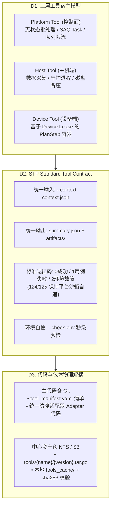

# ADR-0033：外部工具统一接入契约规范与包管理解耦模型（Tool-Kit Ecosystem Integration）

- 状态：**Accepted（v1.11）**
- 落地状态：**部分落地**（Phase 2 B5 `DedupMergeEngine`；Phase A：D0 新族门禁 + Tool Contract 脚手架 + Jira 薄 ACL（#3005）；Phase A3：`PlanRunArtifact` 下载 + DedupReportCard + `jira/runs?plan_run_id=`（#3015）+ DLE zip / `extract_bundle` 登记下载 / PlanRun 内嵌 Jira 历史（#3013 follow-ups）；Scan-Result-GT 仍仅 Agent B2；**包存储已触发（§5.4 条件 4·多站点）、可排期、尚未实现**——见 §5.4 评估锚与 [#3075](https://github.com/DUElost/stability-test-platform/issues/3075)；Phase 3 未做；D0/D3 权威已生效——见 §5；§5.6 **D0 可拦对象口径**已定——见 v1.10）
- 优先级：P1
- 目标里程碑：M7
- 日期：2026-09-03
- 决策者：平台研发组
- 标签：toolkit, adapter, anti-corruption, package-store, scripts, dedup, jira, flash, multi-site, #745, #735, #738, #1237, #2546, #3075
- 归属域：semantic-ownership flash-tool
- 关联 Issue：[#745](https://github.com/DUElost/stability-test-platform/issues/745)（追踪 Epic）、[#735](https://github.com/DUElost/stability-test-platform/issues/735)（脚本膨胀治理）、[#738](https://github.com/DUElost/stability-test-platform/issues/738)（架构解耦与防腐）、[#1237](https://github.com/DUElost/stability-test-platform/issues/1237)（v1.2 收窄）、[#2546](https://github.com/DUElost/stability-test-platform/issues/2546)（语义归属 / flash 补登记）、[#3075](https://github.com/DUElost/stability-test-platform/issues/3075)（Phase B Package Store 实现跟踪）
- 背景分析：[`TOOLKIT_INTEGRATION_FEASIBILITY_2026-08-26.md`](../reviews/TOOLKIT_INTEGRATION_FEASIBILITY_2026-08-26.md)；设计方案：[`2026-09-external-tools-integration-and-package-architecture.md`](../design/2026-09-external-tools-integration-and-package-architecture.md)

## 修订记录

| 版本 | 日期 | 变更 |
|------|------|------|
| v1.0 | 2026-09-03 | 初版：D0 阻断全量入仓、D1 三层宿主、D2 Tool Contract、D3 Manifest + 包存储、D4 防腐适配器（#840） |
| v1.1 | 2026-09-04 | 三项合入前必答裁定：与 ADR-0032 权威分家（§1.1）、契约翻译在 Agent 边缘 + 退出码命名空间分层（设计 §2.5）、DB script catalog 唯一运行时权威（D3）（#846） |
| v1.2 | 2026-09-10 | **收窄与登记**：D0/D3 权威即刻生效；D2 降为「新工具族准入、按族采用」；包存储改为条件落地（三条触发条件）；legacy 例外（展锐三工具族 + 私有路径键）显式登记；未落地状态与 §4 排期作废显式化（§5，#1237） |
| v1.3 | 2026-09-18 | **D1 刷机补登记**：Tier 3 典型工具增列 `flash_firmware` / `flash_preflight`；原厂 flashtool 不入仓；提权面仍归 ADR-0037 D5（#2546 F-5） |
| v1.4 | 2026-09-18 | **Phase 2 阻塞登记**（非决策变更）：控制面 unisoc/`Scan-Result-GT` `DedupMergeEngine` 样板与 ADR-0032 D3「同一 merge 工具」+ GT 仅 `-d` CLI 冲突；停做适配器，待 A/B/C 出口（#745） |
| v1.5 | 2026-09-19 | **Phase 2 选项 A 拍板落地**：样板 = 包 **B5** 现态 `start_log_scan -merge_files_list`（两平台同一工具）；Scan-Result-GT **继续只做 B2** Agent 主机汇总，不插 merge 循环；纠正 v1.0–v1.4「unisoc GT = DedupMergeEngine」措辞；薄适配器 `backend/services/dedup/`；不做包存储 / Phase 3 / 不修订 D3（#745 / #2546） |
| v1.6 | 2026-09-20 | **包存储触发条件评估锚**（非决策变更）：§5.4 三条对照仓内/文档现态 → **未触发**；评估正本 [`2026-09-20-adr0033-package-store-trigger-assessment.md`](../notes/architecture/2026-09-20-adr0033-package-store-trigger-assessment.md)；不改 D 决策、不排期 tar.gz/`tools_cache`（#745 / #2546） |
| v1.7 | 2026-09-21 | **Phase A 机械落地**（非决策变更）：D0 新族门禁 `check_new_script_family.py`；D2 脚手架 `verify_tool_contract.py` + fixture；Jira 薄 ACL `backend/services/jira_vendor/`；**不做**包存储 / ToolRun 表 / PlanRun 日志 UI（#745） |
| v1.8 | 2026-09-21 | **Phase A3 最小导航切片**（非决策变更）：`GET /plan-runs/{id}/artifacts/{id}/download` + DedupReportCard 下载链 + `GET /jira/runs?plan_run_id=`（#3013）；不做 Package Store / ToolRun / DLE zip |
| v1.9 | 2026-09-21 | **Phase A3 follow-ups**（非决策变更）：DLE `log-events/{id}/download`（目录 zip）；extract 登记 `extract_bundle` + 目录 zip 下载；PlanRun 详情内嵌 `JiraRunHistory`（#3013） |
| v1.10 | 2026-09-21 | **D0 可拦对象口径**（#3014 案 3A，非决策变更）：§5.6 定「计数口径 = 带外部资产的族」+ 首次基线（16 / 19，`clear_recents`、`unisoc_*` 判非 D0 对象）；§5.1 修正「新族门禁零触发」的成因（分母选错，非本期巧合）；**案 3A-1 采选项 A**——§5.6 增「门禁射程 = 归类动作」三态（`platform-authored` 放行 / `external-tool` 仍禁 / 未声明红，判据实现在 #3055）；脚本膨胀账继续归 ADR-0039 / #735。不动 D0–D4 与 §5.4 三条触发条件本身。相对 Phase A3 follow-ups（v1.9）顺延为 v1.10 |
| v1.11 | 2026-09-22 | **§5.4 增第四条触发条件·多站点部署**（方向级修订）：用户裁定「多站点部署 = §5.4 触发」——多站点是平台镜像与外部工具资产物理解耦的需求来源，防止工具/脚本合入持续腐化平台主干；评估结论锚改为**已触发**（条件 4）；撤销「触发前不得排期」；实现跟踪 [#3075](https://github.com/DUElost/stability-test-platform/issues/3075)；评估正本 [`2026-09-22-adr0033-package-store-multisite-trigger.md`](../notes/architecture/2026-09-22-adr0033-package-store-multisite-trigger.md)。**本版不实现** tar.gz/`tools_cache` 代码；条件 1–3 现态对账仍可不成立，但任一条件（含新增第 4 条）成立即可排期 |

---

## 1. 背景与问题定性

随着测试业务深入，平台需要持续接入大量异构的外部工具（原厂芯片商工具、厂商提单工具、自研专项压测工具）：
1. **控制面数据流工具**：MTK 汇总去重（`start_log_scan.py`）、展锐汇总去重（`Scan-Result-GT`）、多厂商 Jira 自动化提单（Transsion / Tinno / Moto）；
2. **主机端采集工具**：展锐 YPLog/Uniview 日志采集（`scan_log_gt.py`）、MTK 本地 AEE 扫描；
3. **设备端专项测试工具**：稳定性模块开关机测试（`powercycle_*`）、休眠唤醒测试（`sleep_*`）、GPU 专项压测（`gpu_*`，含 Antutu v10 依赖）、AIMonkey 等。

这些工具在**单机线下均已验证可独立运行**，但在接入 STP 平台时引发了严重的**代码腐化与技术债危机**：
- **源码直接拷贝膨胀**：依据 ADR-0020 脚本版本不可变原则，每次外部工具小修小补均全量复制代码树，导致 `backend/agent/scripts/` 累积 100 个版本、59,406 行代码（占全后端代码 27.43%），且历史版本的 Bug 被永久“冷冻”在代码库中；
- **平台主干充斥私有胶水代码**：服务层与控制面代码直接硬编码原厂特化参数（如 merge 清单文件协议、`-side` 产线参数、`Result_MergeFiles*` 产物目录命名探测），原厂工具微调容易引起平台主干震荡；
- **环境变量黑盒蔓延**：为适配不同工具的路径，代码中去重读取的环境变量已膨胀至约 190 个，但示例配置仅列出 29 个，运维配置负担极重；
- **职责宿主混杂**：Platform 层、Host 层与 Device 层工具执行上下文未物理隔离，缺少标准统一的防腐层（Anti-Corruption Layer, ACL）。

### 1.1 与 ADR-0032 的承接关系（非 supersede，行为 / 结构权威分家）
ADR-0032 已经终裁并落地了展锐与 MTK 并列日志链路（Watcher 实时采集 + 归档 dedup 路径分区），正式 supersede 了历史上的 #220（UNISOC Reconciler / Collector 已真实落地，`device.platform` 双轨分流生效）。
**ADR-0033 建立在 ADR-0032 已落地的多平台基础之上**：
- ADR-0032 解决了“展锐专属链路如何并列存在”的问题；
- ADR-0033 进一步解决“所有外部第三方原厂与专项工具如何通过统一协议（Tool Contract）和独立资产包（Package Store）标准化接入”，避免未来高通（QCOM）或新测试专项继续走“源码入仓全量拷贝”的老路。

| | ADR-0032 | ADR-0033 |
|---|---|---|
| 权威域 | **行为**：platform 路由、`dedup/{run}/{mtk,unisoc}/` 分区、按分区双 merge 循环、归档语义 | **结构**：工具如何打包分发、如何被调用、胶水收在哪 |
| 变更性质 | 已落地（v0.6），迁移期间持续有效 | Phase 3 存量归一是**重构而非行为变更**，验收 = watermark 语义、merge 产物发布中心路径、产物注册行为等价 |

- 现态事实：`run_merge_all_platforms_sync`（`backend/services/dedup_scan.py`）是**同一扫描工具按 mtk/unisoc 分区跑两遍**；
- **Phase 2 样板（v1.5 / 选项 A）**：在 ADR-0032 已建的 per-platform merge 循环上，为控制面 **B5** 加装第一个 `DedupMergeEngine`——实现体是现态 `start_log_scan -merge_files_list`（薄 ACL / argv 接缝），**不是** Scan-Result-GT。GT 继续只做 Agent **B2** 主机汇总（`scan_result.py -d`，已由 `UnisocScanRunner` 使用）。行为权威仍属 ADR-0032 D3；本 ADR 只收结构接缝；
- 可行性评审（2026-08-26）要求「P1 采集 Agent 化必开 ADR 重议 #220」，该 ADR 即 ADR-0032；本 ADR 只覆盖其 P2 汇总去重形态中的**控制面 merge 防腐层**（B5），不把 B2 主机汇总工具误写成 merge 引擎；
- 落地本 ADR 时同步修订 `backend/agent/aee/CLAUDE.md` 的 #220 旧口径（「生产只扫 MTK」已失效）。

---

## 2. 决策（Decisions）

> **落地优先级与适用范围以 §5（v1.2）为准**：D0 与 D3 的权威**即刻生效**（零成本、不依赖包存储就绪）；D2 收窄为**新工具族准入要求**（既有族按族迁移）；D3 的包存储分发机制改为**条件落地**；已发生的 legacy 例外在 §5.4 显式登记。

### D0：彻底阻断外部工具源码全量入仓（In-tree Code Freeze）
- **决议**：即日起，**严禁将外部第三方或专项工具的完整源码全量复制提交至主代码仓**（`backend/agent/scripts/` 不再新增任何未经解耦的全量外部工具目录）；
- 平台主代码仓只承载**工具元数据清单（Manifest）**以及**平台标准防腐适配器（Adapter）**；
- **分级准入（执行细则）**：新工具族必须以 Tool Contract + 包存储形态登记；既有工具族的新版本目录允许沿用 legacy argv 形态（保 ADR-0020 不可变、最小 diff 修复 Bug），直至该族在 Phase 3 完成契约化迁移——避免「修 Bug 也被迫先契约化」使本决议形同虚设。

### D1：确立严格的三层工具宿主分类与生命周期隔离
外部工具按执行载体严格划归为三类，禁止跨层混用执行协议：

| 宿主分类 | 典型工具 | 运行上下文与生命周期 | 约束与管控机制 |
|---|---|---|---|
| **Tier 1: Platform Tool**（控制面） | MTK/展锐 Merge 汇总去重、Jira 提单工具 | 跑在控制面容器/主机；由 SAQ Task 异步拉起；无状态批处理任务。 | 受 SAQ 任务超时限制；只读共享存储（NFS/CIFS），产物写入统一归档目录。 |
| **Tier 2: Host Tool**（主机端） | 展锐日志扫描（`scan_log_gt`）、AEE 扫描 | 跑在测试机 Host（Linux/WSL）；作为独立进程/守护进程执行。 | 依赖 Host Python/二进制；受 Host 磁盘背压（LocalDiskMonitor）与文件生命周期管控。 |
| **Tier 3: Device Tool**（设备端） | 开关机、休眠唤醒、GPU 压测、Monkey、**刷机（`flash_firmware` / `flash_preflight`）** | 针对特定连接设备；作为 Plan 中的标准 `script:<name>` 步骤执行。 | 必须受单设备排他租约（Device Lease）制约；扩展 `models/script.py` 的 `support_files_manifest` 列语义支持外部 APK/资源包统一下发。 |

- **刷机补登记（v1.3 / #2546）**：`flash_*` 归 Tier 3（PlanStep 编排）；原厂 SP_Flash_Tool 等二进制**不入仓**；主机提权边界见 ADR-0037 D5。v1.2 及以前 D1 表未列 flash，属分类学空洞（F-5）。

### D2：制定统一工具契约规范（STP Standard Tool Contract）
任何进入平台的外部工具，无论底层实现语言（Python / Shell / 二进制），必须通过极薄的适配器实现统一四要素契约：

1. **统一输入机制**：
   - 命令行调用签名统一为：`entrypoint --context <path/to/context.json> --output-dir <path/to/output_dir>`；
   - 彻底废止在平台主干中动态拼装特定原厂命令行的胶水逻辑；所有环境变量、设备信息、步骤自定义参数统一由平台序列化至 `context.json`；涉及机密凭据（如 Jira Token）按层隔离，禁止透传至设备端。
2. **统一产物与指标规范（双轨平滑衔接）**：
   - 工具执行完结前，必须在 `<output_dir>` 根目录生成结构化指标文件 `summary.json`；原始报告、日志收拢在 `<output_dir>/artifacts/`；
   - 平台 Agent `PipelineEngine` 与控制面执行器优先消费 `summary.json`；存量未改造脚本继续沿用 stdout JSON 解析，形成双轨平滑兼容。
3. **标准化退出码语义（Fail-Fast 区分）**：
   - `0`（Success）：任务正常执行，无异常；
   - `1`（Test Failure）：被测设备用例未通过（如稳定性跑出 Crash、开关机失败），属业务断言失败；
   - `2`（Environment / Tool Error）：工具自身执行异常（如 ADB 断开、原厂工具依赖缺失），触发平台重试或环境告警，杜绝误判为用例失败；
   - `124`（Wall Timeout）与 `125`（Stall Timeout）：由平台执行引擎双层钟机制强制杀死时由平台沙箱自造，工具自身不得伪造该退出码；
   - **命名空间分层**：工具作者只拥有 `{0, 1, 2}`；`≥124` 为平台执行器保留；`3–123` 与信号死亡视为工具缺陷，按环境类处理并告警。退出码 → 步骤终态映射（`failure_kind` 标注，不新增状态机终态）与双轨运行声明见设计文档 §2.5。
4. **强制环境自检契约（Pre-flight Check）**：
   - 工具必须实现 `--check-env` 开关，以**退出码 0（就绪）/ 2（环境故障）**为判定准则，标准输出提供诊断 JSON；
   - 挂点：Tier 3 设备端工具由 Agent 在步骤启动前调用（复用现有 precheck 槽位——ADB 连通性只有持有设备的主机可判）；Tier 1 平台工具由 SAQ 任务在长任务前自调；
   - 未就绪 → 步骤不启动、按 ENV_ERROR + `precheck_failed` 记录，不计入测试失败统计（Fail-Fast），杜绝长跑后因环境问题失败。

### D3：代码仓与工具资产包物理解耦（Manifest + Package Store）
- **工具包分发机制**：
  - 外部工具以独立压缩包（`{name}-{version}.tar.gz` 或 wheel）托管于中心存储 `{STP_AEE_NFS_ROOT}/tools/{name}/`（该目录作为权威存储布局在系统架构中补齐登记）；
  - Agent / 控制面启动或收到新任务时，按需将工具包拉取至本地缓存 `tools_cache/{name}/{version}/`，解压并核验 `sha256` 防篡改。
- **元数据清单（Manifest）**：
  - 主代码仓中仅保留 `tool_manifest.yaml`，定义工具名称、版本、适用架构、执行入口、超时及依赖配置；
  - **双版本体系权威裁定**：架构不变量保持一致——执行引擎仍以 `script:<name>` 作为调用标识，但 **DB script 目录（script catalog）仍是唯一运行时权威**；`tool_manifest.yaml` 是发布格式，注册时编译进 script 行（沿用 `capabilities.json` → scan → DB 的既有先例，#171），不是并存的第二套版本体系；
  - **升级工具包 = 新建 script 版本行**（`content_sha256 := tarball sha256`），保 ADR-0021 / ADR-0023 经由 `Script.content_sha256` 溯源（**无** `plan_step.script_sha` 列；#2546 Mode C）；ADR-0020 不可变、422 与退役 409 守卫（`SCRIPT_STILL_REFERENCED`）原样复用，零新机制；
  - **CI 门禁分工**：PR 门禁（无 NFS 访问）只管 Git 侧——manifest schema lint + 已登记版本条目 append-only；tarball 存在性与 sha256 校验发生在注册时、Agent 拉取时与控制面周期健康巡检。

### D4：防腐适配器架构（Anti-Corruption Layer, ACL）
- 控制面与 Agent 核心调度只面向通用抽象接口编程（例如 `DedupMergeEngine` 接口仅负责封装 vendor CLI 的调用与返回解析，外围 round/waterline 调度仍由控制面统一管控）；
- 针对 MTK、展锐、各 Jira 厂商的特化逻辑严格收敛在对应的 `adapters/` 子模块内部，任何原厂私有字段格式变更只影响适配器，绝不震荡平台主干。

---

## 3. 备选方案与权衡

- **包分发载体**：git submodule（弃——外部二进制 / APK 不适合进 Git，权限模型差）；私有 PyPI / wheel（弃——Shell 与原厂二进制工具装不进 Python 包）；NFS tar.gz + sha256（取——语言中立、复用中心存储与既有挂载）。
- **版本权威**：manifest 独立成第二套权威体系（弃——422 不可变 / 409 退役守卫 / sha 溯源全部要重造一遍）；DB script catalog 唯一权威 + manifest 仅作发布格式（取——零新机制，见 D3）。
- **契约翻译位置**：控制面集中翻译（弃——Job/PlanRun 状态机与四层调度全部感知契约，震荡面大）；Agent 边缘翻译（取——控制面零改动，双轨可按 script 行灰度）。

## 4. 实施阶段规划（对齐 Issue #745）

> **本节时间点已作废为参考序**（v1.2）：Phase 2/3 的 09-07 / 09-12 / 09-17 / 09-24 / 09-29 均已过期且零启动，实际排期以 issue 为准；阶段划分与依赖序不变，但**不得以"未按期"推断本 ADR 决策失效**（决策效力与实现进度分离，见 §5.5）。

- **Phase 1（近期·止血与标准）**：固化本文档与详细实施设计；阻断主仓新脚本源码拷入；执行 Issue #735（含先修复退役诊断工具自身崩溃）退役 47 个历史零引用活跃版本；
- **Phase 2（中期·标杆样板打样）**：
  - **控制面样板（v1.5 选项 A，已拍板）**：在 ADR-0032 per-platform merge 循环上接入第一个 `DedupMergeEngine`——**包 B5 现态** `start_log_scan -merge_files_list`（`backend/services/dedup/StartLogScanMergeEngine`）；mtk/unisoc **同一引擎**（D3）；编排（round / flock / 发布）仍在 `dedup_scan.run_merge_sync`；
  - **Scan-Result-GT 边界**：GT 公开 CLI 仅 `scan_result.py -d`（Agent **B2** 主机汇总）；**不**插进控制面 merge 循环；v1.0–v1.4「unisoc GT = DedupMergeEngine」措辞作废，阻塞笔记出口见 [`2026-09-18-adr0033-phase2-unisoc-merge-blocker.md`](../notes/architecture/2026-09-18-adr0033-phase2-unisoc-merge-blocker.md)，选定 A 的 Agent Note 见 [`2026-09-19-adr0033-phase2-option-a.md`](../notes/architecture/2026-09-19-adr0033-phase2-option-a.md)；
  - **明确不做（本阶段）**：包存储 tar.gz、Phase 3 存量归一、修订 ADR-0032 D3 换独立 unisoc merge 工具（选项 B）、Agent 侧 GT Adapter 作为 Phase 2 主样板（选项 C）；
  - 设备端样板：GPU / 开关机 / 休眠唤醒（#462）按照统一 Tool Contract 模板化接入（依赖工具包缓存机制就绪，排期见设计文档 §5）；
  - 实现工具包本地校验解压缓存机制（§5.4 条件 4 已触发，实现跟踪 [#3075](https://github.com/DUElost/stability-test-platform/issues/3075)；本 ADR 修订不实现代码）；
- **Phase 3（远期·存量归一）**：存量 MTK 扫描与 Jira 提单迁移至适配器体系（重构而非行为变更，验收 = 与 ADR-0032 行为等价）；在 Web 管理面暴露外部工具管理面板。

---

## 5. v1.2 修订：落地优先级重排与 legacy 例外登记（2026-09-10，#1237）

### 5.1 背景：零落地 + 反向增长的核验

ADR-0033 自 2026-09-03 Accepted 起至 2026-09-10 **无任何落地提交**（同期 567 次提交中 127 fix / 89 docs / 12 feat），而账目继续增长（基线 `fdf0247c` → `a009eeee`）：

- **契约要素（v1.5 前）曾全代码零命中**：`tool_manifest.yaml`、`tools_cache/`、`--context`、`summary.json` 消费分支、`tools/dev/verify_tool_contract.py`、manifest 门禁；v1.5 起控制面 B5 薄接缝落地为 `backend/services/dedup/`（`DedupMergeEngine` / `StartLogScanMergeEngine`）；**v1.7** 起 D0 新族门禁 + `verify_tool_contract.py`（fixture 靶子）+ Jira 薄 ACL `backend/services/jira_vendor/` 已落地，**仍无**包存储与存量 Tool Contract 全要素；
- **脚本膨胀未减速**：`backend/agent/scripts/` 版本目录 **100 → 110**（新增 10 个**全部落在既有族**）、`.py` 文件 **180 → 199**、行数 **59,406 → 67,288**（+7,882 / 7 天）、工具族 **32 → 32**；env 读键 **191 → 199**；
- **现实已跑出第三条路**：中心存储 `/mnt/stp-aee/tools/` 下为**未打包源码目录**（`Start-Log-Scan` / `Monkey-Log-Scan-GT-SPRD` / `Scan-Result-GT`），Agent 经 4 个私有 env 配置路径（2026-08-31 ADR-0032 落地时引入）。

**诊断（处方与病根错位）**：本 ADR 自述的病根是 ADR-0020 的「不可变 + 每次小改全量复制代码树」（§1）；而 D0 分级准入只拦**新工具族**——本期 10 个新版本目录全部落在既有族，**新族门禁零触发**。
> **v1.10 复核修正成因**：上面「零触发」不是本期巧合，而是**分母选错**。D0 正文管的是「外部工具**源码**全量复制入仓」，而实测 `backend/agent/scripts/` 现 35 族中 **0 族含第三方源码**（无 LICENSE / 版权头命中），展锐三族实际在中心存储 `tools/`（§5.4 过渡形态）——**该目录的族数与版本目录数从来不是 D0 的可拦对象计数**。本节账目（族数 / 版本目录 / 行数 / env 读键）继续作为**脚本膨胀账**有效，归 ADR-0039 与 #735；D0 侧口径改见 §5.6「D0 可拦对象口径」。即：唯一可立即见效的机制在当前账单来源上不生效，治本的 D2 + D3 + Phase 3 是大工程且收益延迟。本版**不改病根判断**（改 ADR-0020 复制契约属另一方向级问题，见 §5.6），只重排落地优先级并把已发生的例外显式登记。

### 5.2 裁定一：D0 与 D3 的权威即刻生效

- **D0（外部工具源码不入主仓）** 与 **D3 的版本权威裁定**（DB script catalog 唯一运行时权威；`tool_manifest.yaml` 仅发布格式；升级工具包 = 新建 script 版本行）**自本版起即约束评审与实现**，不等 tar.gz / manifest / 缓存机制就绪；
- 理由：这两条零成本、零新机制，且正是防止「新族继续全量入仓」与「双版本体系重造」的关键；把它们与包存储解耦，落地不再被大工程阻塞。

### 5.3 裁定二：D2 收窄为「新工具族准入要求、按族采用」

- Tool Contract 四要素（`context.json` / `summary.json` + `artifacts/` / 退出码 `{0,1,2}` 命名空间 / `--check-env`）**不再是"所有外部工具必须立即改造"的存量要求**，而是**新工具族入场的准入条件**；
- 既有工具族继续按 legacy 形态（argv + stdout JSON）运行与发版，改造时机由各族的 Phase 3 迁移决定（D0 分级准入执行细则不变）；
- **D2 的语义本身不变**（退出码命名空间分层、`failure_kind` 标注、与现态执行器的双轨衔接设计见设计文档 §2.5），变的只是**适用范围**。

### 5.4 裁定三：包存储（D3 分发机制）改为条件落地，并登记 legacy 例外

- tar.gz + sha256 + `tools_cache/` + 注册流 + 周期巡检作为**终态出口**保留；在下列**触发条件**任一出现前不排期（v1.11 起已增第 4 条；**条件 4 已成立 → 可排期**）：
  1. 出现**第二个**需要版本化分发 + 防篡改校验的 Tier 1/2 工具族（现有展锐三族之外的第一个）；或
  2. 出现因多机复制不一致、或源码目录被就地修改而导致的**真实事故**；或
  3. Phase 3 存量归一启动（包存储是该迁移的前置）；或
  4. **多站点部署**成为正式需求并进入交付实施（平台镜像与外部工具资产必须可独立版本化、按 digest 校验分发，防止各站工具/脚本合入与人肉同步持续腐化平台主干）——**2026-09-22 用户裁定**；关联 [ADR-0041](./ADR-0041-independent-site-delivery-and-management.md) / [`多站点交付 PRD`](../prd/2026-multi-site-delivery.md)。
- 在触发前，Tier 1/2 外部工具的**过渡形态** = 中心存储版本化源码目录（`tools/{name}/`）+ 路径 env 配置 + 本节登记义务。**这是标注过的过渡，不是终态**（终态出口即上述触发后的包存储）。**v1.11 起条件 4 已触发**：过渡形态在实现落地前仍可运维使用，但**不得再扩散**，且不得把「每站人肉 rsync `tools/`」写成终态。
- **legacy 例外显式登记**（2026-08-31 ADR-0032 落地，早于本 ADR 生效，按 legacy 追溯承认）：

| 例外对象 | 形态 | 边界 |
|---|---|---|
| 展锐三工具族（`Start-Log-Scan` / `Monkey-Log-Scan-GT-SPRD` / `Scan-Result-GT`） | 中心存储 `tools/{name}/` 下的**未打包源码目录** + `STP_UNISOC_*` / `STP_AGENT_UNISOC_*` 路径键 | ① 仅限这三个已存在族，**不得扩散**到新族或新工具；② 路径键必须登记在 `docs/development/environment-variables.md`（本次已补）；③ **不得再新增工具私有 env 键**——新增即违反 D0 分级准入与设计文档 §6「环境去黑盒化」 |

- **设计文档 §6「环境去黑盒化」就此收窄**：Tier 1 平台工具（`Start-Log-Scan`）与 Tier 2 主机工具（展锐采集 / 汇总去重）的路径键属上述既有例外；Tier 3 设备端工具（`scripts/` 内已发布脚本族）继续沿用既有版本目录约定，不引入工具私有路径变量。
- **评估结论锚（v1.11）**：2026-09-22 对账 → **已触发**（条件 4·多站点；条件 1–3 现态仍可不成立）。书面结论见 [`2026-09-22-adr0033-package-store-multisite-trigger.md`](../notes/architecture/2026-09-22-adr0033-package-store-multisite-trigger.md)。历史「未触发」快照保留于 [`2026-09-20-adr0033-package-store-trigger-assessment.md`](../notes/architecture/2026-09-20-adr0033-package-store-trigger-assessment.md)。**触发后可排期包存储实现**（跟踪 [#3075](https://github.com/DUElost/stability-test-platform/issues/3075)）；本 ADR 修订本身**不实现**代码。

### 5.5 裁定四：未落地状态显式化（决策效力与实现进度分离）

- **落地状态：部分落地**（Phase 2 控制面 B5 样板·选项 A 已落地薄 `DedupMergeEngine`；Phase A：D0 新族门禁 + Tool Contract 脚手架 + Jira 薄 ACL 已落地；**包存储已触发（条件 4）可排期、尚未实现**——跟踪 #3075；Phase 3 / 设备端样板仍未排期；2026-09-18 阻塞由 v1.5 选定 A 解除，见 §4）；D0/D3 权威已生效，D2 按族准入；
- §4 的时间点作废为参考序，排期以 issue 为准；
- **不因超期自动降级本 ADR 的决策效力**，反之也**不得因"纸面 Accepted"当作已落地基线**——索引面（`docs/adr/README.md`、`docs/DOC-MAP.md`、M7 看板）与本文头部"落地状态"行须同步体现这一区分。

### 5.6 对账与复议触发器

**本次同步面**：`docs/adr/README.md` 主表 + M7 看板、`docs/DOC-MAP.md` 行、`docs/development/script-versioning.md` 指针、`docs/reviews/TOOLKIT_INTEGRATION_FEASIBILITY_2026-08-26.md` §6 承接补注（4-P1 已由 ADR-0032 承接）。

**包存储触发对账（v1.11）**：最新书面评估见 [`2026-09-22-adr0033-package-store-multisite-trigger.md`](../notes/architecture/2026-09-22-adr0033-package-store-multisite-trigger.md)（结论：**已触发**——条件 4·多站点）。2026-09-20「未触发」快照见 [`2026-09-20-adr0033-package-store-trigger-assessment.md`](../notes/architecture/2026-09-20-adr0033-package-store-trigger-assessment.md)。实现排期以 [#3075](https://github.com/DUElost/stability-test-platform/issues/3075) 为准。

**D0 可拦对象口径（v1.10，#3014 案 3A）**：判「D0 分级准入是否首次有真实对象 / §5.4 条件 1 是否成立」，**计数口径 = 带外部资产的族**（依赖厂商二进制、第三方源码套件，或需独立分发的大体积 APK），**不是** `backend/agent/scripts/` 的族数或版本目录数。

- 首次基线（2026-09-21，`origin/main`）：35 族 → **带外部资产 16 族**（`flash_firmware` / `flash_preflight` = SP Flash Tool；`gpu_setup` / `gpu_check` / `gpu_finish` = Antutu APK；`monkey_*` 五族、`powercycle_*` / `sleep_*` / `mtbf_setup` = APK 资源）**；**纯 adb/python 平台自研 19 族**，其中 `clear_recents`（09-20 入场，第 35 族）与 `unisoc_probe` / `unisoc_signal_trigger`（09-14）经判 **非 D0 对象** → 不需要 Tool Contract 准入、不触发 §5.4 条件 1（#2827「未触发」结论由此获得依据）。
- 复算命令：`grep -rl "Permission is hereby granted\|GNU General Public\|All rights reserved" backend/agent/scripts/`（第三方源码树 → 应 0 命中）；`git grep -l "STP_UNISOC\|Scan-Result-GT\|Start-Log-Scan" origin/main -- backend`（外部工具族的实际调用位置）。
- **口径变更不改判据本身**：§5.4 条件 1–3 仍按**形态**限定（需要版本化分发 + 防篡改校验 / 中心存储源码目录 + env 路径扩散 / Phase 3 启动）；条件 4（多站点）按**需求/交付裁定**成立，与条件 1 的族计数正交。本条只规定条件 1「怎么数」。
- **门禁射程 = 归类动作，不是族数**（#3014 案 3A-1，选项 A）：`tools/dev/check_new_script_family.py` 检测到新增顶层族时，要求**同一 PR 内出现归类声明** —— `ADR-0033 归类：<family> = platform-authored` 或 `= external-tool`（载体 = **diff 或提交说明**内任一行——门禁只扫 `git diff base...head` 与 `git log base..head`，**不读 PR 描述**；写在 §5.6 或 Agent Note 里则自然进 diff）。判为 `platform-authored`（纯 adb / python，无厂商二进制、无第三方源码树、无需独立分发的大体积资产）→ **放行**；判为 `external-tool` → 必须走 D0 分级准入（Tool Contract + §5.4 触发后的包形态登记）或按 §5.4 显式登记 legacy 例外。**不建豁免清单**（避免第二个事实源）：声明本身即事实，随 PR 一起被审。

**复议触发器**：

1. §5.4 四条包存储触发条件任一成立 → 立即排期落地（v1.11：条件 4 已成立 → 跟踪 #3075）；过渡形态在包存储样板落地前保留运维可用性，但标注为待撤销；
2. 出现**第二个**使用"中心存储源码目录 + env 路径"形态的工具族（即过渡形态开始扩散）→ 视为违纪，不得再默许，优先推进 #3075 而非再开例外；
3. 脚本膨胀治理（#735「差量分发 / 共享基础库」长效机制）若形成方向级提案 → 与本 ADR 的 D3 权威裁定对齐；**ADR-0020「每版本全量副本 + 绝对不可变」是否修订属独立方向级问题**，必要时由新 ADR 裁决（本 ADR 不代答）。

