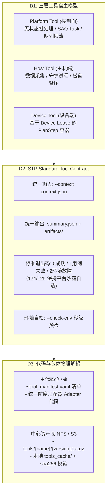

# ADR-0033：外部工具统一接入契约规范与包管理解耦模型（Tool-Kit Ecosystem Integration）

- 状态：**Accepted（v1.1）**
- 优先级：P1
- 目标里程碑：M7
- 日期：2026-09-03
- 决策者：平台研发组
- 标签：toolkit, adapter, anti-corruption, package-store, scripts, dedup, jira, #745, #735, #738
- 关联 Issue：[#745](https://github.com/DUElost/stability-test-platform/issues/745)（追踪 Epic）、[#735](https://github.com/DUElost/stability-test-platform/issues/735)（脚本膨胀治理）、[#738](https://github.com/DUElost/stability-test-platform/issues/738)（架构解耦与防腐）
- 背景分析：[`TOOLKIT_INTEGRATION_FEASIBILITY_2026-08-26.md`](../reviews/TOOLKIT_INTEGRATION_FEASIBILITY_2026-08-26.md)；设计方案：[`2026-09-external-tools-integration-and-package-architecture.md`](../design/2026-09-external-tools-integration-and-package-architecture.md)

---

## 1. 背景与问题定性

随着测试业务深入，平台需要持续接入大量异构的外部工具（原厂芯片商工具、厂商提单工具、自研专项压测工具）：
1. **控制面数据流工具**：MTK 汇总去重（`start_log_scan.py`）、展锐汇总去重（`Scan-Result-GT`）、多厂商 Jira 自动化提单（Transsion / Tinno / Moto）；
2. **主机端采集工具**：展锐 YPLog/Uniview 日志采集（`scan_log_gt.py`）、MTK 本地 AEE 扫描；
3. **设备端专项测试工具**：稳定性模块开关机测试（`powercycle_*`）、休眠唤醒测试（`sleep_*`）、GPU 专项压测（`gpu_*`，含 Antutu v10 依赖）、AIMonkey 等。

这些工具在**单机线下均已验证可独立运行**，但在接入 STP 平台时引发了严重的**代码腐化与技术债危机**：
- **源码直接拷贝膨胀**：依据 ADR-0020 脚本版本不可变原则，每次外部工具小修小补均全量复制代码树，导致 `backend/agent/scripts/` 累积 100 个版本、59,406 行代码（占全后端代码 27.43%），且历史版本的 Bug 被永久“冷冻”在代码库中；
- **平台主干充斥私有胶水代码**：服务层与控制面代码直接硬编码原厂特化参数（如 merge 清单文件协议、`-side` 产线参数、`Result_MergeFiles*` 产物目录命名探测），原厂工具微调容易引起平台主干震荡；
- **环境变量黑盒蔓延**：为适配不同工具的路径，代码中去重读取的环境变量已膨胀至约 190 个，但示例配置仅列出 29 个，运维配置负担极重；
- **职责宿主混杂**：Platform 层、Host 层与 Device 层工具执行上下文未物理隔离，缺少标准统一的防腐层（Anti-Corruption Layer, ACL）。

### 1.1 与 ADR-0032 的承接关系（非 supersede，行为 / 结构权威分家）
ADR-0032 已经终裁并落地了展锐与 MTK 并列日志链路（Watcher 实时采集 + 归档 dedup 路径分区），正式 supersede 了历史上的 #220（UNISOC Reconciler / Collector 已真实落地，`device.platform` 双轨分流生效）。
**ADR-0033 建立在 ADR-0032 已落地的多平台基础之上**：
- ADR-0032 解决了“展锐专属链路如何并列存在”的问题；
- ADR-0033 进一步解决“所有外部第三方原厂与专项工具如何通过统一协议（Tool Contract）和独立资产包（Package Store）标准化接入”，避免未来高通（QCOM）或新测试专项继续走“源码入仓全量拷贝”的老路。

| | ADR-0032 | ADR-0033 |
|---|---|---|
| 权威域 | **行为**：platform 路由、`dedup/{run}/{mtk,unisoc}/` 分区、按分区双 merge 循环、归档语义 | **结构**：工具如何打包分发、如何被调用、胶水收在哪 |
| 变更性质 | 已落地（v0.6），迁移期间持续有效 | Phase 3 存量归一是**重构而非行为变更**，验收 = watermark 语义、merge 产物发布中心路径、产物注册行为等价 |

- 现态事实：`run_merge_all_platforms_sync`（`backend/services/dedup_scan.py`）是**同一扫描工具按 mtk/unisoc 分区跑两遍**；展锐自有去重引擎（Scan-Result-GT，#463 P2）尚未接入——Phase 2 样板即「在 ADR-0032 已建的 per-platform merge 循环内，为 unisoc 分区加装第一个 `DedupMergeEngine` 实现」；
- 可行性评审（2026-08-26）要求「P1 采集 Agent 化必开 ADR 重议 #220」，该 ADR 即 ADR-0032；本 ADR 只覆盖其 P2 汇总去重形态；
- 落地本 ADR 时同步修订 `backend/agent/aee/CLAUDE.md` 的 #220 旧口径（「生产只扫 MTK」已失效）。

---

## 2. 决策（Decisions）

### D0：彻底阻断外部工具源码全量入仓（In-tree Code Freeze）
- **决议**：即日起，**严禁将外部第三方或专项工具的完整源码全量复制提交至主代码仓**（`backend/agent/scripts/` 不再新增任何未经解耦的全量外部工具目录）；
- 平台主代码仓只承载**工具元数据清单（Manifest）**以及**平台标准防腐适配器（Adapter）**；
- **分级准入（执行细则）**：新工具族必须以 Tool Contract + 包存储形态登记；既有工具族的新版本目录允许沿用 legacy argv 形态（保 ADR-0020 不可变、最小 diff 修复 Bug），直至该族在 Phase 3 完成契约化迁移——避免「修 Bug 也被迫先契约化」使本决议形同虚设。

### D1：确立严格的三层工具宿主分类与生命周期隔离
外部工具按执行载体严格划归为三类，禁止跨层混用执行协议：

| 宿主分类 | 典型工具 | 运行上下文与生命周期 | 约束与管控机制 |
|---|---|---|---|
| **Tier 1: Platform Tool**（控制面） | MTK/展锐 Merge 汇总去重、Jira 提单工具 | 跑在控制面容器/主机；由 SAQ Task 异步拉起；无状态批处理任务。 | 受 SAQ 任务超时限制；只读共享存储（NFS/CIFS），产物写入统一归档目录。 |
| **Tier 2: Host Tool**（主机端） | 展锐日志扫描（`scan_log_gt`）、AEE 扫描 | 跑在测试机 Host（Linux/WSL）；作为独立进程/守护进程执行。 | 依赖 Host Python/二进制；受 Host 磁盘背压（LocalDiskMonitor）与文件生命周期管控。 |
| **Tier 3: Device Tool**（设备端） | 开关机、休眠唤醒、GPU 压测、Monkey | 针对特定连接设备；作为 Plan 中的标准 `script:<name>` 步骤执行。 | 必须受单设备排他租约（Device Lease）制约；扩展 `models/script.py` 的 `support_files_manifest` 列语义支持外部 APK/资源包统一下发。 |

### D2：制定统一工具契约规范（STP Standard Tool Contract）
任何进入平台的外部工具，无论底层实现语言（Python / Shell / 二进制），必须通过极薄的适配器实现统一四要素契约：

1. **统一输入机制**：
   - 命令行调用签名统一为：`entrypoint --context <path/to/context.json> --output-dir <path/to/output_dir>`；
   - 彻底废止在平台主干中动态拼装特定原厂命令行的胶水逻辑；所有环境变量、设备信息、步骤自定义参数统一由平台序列化至 `context.json`；涉及机密凭据（如 Jira Token）按层隔离，禁止透传至设备端。
2. **统一产物与指标规范（双轨平滑衔接）**：
   - 工具执行完结前，必须在 `<output_dir>` 根目录生成结构化指标文件 `summary.json`；原始报告、日志收拢在 `<output_dir>/artifacts/`；
   - 平台 Agent `PipelineEngine` 与控制面执行器优先消费 `summary.json`；存量未改造脚本继续沿用 stdout JSON 解析，形成双轨平滑兼容。
3. **标准化退出码语义（Fail-Fast 区分）**：
   - `0`（Success）：任务正常执行，无异常；
   - `1`（Test Failure）：被测设备用例未通过（如稳定性跑出 Crash、开关机失败），属业务断言失败；
   - `2`（Environment / Tool Error）：工具自身执行异常（如 ADB 断开、原厂工具依赖缺失），触发平台重试或环境告警，杜绝误判为用例失败；
   - `124`（Wall Timeout）与 `125`（Stall Timeout）：由平台执行引擎双层钟机制强制杀死时由平台沙箱自造，工具自身不得伪造该退出码；
   - **命名空间分层**：工具作者只拥有 `{0, 1, 2}`；`≥124` 为平台执行器保留；`3–123` 与信号死亡视为工具缺陷，按环境类处理并告警。退出码 → 步骤终态映射（`failure_kind` 标注，不新增状态机终态）与双轨运行声明见设计文档 §2.5。
4. **强制环境自检契约（Pre-flight Check）**：
   - 工具必须实现 `--check-env` 开关，以**退出码 0（就绪）/ 2（环境故障）**为判定准则，标准输出提供诊断 JSON；
   - 挂点：Tier 3 设备端工具由 Agent 在步骤启动前调用（复用现有 precheck 槽位——ADB 连通性只有持有设备的主机可判）；Tier 1 平台工具由 SAQ 任务在长任务前自调；
   - 未就绪 → 步骤不启动、按 ENV_ERROR + `precheck_failed` 记录，不计入测试失败统计（Fail-Fast），杜绝长跑后因环境问题失败。

### D3：代码仓与工具资产包物理解耦（Manifest + Package Store）
- **工具包分发机制**：
  - 外部工具以独立压缩包（`{name}-{version}.tar.gz` 或 wheel）托管于中心存储 `{STP_AEE_NFS_ROOT}/tools/{name}/`（该目录作为权威存储布局在系统架构中补齐登记）；
  - Agent / 控制面启动或收到新任务时，按需将工具包拉取至本地缓存 `tools_cache/{name}/{version}/`，解压并核验 `sha256` 防篡改。
- **元数据清单（Manifest）**：
  - 主代码仓中仅保留 `tool_manifest.yaml`，定义工具名称、版本、适用架构、执行入口、超时及依赖配置；
  - **双版本体系权威裁定**：架构不变量保持一致——执行引擎仍以 `script:<name>` 作为调用标识，但 **DB script 目录（script catalog）仍是唯一运行时权威**；`tool_manifest.yaml` 是发布格式，注册时编译进 script 行（沿用 `capabilities.json` → scan → DB 的既有先例，#171），不是并存的第二套版本体系；
  - **升级工具包 = 新建 script 版本行**（`content_sha256 := tarball sha256`），保 ADR-0023 `plan_step.script_sha` 溯源；ADR-0020 不可变、422 与退役 409 守卫（`SCRIPT_STILL_REFERENCED`）原样复用，零新机制；
  - **CI 门禁分工**：PR 门禁（无 NFS 访问）只管 Git 侧——manifest schema lint + 已登记版本条目 append-only；tarball 存在性与 sha256 校验发生在注册时、Agent 拉取时与控制面周期健康巡检。

### D4：防腐适配器架构（Anti-Corruption Layer, ACL）
- 控制面与 Agent 核心调度只面向通用抽象接口编程（例如 `DedupMergeEngine` 接口仅负责封装 vendor CLI 的调用与返回解析，外围 round/waterline 调度仍由控制面统一管控）；
- 针对 MTK、展锐、各 Jira 厂商的特化逻辑严格收敛在对应的 `adapters/` 子模块内部，任何原厂私有字段格式变更只影响适配器，绝不震荡平台主干。

---

## 3. 备选方案与权衡

- **包分发载体**：git submodule（弃——外部二进制 / APK 不适合进 Git，权限模型差）；私有 PyPI / wheel（弃——Shell 与原厂二进制工具装不进 Python 包）；NFS tar.gz + sha256（取——语言中立、复用中心存储与既有挂载）。
- **版本权威**：manifest 独立成第二套权威体系（弃——422 不可变 / 409 退役守卫 / sha 溯源全部要重造一遍）；DB script catalog 唯一权威 + manifest 仅作发布格式（取——零新机制，见 D3）。
- **契约翻译位置**：控制面集中翻译（弃——Job/PlanRun 状态机与四层调度全部感知契约，震荡面大）；Agent 边缘翻译（取——控制面零改动，双轨可按 script 行灰度）。

## 4. 实施阶段规划（对齐 Issue #745）

- **Phase 1（近期·止血与标准）**：固化本文档与详细实施设计；阻断主仓新脚本源码拷入；执行 Issue #735（含先修复退役诊断工具自身崩溃）退役 47 个历史零引用活跃版本；
- **Phase 2（中期·标杆样板打样）**：
  - 控制面样板：在 ADR-0032 已建的 per-platform merge 循环内，为 unisoc 分区接入第一个 `DedupMergeEngine` 实现（展锐 `Scan-Result-GT`，#463 P2）；
  - 设备端样板：GPU / 开关机 / 休眠唤醒（#462）按照统一 Tool Contract 模板化接入（依赖工具包缓存机制就绪，排期见设计文档 §5）；
  - 实现工具包本地校验解压缓存机制；
- **Phase 3（远期·存量归一）**：存量 MTK 扫描与 Jira 提单迁移至适配器体系（重构而非行为变更，验收 = 与 ADR-0032 行为等价）；在 Web 管理面暴露外部工具管理面板。
