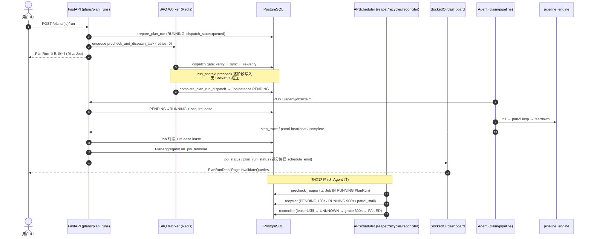

# 稳定性测试平台 — 主功能链路脆弱性专项分析

> 生成日期：2026-05-23  
> 审查方式：只读代码追踪 + 测试覆盖对照 + 主链路 grep  
> 关联：`docs/production-readiness-assessment-2026-05-23.md`、ADR-0020/0021/0022、ADR-0019

**主链路定义**（本次分析边界）：

```
Plan 创建/编辑 → POST /plans/{id}/run → PlanRun 创建
→ 派发门禁 precheck (dispatch gate) → JobInstance PENDING
→ Agent claim → RUNNING → pipeline_engine (init/patrol/teardown)
→ step_trace / patrol-heartbeat / log-signals
→ Job 终态 → PlanRun aggregator → UI (PlanRunDetailPage + SocketIO invalidation)
```

旁路但纳入：**设备 lease**、热更新 abort、手动 retry/exit、Plan 链 `next_plan`。

---

## 1. 主链路一张图



**CHAIN / SCHEDULE 路径**：`dispatch_plan_sync` 已 inline 走 dispatch gate（verify → sync → dispatch）；MANUAL 仍经 SAQ `precheck_and_dispatch`（`plan_dispatcher_sync.py:610-644`）。

---

## 2. 脆弱点清单（按链路阶段分组）

### 2.1 Plan 创建 / 编辑

| 现象 | 根因 | 严重度 | 现有缓解 | 建议加固 | 测试 |
|------|------|--------|----------|----------|------|
| Plan 保存成功但执行时报脚本不可用 | prepare 与 complete 之间存在脚本失活窗口；complete 内部写 FAILED 不 raise | 中 | ADR-0023 两阶段校验 + audit | **S**：prepare 时锁脚本版本或 complete 失败时显式 SocketIO 终态推送 | `test_plan_precheck.py::test_complete_failed_overrides_default_dispatch_state` ✅ |
| WiFi 步骤静默缺参 | ~~`AllocationError` 仅 warning 跳过~~ → 分配失败时 PlanRun FAILED + audit | 中 | `plan_dispatcher_sync.py` hard fail | — | `test_plan_dispatcher.py` wifi 失败路径 ✅ |
| Plan 链配置环/自引用 | `_validate_plan_dag` 422 拦截 | 低 | API 校验 | — | `test_plans_api.py::test_next_plan_self_reference_rejected` ✅ |

### 2.2 POST /plans/{id}/run → PlanRun 创建

| 现象 | 根因 | 严重度 | 现有缓解 | 建议加固 | 测试 |
|------|------|--------|----------|----------|------|
| 点击执行后长期 RUNNING、设备矩阵空 | `enqueue_sync` 在 SAQ 未启动时 **静默 drop**（`saq_worker.py:151-153`）；任务 `retries=0` | **高** | `precheck_reaper` 90s 后 re-enqueue 1 次 | **S**：enqueue 失败时 API 返回 503 或同步降级跑 gate；启动期校验 Redis+SAQ | `test_saq_tasks.py::test_enqueue_sync_drops_when_not_running` ✅（仅断言 drop） |
| 派发「卡住」90s~数分钟 | reaper 阈值 `PRECHECK_QUEUE_STALE_SECONDS=90`；active worker 丢失需 180s | 中 | reaper + MAX_REENQUEUE=1 | **S**：缩短 stale 阈值或 enqueue 时写 metric/audit | `test_precheck_reaper.py` ✅ |
| 用户感觉「已执行但什么都没发生」 | API 同步返回 RUNNING，Job 尚未物化；UI 依赖 10s 轮询读 `run_context` | 中 | 10s refetch + DispatchGateCard | **M**：precheck 阶段 SocketIO 推送或 3s 轮询 | `PlanRunDetailPage.test.tsx` mock ✅ |

### 2.3 派发门禁 (dispatch gate / precheck)

| 现象 | 根因 | 严重度 | 现有缓解 | 建议加固 | 测试 |
|------|------|--------|----------|----------|------|
| Agent 离线即整 PlanRun FAILED | `_gather_verify` → `agent_offline` 直接 `_mark_precheck_failed` | 中 | 明确错误写入 precheck.errors | **S**：UI 展示 host 级 offline 原因（已有数据） | `test_plan_precheck.py` mock RPC ✅ |
| 脚本 sync 一次失败即终态 | `sync_attempts` 设计上 cap=1；lightweight 失败 fallback 全量 hot-update | 中 | hot-update 路径 | **M**：可配置重试或人工「重试派发」按钮 | 部分 mock ✅ |
| precheck 进度 UI 不实时 | `_persist_precheck` **无** `broadcast_*` / `schedule_emit` | **高** | 10s HTTP 轮询 | **S**：每次 phase 变更 push `plan_run_status` 或专用 `precheck_update` | ❌ 无 push 测试 |
| verify RPC 异常被吞为 failed | `asyncio.gather(..., return_exceptions=True)` → `verify_exception` | 中 | 错误写入 host_state | **S**：区分 transient vs terminal | `test_plan_precheck.py` ✅ |
| SAQ 任务未捕获异常 | `_drive_dispatch_gate` except 写 FAILED 后 **re-raise**；外层 retries=0 | 中 | reaper 补偿 | **S**：SAQ retries≥1 或 reaper 覆盖 started_at 场景 | 部分 ✅ |

### 2.4 JobInstance PENDING → Agent claim

| 现象 | 根因 | 严重度 | 现有缓解 | 建议加固 | 测试 |
|------|------|--------|----------|----------|------|
| Job 永久 PENDING 后变 FAILED | `DISPATCHED_TIMEOUT_SECONDS=120` recycler | 中 | recycler + SocketIO FAILED | **S**：UI 可见「认领 SLA 剩余」（tooltip 已有；矩阵列/chip 仍缺） | `test_recycler.py` ✅ |
| 设备 BUSY 无法接新 Job | 过期 grace 内 ACTIVE lease 仍占 claim 槽位（`agent_api.py:257-259`） | **高** | reconciler 300s grace 后释放 | **M**：UI 展示 `grace_remaining_seconds` / `busy_reason`（UNKNOWN tooltip 已有；秒级倒计时与 BUSY 来源仍缺） | `test_session_lease.py` 部分 ✅ |
| claim 静默跳过 | `acquire_lease` 失败 `continue`，无 Job 级错误 | 中 | `stability_claim_lease_failed_total` 已计数 | **S**：Host 页「设备被 lease 阻塞」提示 | `test_agent_dual_write.py` metric ✅ / Host UI ❌ |
| 设备 adb 过滤误伤 | claim 排除 `adb_connected=False` / OFFLINE（`agent_api.py:247-253`） | 中 | Agent 心跳更新 adb 字段 | **S**：Host 页展示「因 adb 被排除」 | ❌ 无专项 |
| orphan device 仍建 Job | `device_host_map.get` 为 None 仅 warning（`plan_dispatcher_sync.py:365-369`） | 中 | Job host_id=null | **M**：prepare 阶段拒绝 orphan | `test_plan_dispatcher.py` ✅ warning 路径 |
| ~~CHAIN 跳过 precheck~~ | `dispatch_plan_sync` 已 inline gate（CHAIN/SCHEDULE） | — | `test_main_chain_happy_path.py` gate 路径 | — | 集成 ✅ / Plan 链 E2E ❌ |

### 2.5 pipeline_engine (init / patrol / teardown)

| 现象 | 根因 | 严重度 | 现有缓解 | 建议加固 | 测试 |
|------|------|--------|----------|----------|------|
| Agent 进程挂掉 Job 假 RUNNING | `RUNNING_HEARTBEAT_TIMEOUT_SECONDS=900` 才 → UNKNOWN | **高** | `job_timeout_config.py` 分级框架（生产 patrol 默认仍 900s） | **M**：确认生产 patrol 默认值 + grace 秒级 UI | `test_recycler.py` patrol_stall ✅ |
| patrol heartbeat 409 后 Agent 不主动停 | ~~agent 端仅 log~~ → `patrol_recovery.py` 触发 recovery/sync | 中 | `JOB_NOT_RUNNING` sentinel + callback | — | `test_patrol_heartbeat_uploader.py` ✅ |
| complete 依赖 outbox 重试 | Agent `OutboxDrainThread` 异步补发 | 中 | 幂等 complete + idempotent terminal | **S**：监控 outbox 积压 | `test_agent_dual_write.py` ✅ |
| teardown 部分失败仍 COMPLETED | DEGRADED 计 success（`pipeline_engine.py:1750-1756`） | 低 | metadata.teardown_status | — | `test_pipeline_engine_patrol.py` 部分 ✅ |
| Watcher 默认关闭 | `STP_WATCHER_ENABLED=false`（`agent/main.py:64`） | 低（主链可跑） | log-signals 可选 | P1 生产评估 | `test_job_session_e2e.py` ✅ mock |

### 2.6 step_trace / patrol-heartbeat / log-signals

| 现象 | 根因 | 严重度 | 现有缓解 | 建议加固 | 测试 |
|------|------|--------|----------|----------|------|
| 步骤状态 UI 延迟 | step_trace 批量上报后 broadcast（`agent_api.py:526-535`）；依赖 SocketIO | 中 | 10s 轮询 | 见 UI 节 | `test_agent_routes.py` ✅ |
| patrol 计数与 UI 不一致 | patrol-heartbeat **不写** step_trace（设计如此） | 低 | devices 端点读 Job 列 | **S**：文档化；UI 已读 patrol 字段 | `test_plan_run_aggregation_endpoints.py` ✅ |
| recycler patrol_stall 与 heartbeat race | CAS `last_patrol_heartbeat_at` guard | 中 | 原子 UPDATE | — | `test_recycler.py` 多 case ✅ |

### 2.7 Job 终态 → PlanRun aggregator

| 现象 | 根因 | 严重度 | 现有缓解 | 建议加固 | 测试 |
|------|------|--------|----------|----------|------|
| PlanRun 永不终态 | 需 **全部** Job terminal（含 UNKNOWN）；任一 RUNNING 则卡住 | **高** | recycler + reconciler Eventually | **M**：PlanRun 级「卡住检测」banner（有 RUNNING/UNKNOWN 超时） | `test_plan_run_aggregation_shared.py` ✅ |
| 聚合失败被吞 | recycler except 仍 warning 但已写 audit + `stability_plan_run_aggregation_failed_total`（`recycler.py:268-281`）；`aggregator_sync.py` 本身无 metric | 中 | 下轮 Job 已终态可重试 | **S**：AlertManager 规则（metric 已有，告警仍缺） | metric+audit ✅ / 告警 ❌ |
| Plan 链下一段未触发 | `next_plan_triggered=true` **先于** dispatch commit（`plan_chain_trigger.py:112-120`）；dispatch 失败仅 error log | **高** | 无自动回滚 | **M**：dispatch 失败回滚 triggered 或 SAQ 重试 | ❌ **无** chain trigger 测试 |
| post_completion 丢失 | enqueue 失败 warning（`agent_api.py:860-861`） | 低 | 主链不依赖 post_completion | P2 | `test_saq_tasks.py` ✅ |

### 2.8 UI (PlanRunDetailPage + SocketIO)

| 现象 | 根因 | 严重度 | 现有缓解 | 建议加固 | 测试 |
|------|------|--------|----------|----------|------|
| DB 已更新 UI 不动 | 生产 Nginx 缺 `/socket.io/`；`API_BASE_URL` 指向 :8000（`config/index.ts:8-11`） | **高** | 10s polling 兜底 | **S**：同源 SocketIO（与 prod readiness P0#1 一致） | `PlanRunDetailPage.test.tsx` mock ✅ |
| precheck 阶段无 Socket 事件 | `JOB_STATUS` invalidation 不含 `plan-run` query（`PlanRunDetailPage.tsx:115-118`） | 中 | runQ 10s 轮询 | **S**：precheck push 或 invalidate plan-run | 见上 |
| 终态后仍连 Socket | `enabled: !!id && !isTerminal` 正确断开 | 低 | — | — | ✅ |
| 导出报告占位 | toast「功能开发中」 | 低 | 后端已有 export | P1 | — |

### 2.9 旁路：lease / 热更新 / manual retry / Plan 链

| 现象 | 根因 | 严重度 | 现有缓解 | 建议加固 | 测试 |
|------|------|--------|----------|----------|------|
| 设备 BUSY 泄漏最长 ~20min | RUNNING 900s → UNKNOWN + lease 保持 + grace 300s → FAILED | **高** | reconciler | **M**：UI「grace 剩余 Xs」+ `busy_reason`（UNKNOWN tooltip 已有） | reconciler tests ✅ |
| 热更新 409 | 有 Job 时拒绝；C6 dialog abort 路径 | 中 | HostHotUpdateConfirmDialog | — | Vitest ✅ |
| manual retry/exit | patrol 退避态 API | 中 | DeviceDetailDrawer | — | `test_manual_retry_exit_api.py` ✅ |
| abort PlanRun | abort reaper grace 60s | 中 | PlanRunTopbar | — | `test_plan_run_abort_api.py` ✅ |

---

## 3. P0 主功能加固（上线前必做，≤5 项）

1. **消除 SAQ enqueue 静默丢失（主链路单点）**  
   `POST /plans/{id}/run` 在 `enqueue_sync` 失败时必须 **显式失败**（503 + 可读 detail）或 **同步执行** `_drive_dispatch_gate`，避免 PlanRun 长期「空 RUNNING」。  
   依据：`saq_worker.py:151-153`、`plans.py:541-547`。

2. **派发门禁进度可感知**  
   precheck / `dispatch_state` 每次 phase 变更推送 SocketIO（或 PlanRunDetailPage 在 gate 阶段 **3s 轮询** + 超时 banner）。  
   依据：`plan_precheck.py` 无 broadcast；用户「感官脆弱」首要来源。

3. **Plan 链静默断链修复**  
   `trigger_next_plan_sync` 在 `dispatch_plan_sync` 失败时 **回滚 `next_plan_triggered`** 或写入 `result_summary.chain_dispatch_failed` 并告警。  
   依据：`plan_chain_trigger.py:136-150` 仅 `logger.error`。

4. **生产环境 SocketIO 可达（主链路 UI 闭环）**  
   Nginx `/socket.io/` + 同源 `VITE_API_BASE_URL`；否则 Job/PlanRun 状态依赖 10s 轮询，操作 manual retry/abort 后体验「卡顿」。  
   与 `production-readiness-assessment` P0#1 重合，**属主链路而非纯运维**。

5. **上线前强制执行一次真实 smoke** — **已落地 2026-05-25**（代码/CI/部署文档）  
   `seed_and_smoke.py` 已写入 `docs/preprod-drill-runbook.md` §4.0 与 `docs/production-minimum-deployment-checklist.md` §5.0。  
   CI：`backend-test` → `main-chain-integration-smoke`（`test_main_chain_happy_path.py` + `test_seed_and_smoke.py`）；可选 `smoke-nightly` workflow（`workflow_dispatch` + 有密钥时真实设备 job）。真实设备 E2E **不**在默认 PR CI 跑，预发布须人工勾选 smoke。  
   **注**：预发布真实设备 smoke 的**实际执行记录**（签字表/归档）无法仅凭仓库确认，须运维侧留存。

---

## 4. P1 主功能加固（短期）

> **复查结论（2026-05-25 勘误）**：7 项中 **明确完成 3 项**（#3 CHAIN/SCHEDULE gate、#4 WiFi hard fail、#6 JOB_NOT_RUNNING→recovery）；**部分完成 3 项**（#1 timeout 分级框架、#2 UNKNOWN/PENDING tooltip、#7 claim_lease_failed metric）；**#5 聚合失败 metric** 已在 recycler 侧落地（`stability_plan_run_aggregation_failed_total` + audit），但无 `aggregator_sync` 命名 metric、AlertManager 告警仍缺。不宜表述为「约半数完成」，应写：**已有多项完成，另有多项仅部分完成**。

| # | 项 | 工作量 | 复查状态 |
|---|-----|--------|----------|
| 1 | 缩短或分级 RUNNING/recycler timeout（patrol 场景 vs 长任务） | M | 部分 ✅ — `job_timeout_config.py` 框架已有；生产 patrol 默认仍 900s |
| 2 | UI 展示 UNKNOWN / grace / PENDING 等待原因（devices 矩阵 + 设备 BUSY 来源） | M | 部分 ✅ — PENDING 120s SLA tooltip、UNKNOWN/grace 提示（`DeviceMatrixCard.tsx`）；缺 `grace_remaining_seconds` / `busy_reason` API 字段与可见倒计时 |
| 3 | CHAIN/SCHEDULE 派发统一走 precheck 或 minimum verify | M | ✅ — `dispatch_plan_sync` inline gate |
| 4 | WiFi 分配失败改为 hard fail，避免 init 阶段迷惑性失败 | S | ✅ — `AllocationError` → PlanRun FAILED + audit |
| 5 | `plan_aggregator_sync` 失败 metric + 告警（防 PlanRun 悬挂） | S | 部分 ✅ — recycler 侧 `stability_plan_run_aggregation_failed_total` + audit；告警规则仍缺 |
| 6 | Agent patrol-heartbeat 消费 `JOB_NOT_RUNNING` → 触发 `/agent/recovery/sync` | S | ✅ — `patrol_recovery.py` |
| 7 | claim lease 失败计数 + Host 页「设备被 lease 阻塞」提示 | S | 部分 ✅ — `stability_claim_lease_failed_total`；Host 页提示仍缺 |

---

## 5. 建议增加的主链路测试 / E2E

| 场景 | 类型 | 现状 |
|------|------|------|
| **Happy path**：Plan run → precheck mock 通过 → Job claim → complete → PlanRun SUCCESS | Backend integration | ✅ `test_main_chain_happy_path.py`（gate + 聚合 + `/plans/run`）；Agent HTTP claim 见 `test_agent_dual_write.py`；真实设备见 `seed_and_smoke.py` |
| **SAQ 不可用**：enqueue drop → API 应失败或 reaper 在 SLA 内恢复 | API + scheduler | 仅 drop 单测 |
| **precheck agent_offline → FAILED** + UI precheck.errors 展示 | API + Vitest | backend ✅ / frontend 部分 |
| **PENDING 120s timeout → FAILED** + lease 释放 + SocketIO | scheduler + PG | recycler ✅ |
| **RUNNING → UNKNOWN → grace → FAILED** + PlanRun DEGRADED | scheduler 链 | reconciler ✅ / 无 PlanRun 级断言 |
| **patrol_stall** + manual_retry → RUNNING 恢复 | API + agent mock | API ✅ / 无 agent 集成 |
| **Plan 链**：父 SUCCESS → 子 PlanRun 创建；dispatch 失败 → triggered 回滚 | service | 单元 ✅ `test_plan_chain_trigger.py` / **全链路 E2E 仍缺**（T-B10） |
| **complete 幂等**：重复 complete 不 409 循环 | API | ✅ `test_agent_routes.py` |
| **PlanRunDetailPage**：SocketIO job_status / plan_run_status invalidation 范围 | Vitest | ✅ mock |
| **生产同源 SocketIO**：E2E 连 Nginx 443 收 push | E2E | ❌ |
| **pipeline init→patrol→teardown**（真实脚本 subprocess） | Agent | 单元 mock 为主 |

**推荐最小 CI 增量**：✅ 已实施 — `ci.yml` 的 `main-chain-integration-smoke` + `.github/workflows/smoke-nightly.yml`（集成 smoke 必跑；真实 `seed_and_smoke.py` 仅在有 `STP_ADMIN_PASSWORD` 等密钥时可选 job）。

---

## 6. 与 `production-readiness-assessment-2026-05-23.md` 的关系

| production-readiness 项 | 分类 | 主链路优先级建议 |
|-------------------------|------|------------------|
| P0#1 Nginx `/socket.io/` | 直接阻断 UI 实时刷新 | **与本文 P0#4 合并，主链路优先** |
| P0#2 HTTPS + Cookie env | 安全 | 上线必须，但不影响「能跑测试」；与主链路并行 |
| P0#3 alembic head | 数据 | 必须；logout 无关主链 |
| P0#4 login 死循环 fix | 安全/入口 | **先于任何 Plan 执行**（进不了详情页） |
| P0#5 JWT/AGENT_SECRET | 安全 | Agent claim 依赖 AGENT_SECRET；**主链路 P0** |
| P0#6 单实例 backend | 架构 | 调度/recycler 假设单进程；暂可文档化 |
| P0#7 读 API 鉴权 | 安全 | 内网 MVP 可暂缓；**低于**派发/执行稳定性 |
| P0#8 关闭 register | 安全 | 可暂缓（内网） |
| P0#9 env 模板文档 | 运维 | 可暂缓 |
| P1 AlertManager / Loki / 备份 | 可观测/灾备 | **低于**本文 P0#1–#5 |
| P1 导出报告 UI | 功能完善 | 低于主链执行 |

**结论**：运维向 P0（HTTPS 模板、AlertManager、备份）多数 **可暂缓**；与主链路重叠的 **login fix、AGENT_SECRET、Redis/SAQ、SocketIO 同源、smoke 验收** 应 **优先于** AlertManager/Loki/备份。用户「感官脆弱」主要来自：**派发异步无反馈、SocketIO 生产不可用、Job 长时间 RUNNING/UNKNOWN、Plan 链静默失败、设备 BUSY 长 grace**。

---

## 附录：grep 摘要（主链路相关）

| 模式 | 命中摘要 |
|------|----------|
| `TODO/FIXME` | `watcher/manager.py:409` CATCHUP（Watcher 灰度，非主链默认路径） |
| `except pass` | `pipeline_engine.py:1810-1812` 日志目录创建（非状态机） |
| `grace` | lease UNKNOWN 300s、abort 60s、complete recovery 300s — 主链补偿核心 |
| `409` | fencing_token / JOB_NOT_RUNNING / claim 冲突 — Agent 重试与 LeaseRenewer 联动 |
| `WARN` | recycler 聚合失败、post_completion enqueue 失败、wifi 跳过 — 多属静默降级 |
| `rollback` | claim 空结果 `rollback` 释放 host 锁（`agent_api.py:330-334`）✅ |

---

## 3. P0 完成注记

| P0# | 状态 | 日期 |
|-----|------|------|
| #5 smoke + CI E2E | 已落地（代码/CI/文档） | 2026-05-25 |

**复查总结（勘误后）**：P0 5 项的代码/CI/部署文档已全部落地；但预发布真实设备 smoke 的实际执行记录无法仅凭仓库确认。P1 与 §2 建议中，已有若干项完成，另有若干项仅部分完成；仍待收口的重点包括生产 patrol 默认值、grace/BUSY 显示、outbox 监控、生产 SocketIO 真实 E2E 和部分集成断言。

---

*审查人：只读分析子任务 | P0#5 smoke/CI 于 2026-05-25 落地 | 剩余工作实施计划见 [main-chain-remaining-work-implementation-plan-2026-05-25.md](./main-chain-remaining-work-implementation-plan-2026-05-25.md)*
