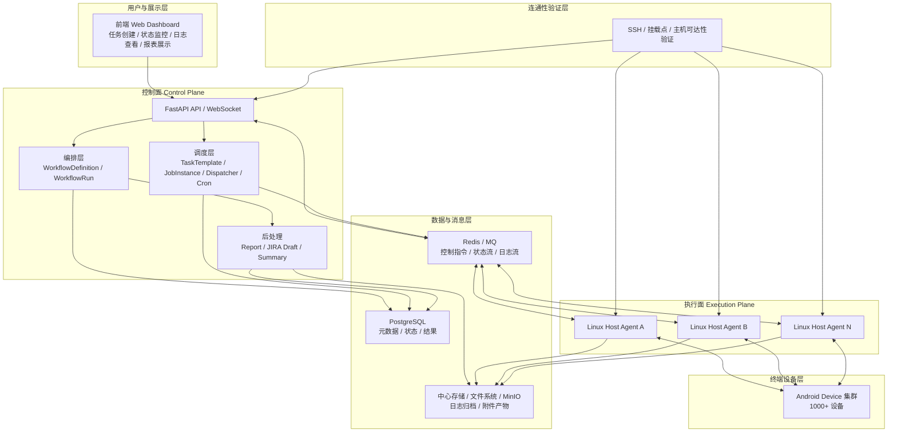
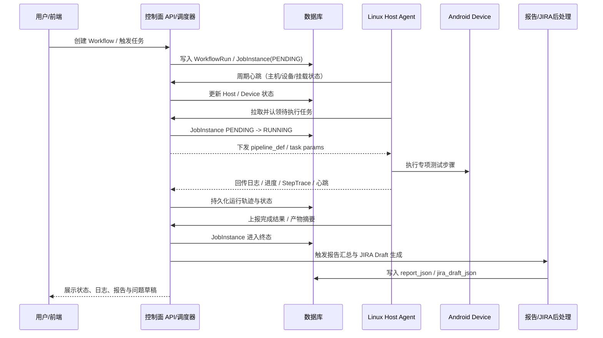
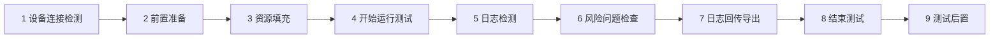
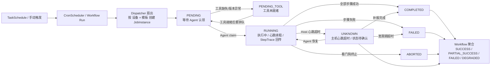

# 创新项目申报附件图示（正式版）

## 1. 平台总体架构图

## 2. 控制面与 Agent 协同流程图

## 3. 稳定性专项测试标准流程图

## 4. 任务调度与状态流转图

## 5. 图示说明

- 平台总体架构图用于展示“控制面 + 执行面 Agent + 连通性验证层 + 数据层”的整体协同关系。
- 控制面与 Agent 协同流程图用于展示从任务创建、心跳上报、任务认领、执行回传到报告/JIRA 后处理的闭环。
- 稳定性专项测试标准流程图严格对应项目既有九阶段标准流程，可直接用于申报附件或汇报材料。
- 任务调度与状态流转图用于展示从计划触发、任务扇出、Agent 认领到 Job 状态迁移和 Workflow 聚合判定的完整链路。
