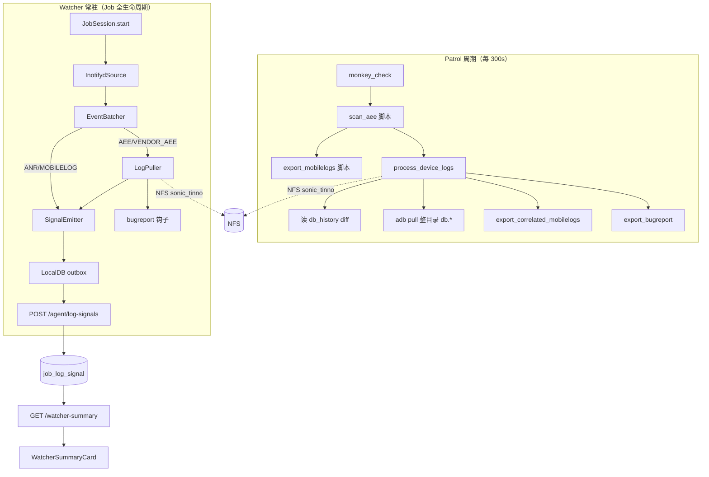
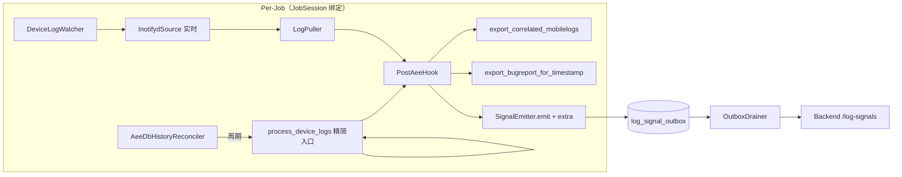

# Watcher 收编 scan_aee / export_mobilelogs 方案

> 日期：2026-05-27  
> 状态：方案（未实施）  
> 背景：D1 已落地 `backend/agent/aee/`、`scan_aee`/`export_mobilelogs` patrol 脚本、Watcher LogPuller sonic 路径、`POST /agent/log-signals`、`GET /plan-runs/{id}/watcher-summary`、前端 `WatcherSummaryCard`。  
> 目标：将 AEE 增量拉取与 mobilelog 关联收进 Watcher 常驻链路，patrol 仅保留 `monkey_check`；平台端可聚合展示 Crash/ANR 数量与涉及应用。

---

## 0. 结论

**合适，需条件。**

| 维度 | 判断 |
|------|------|
| 架构方向 | ✅ 与 ADR-0018 Watcher「设备侧报错文件探测器 + log_signal 权威流」一致；patrol 周期脚本与 Watcher 实时/常驻职责重叠，收编合理 |
| 代码复用 | ✅ `aee/processor.py`、`mobilelog.py`、`bugreport.py`、`paths.py` 已与 patrol 脚本共享；Watcher Puller 已接 sonic 布局 + bugreport 钩子 |
| 平台聚合 | ✅ `job_log_signal` 表、`watcher-summary` 端点、`watcher_signal` SocketIO、`WatcherSummaryCard` 已存在，扩展 `extra` + 聚合 SQL 即可 |
| 前置缺口 | ⚠️ **db_history 周期 reconciler 尚未接入 Watcher**；**mobilelog 时间窗关联未在 Puller/Reconciler 路径触发**；**polling 能力探测存在但无 PollingSource 实现** |
| 迁移风险 | ⚠️ 双路径并行期需去重；Watcher 未启用主机需显式 gate；inotifyd 拉单文件 vs scan_aee 拉整目录存在语义差异 |

**启用条件（全部满足后再关 patrol 步骤）：**

1. Monkey AEE 类 Plan 默认 `STP_WATCHER_PLAN_DEFAULT=true` 且 Agent 已热更新至含 reconciler 的版本  
2. `AeeDbHistoryReconciler` 在 Job 生命周期内按配置间隔运行，与 inotifyd 事件经 dedup key 去重  
3. AEE 事件成功后触发 `export_correlated_mobilelogs`（与现 `export_mobilelogs` 脚本等价）  
4. `log_signal.extra` 携带 `package_name` / `event_type` / `aee_ts` / `nfs_path`，后端聚合与前端展示验收通过  
5. 双写期（≥1 个完整 PlanRun 周期）对账：Watcher 信号数 ≥ patrol 脚本 `pulled` 计数，无大面积漏采  

---

## 1. 现状与差距

### 1.1 两条并行链路



### 1.2 能力对照

| 能力 | patrol `scan_aee` | Watcher 现状 | 收编后 |
|------|-------------------|--------------|--------|
| 检测方式 | 周期读 `db_history` | inotifyd 文件事件 | inotifyd **+** 周期 db_history reconciler |
| AEE 拉取粒度 | 整目录 `db.*` | 单文件 `adb pull` | reconciler 走目录 pull；inotifyd 保持单文件（或统一为目录 pull） |
| mobilelog 关联 | pull 成功后按 AEE 时间戳 | ❌ 未做 | reconciler / pull-done 钩子调用 `export_correlated_mobilelogs` |
| bugreport | ✅ | ✅ Puller `_maybe_export_bugreport` | 保持；cooldown 参数对齐 `ProcessConfig` |
| package / event_type | db_history 解析 | ❌ 仅 filename | 写入 `log_signal.extra` |
| 平台可见性 | step_trace metrics（弱） | log_signal + watcher-summary | 扩展聚合 + UI |
| Agent 重启恢复 | ScriptStateStore | outbox drainer + watcher_state（reconcile stub） | reconciler 状态与 db_history processed 共用 LocalDB |

### 1.3 关键代码锚点

| 模块 | 路径 | 说明 |
|------|------|------|
| AEE 处理器 | `backend/agent/aee/processor.py` | `process_device_logs` — patrol 与 Watcher reconciler 共用 |
| Watcher 管理 | `backend/agent/watcher/manager.py` | 启动 DeviceLogWatcher + LogPuller；`reconcile_on_startup` 仍为 stub |
| Puller | `backend/agent/watcher/puller.py` | AEE 单文件 pull + sonic 路径 + bugreport |
| 契约 | `backend/agent/watcher/contracts.py` | `LogSignalEnvelope`；`extra` 已预留 |
| 入库 | `backend/api/routes/agent_api.py` | `ingest_log_signals` + `broadcast_watcher_signal` |
| 聚合 | `backend/api/routes/plan_runs.py` | `get_plan_run_watcher_summary` — 按 category 计数 |
| 前端 | `frontend/src/components/plan-run/WatcherSummaryCard.tsx` | 分类条数 + 趋势 + 阈值 |
| Pipeline 模板 | `backend/schemas/pipeline_templates/monkey_aee_*.json` | patrol 含 scan_aee + export_mobilelogs |

---

## 2. 目标架构

### 2.1 Agent 侧



**组件职责：**

| 组件 | 职责 | 新增/改造 |
|------|------|-----------|
| `DeviceLogWatcher` | 现有 inotifyd → batcher → puller → emit | 改造：pull-done / emit 时填充 `extra` |
| `AeeDbHistoryReconciler` | 后台 daemon 线程，间隔 `WATCHER_AEE_RECONCILE_INTERVAL_SECONDS`（默认 60）调用 `process_device_logs` 或薄封装 | **新增** |
| `PostAeeHook` | AEE 新事件统一后处理：mobilelog + bugreport + emit | **新增**（从 processor 与 Puller 抽共用） |
| `DedupStore` | LocalDB key：`aee:dedup:{job_id}:{db_history_line_hash}` 或 `{nfs_dir}` | **新增** |
| patrol | 仅 `monkey_check` | **降级/删除** scan_aee、export_mobilelogs 步骤 |

**Reconciler 与 inotifyd 分工：**

- **inotifyd**：低延迟感知新文件；适合 crash 现场尽快 pull + 上送  
- **db_history reconciler**：补漏（Agent 重启、inotifyd 不可用、polling 未实现、目录级 pull 与单文件 pull 差异）  
- **去重**：以 `db_history` 行内容或 `(aee_ts, package_name, db_path)` 为幂等键；inotifyd 路径若能映射到 db_history 行则合并为一条 signal  

**去掉 patrol 脚本的路径：**

1. **Phase A（双写）**：patrol 保留 scan_aee/export_mobilelogs，Watcher 启用 reconciler；后端 / UI 以 Watcher 为准，patrol metrics 仅对账  
2. **Phase B（降级）**：模板去掉两步骤；patrol 仅 monkey_check；Plan 编辑 UI 不再展示 AEE 步骤  
3. **Phase C（清理）**：脚本 `is_active=false`；删除模板引用；保留 `backend/agent/aee/` 库供 Watcher 使用  

### 2.2 数据模型

**决策：扩展现有 `job_log_signal`，不新建事件表。**

理由：

- `JobLogSignal.extra`（JSONB）已存在且 API 已透传  
- `watcher-summary` / SocketIO / DeviceMatrix `log_signal_count` 已围绕该表  
- 新表会增加 join 与 drainer 复杂度，YAGNI  

**category（保持现有枚举，不新增顶层 category）：**

| category | 含义 | crash/anr 归类 |
|----------|------|----------------|
| `AEE` | 主进程 AEE | `extra.event_type` 含 CRASH → crash_count |
| `VENDOR_AEE` | 厂商 AEE | 同上，可单独计数或并入 crash |
| `ANR` | `/data/anr` 新文件 | anr_count |
| `MOBILELOG` | mobilelog 目录异常文件 | 不计入 crash/anr（辅助） |

**`extra` 字段设计（建议 schema version 1）：**

```json
{
  "schema_version": 1,
  "event_type": "CRASH",
  "package_name": "com.example.app",
  "aee_ts": "2026-05-27T10:15:22.123+00:00",
  "nfs_path": "/mnt/.../sonic_tinno/X6851.../SERIAL/aee_exp/20260527_101522_db.01",
  "db_history_line": "<optional 审计>",
  "pull_source": "inotifyd",
  "mobilelog_pulled": 3,
  "bugreport_exported": true
}
```

| 字段 | 类型 | 必填 | 说明 |
|------|------|------|------|
| `schema_version` | int | 是 | 演进兼容 |
| `event_type` | string | 否 | db_history 第 2 列：CRASH / ANR / … |
| `package_name` | string | 否 | db_history 解析；inotifyd 路径可后填 reconciler |
| `aee_ts` | ISO8601 | 否 | 设备侧 crash 时间 |
| `nfs_path` | string | 否 | sonic 落盘目录或 artifact_uri 父目录 |
| `pull_source` | enum | 否 | `inotifyd` \| `db_history` \| `reconciler` |
| `mobilelog_pulled` | int | 否 | 关联 mobilelog 文件数 |
| `bugreport_exported` | bool | 否 | 是否触发 bugreport |

**索引（可选 Phase 2）：**

- 若按 package 聚合慢，可加 GIN：`CREATE INDEX idx_job_log_signal_extra_pkg ON job_log_signal USING gin ((extra->'package_name'));`  
- 首期数据量下窗口聚合 + 内存 distinct 足够  

**不做的数据模型变更：**

- 不新增 `aee_event` 表  
- 不改 `(job_id, seq_no)` 幂等键  
- `JobArtifact` 保持独立（aee_crash / bugreport 下载入口不变）  

### 2.3 后端 API

**推荐：扩展 `GET /plan-runs/{id}/watcher-summary`，不新增 `/aee-summary`。**

原因：前端已接 SocketIO invalidation → refetch watcher-summary；减少端点分裂。

**`WatcherSummaryOut` 扩展字段：**

```python
class AeeBreakdownOut(BaseModel):
    crash_count: int          # AEE + VENDOR_AEE 且 event_type=CRASH（或无 event_type 时按 category 计）
    anr_count: int            # category=ANR
    vendor_crash_count: int   # VENDOR_AEE
    packages: list[str]       # distinct extra.package_name，降序可选
    by_package: list[PackageStatOut]  # { package_name, crash_count, anr_count, latest_detected_at }

class WatcherSummaryOut(BaseModel):
    # ... 现有字段 ...
    aee_breakdown: Optional[AeeBreakdownOut] = None
```

**聚合 SQL 思路：**

```sql
-- crash: category IN ('AEE','VENDOR_AEE') AND COALESCE(extra->>'event_type','CRASH') = 'CRASH'
-- anr: category = 'ANR' OR extra->>'event_type' = 'ANR'
-- packages: SELECT DISTINCT extra->>'package_name' ... WHERE package_name IS NOT NULL
```

**SocketIO：**

- 保持现有 `watcher_signal` 事件作 invalidation hint  
- payload 可扩展 `category` + `inserted_count`（已有）；**不必**推送完整 aee_breakdown（前端 refetch 权威态）  

**Prometheus（可选）：**

- `stability_log_signal_total{category}` 已有  
- 可加 `stability_aee_crash_total` / `stability_aee_anr_total` label=`plan_run_id`（高基数需评估）  

### 2.4 前端

**`WatcherSummaryCard` 改造：**

1. **顶栏摘要**：在「共 N 条」旁增加 **`X Crash / Y ANR`**（来自 `aee_breakdown`）  
2. **应用列表**：`packages.length > 0` 时渲染 chip 行：`com.foo (3)` · `com.bar (1)`  
3. **分类行**：现有 AEE / VENDOR_AEE / ANR 行保留；tooltip 展示 `by_package` Top 3  
4. **空态**：Watcher 未启用 / 无信号时说明「AEE 监控由 Watcher 提供，请确认 Agent STP_WATCHER_PLAN_DEFAULT」  

**`PlanRunDetailPage`：**

- 无需新卡片；继续 `useQuery(['watcher-summary', runId, window])` + `watcher_signal` invalidate  
- `BusinessFlowTimeline` patrol 阶段步骤变少（仅 monkey_check）— 符合用户预期的「patrol UI 步骤变弱」  

**`DeviceMatrixCard`：**

- 可选：点击 `log_signal_count` 跳转 run 报告或 filter events by device  

**类型：** `frontend/src/utils/api/types.ts` 增加 `AeeBreakdown` / 扩展 `WatcherSummary`  

---

## 3. 迁移阶段

| 阶段 | 动作 | 验收 |
|------|------|------|
| **M0 开发** | 实现 Reconciler + PostAeeHook + extra 填充 + watcher-summary 扩展 + UI | Agent/Backend/Frontend 单测 + 集成测 |
| **M1 双写** | Watcher reconciler 上线；patrol 仍跑 scan_aee/export_mobilelogs；模板不改 | 同一 Job 对比 NFS 目录与 signal 条数；metrics 对账日志 |
| **M2 关 patrol** | `monkey_aee_*.json` 删除 scan_aee、export_mobilelogs；新 Plan 默认无两步骤 | patrol 周期仅 monkey_check；PlanRun timeline 步骤减少 |
| **M3 脚本退役** | DB `script.is_active=false`；文档标记 deprecated | 扫描无活跃 Plan 引用 |
| **M4 稳态** | `STP_WATCHER_ENABLED=true` 生产默认；`on_unavailable` 评估是否改 FAIL | watcher_capability 覆盖率 ≥ 90% |

**回滚：** M2 回滚 = 恢复模板 patrol 步骤 + 禁用 reconciler env `WATCHER_AEE_RECONCILE_ENABLED=0`  

---

## 4. 测试策略（pytest / vitest 清单）

### 4.1 Agent（`backend/agent/tests/`）

| 用例 | 说明 |
|------|------|
| `test_aee_reconciler_emits_signal_on_new_db_history_line` | mock adb；新 db_history 行 → outbox 1 条 + extra.package_name |
| `test_aee_reconciler_skips_processed_lines` | 增量状态与 `processor` 一致 |
| `test_aee_reconciler_triggers_mobilelog_export` | pull 成功后 `mobilelog_pulled > 0` |
| `test_inotifyd_and_reconciler_dedup` | 同一 crash 两条路径只产生 1 条 signal |
| `test_log_puller_populates_extra` | Puller pull-done → extra.nfs_path |
| `test_reconciler_stop_on_job_session_exit` | JobSession stop → reconciler 线程 join |
| `test_aee_reconciler_disabled_when_watcher_skipped` | capability=skipped 时不启动 |
| 回归 | `test_aee_processor.py` 全绿 |
| 回归 | `test_job_session_e2e.py` / `test_device_watcher.py` |

### 4.2 Backend（`backend/tests/`）

| 用例 | 说明 |
|------|------|
| `test_watcher_summary_aee_breakdown_crash_anr_counts` | 插入 AEE/ANR signals + extra → crash_count/anr_count 正确 |
| `test_watcher_summary_packages_distinct` | 多 package 去重列表 |
| `test_log_signals_persist_extra_jsonb` | ingest 后 extra 可查询 |
| `test_watcher_summary_empty_breakdown` | 无 signal 时 aee_breakdown 零值 |
| 回归 | `test_plan_run_aggregation_endpoints.py` watcher-summary 3 cases |
| 回归 | `test_agent_api_watcher.py` log-signals 幂等 + broadcast |

### 4.3 Frontend（`frontend/`）

| 用例 | 说明 |
|------|------|
| `WatcherSummaryCard.test.tsx` 新增 | 渲染「3 Crash / 1 ANR」与 package chips |
| `PlanRunDetailPage.test.tsx` 回归 | watcher_signal invalidate 仍触发 refetch |

### 4.4 手工 / E2E

1. WSL Agent + 真机触发 AEE → PlanRun 页 60s 内出现 Crash 计数  
2. 重启 Agent → reconciler 补拉未 processed db_history 行  
3. 双写期同一 crash NFS 仅一份、signal 不重复  

---

## 5. 环境变量与运维变化

| 变量 | 默认 | 说明 |
|------|------|------|
| `STP_WATCHER_ENABLED` | `false` | 全局 Watcher；收编完成后建议生产 `true` |
| `STP_WATCHER_PLAN_DEFAULT` | `true` | Plan Job 默认启用 Watcher（已存在） |
| `STP_WATCHER_NFS_BASE_DIR` | 空 | 非空才启用 LogPuller；**必填**才能 pull + sonic |
| `STP_AEE_NFS_ROOT` | 见 `aee/paths.py` | sonic_tinno 根；与 Watcher NFS 对齐 |
| `WATCHER_AEE_RECONCILE_ENABLED` | `true` | **新增**：是否启用 db_history 周期 reconciler |
| `WATCHER_AEE_RECONCILE_INTERVAL_SECONDS` | `60` | **新增**：reconciler 间隔 |
| `WATCHER_AEE_EXPORT_MOBILELOG` | `true` | **新增**：等价原 scan_aee export_mobilelog |
| `WATCHER_AEE_EXPORT_BUGREPORT` | `true` | bugreport；cooldown 对齐 ProcessConfig |
| `WATCHER_AEE_FILTER_DB_LOGS` | `false` | 白名单过滤（与 patrol params 一致） |

**运维变化：**

- Patrol 周期耗时下降（去掉 300s×2 的 AEE 脚本）  
- NFS 写入从「每 5 分钟批量」变为「事件驱动 + 60s reconciler 补漏」  
- 监控：关注 `watcher_capability=unavailable` 比例、outbox 积压、`pulls_failed`  
- Agent 热更新后需验证 `LogWatcherManager.configure(nfs_base_dir=...)`  

---

## 6. 明确未做

| 项 | 说明 |
|----|------|
| **aee_extract** | 解密/解析 AEE db 内容不在本方案范围；与 D1 / Puller 注释一致 |
| **PollingSource 完整实现** | 可后续单独立项；本方案以 db_history reconciler 作降级补漏 |
| **Manager.reconcile_on_startup** | 仍为 stub；Agent 崩溃重启依赖 reconciler 首轮 catch-up，非本方案必须项但建议 M4 跟进 |
| **按 package 的 AlertManager 规则** | 依赖 ADR-0011 第二层 |
| **logcat 实时采集** | 非 Watcher 职责（见 WatcherPolicy 注释） |

---

## 7. 决策对比：保留 patrol 脚本 vs 全 Watcher

| 维度 | 保留 patrol scan_aee + export_mobilelogs | 全 Watcher（本方案） |
|------|------------------------------------------|----------------------|
| **检测延迟** | 最坏 = patrol 间隔（300s） | inotifyd 秒级 + reconciler 60s |
| **Job 耦合** | 每周期占用 pipeline 2 步 / 600s timeout 预算 | 后台线程，不阻塞 monkey_check |
| **Patrol UI** | timeline 可见 scan_aee/export 步骤与 metrics | 仅 monkey_check；AEE 在 Watcher 卡片 |
| **Agent 重启** | 下周期 patrol 继续；state 在 ScriptStateStore | outbox drainer + reconciler 共用 LocalDB |
| **平台聚合** | 需解析 step_trace output | log_signal 原生 + watcher-summary |
| **重复劳动** | 与 Watcher Puller 双份 adb pull | 单链路；需 dedup 设计 |
| **Watcher 不可用** | patrol 仍可跑（降级） | 需 reconciler + 明确 on_unavailable 策略 |
| **实现成本** | 0（已上线） | Reconciler + extra + API/UI + 迁移 |
| **长期维护** | 脚本 + Watcher 两套 state | 仅 `aee/` 库 + Watcher |
| **推荐** | 过渡双写期 | **稳态目标** |

**推荐路径：** 短期 M1 双写保安全 → M2 关 patrol → 全 Watcher 为稳态。

---

## 8. 实施顺序（建议）

1. Agent：`AeeDbHistoryReconciler` + `PostAeeHook` + emit `extra`  
2. Agent：inotifyd pull-done 填充 extra（package 可 reconciler 回填）  
3. Backend：扩展 `WatcherSummaryOut.aee_breakdown`  
4. Frontend：`WatcherSummaryCard` Crash/ANR/应用列表  
5. 双写验证 → 改 pipeline 模板 → 脚本退役  

---

## 9. 相关文档

- ADR-0018 Watcher 子系统  
- ADR-0022 patrol heartbeat（patrol 步骤弱化前提）  
- D1：`backend/agent/aee/`、`backend/agent/tests/test_aee_processor.py`  
- 模板：`backend/schemas/pipeline_templates/monkey_aee_patrol.json`

---

*文档版本：2026-05-27 v1*
