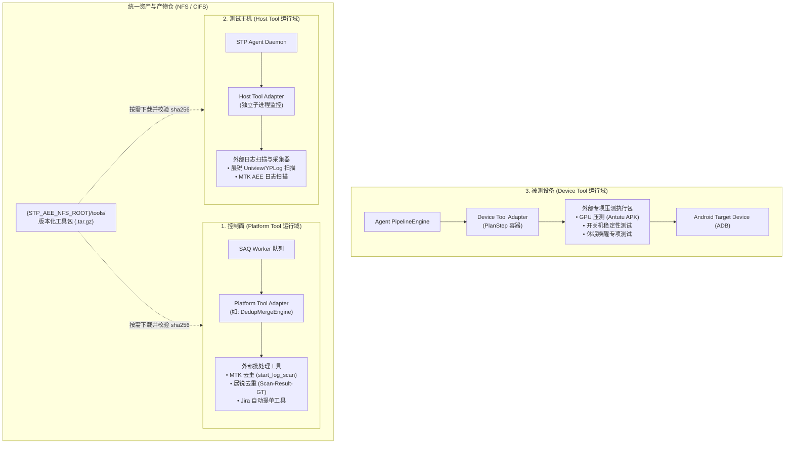
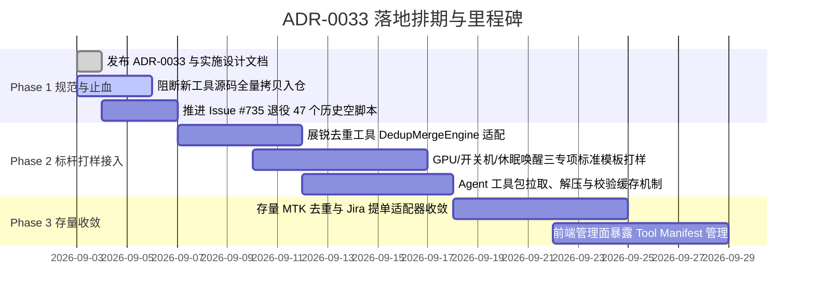

# 外部工具统一接入架构与包管理实施计划（Tool-Kit Ecosystem Implementation Plan）

- 状态：**Living**
- 日期：2026-09-03
- 对应决策：[`ADR-0033：外部工具统一接入契约规范与包管理解耦模型`](../adr/ADR-0033-tool-kit-ecosystem-integration.md)
- 追踪 Issue：[#745](https://github.com/DUElost/stability-test-platform/issues/745)
- 涉及范围：控制面 SAQ 任务链路、Agent 脚本执行器（PipelineEngine）、中心存储布局、外部专项执行包（MTK/展锐去重、Jira 提单、GPU、开关机、休眠唤醒）

---

## 1. 架构全景与分层模型

为解决原厂工具与自研专项在线下独立可运行、接入平台后频繁引发代码腐化的问题，STP 平台将外部工具根据**运行宿主与生命周期**严格划分为三层，每一层均通过**标准适配器（Adapter）**接入系统：



---

## 2. STP Standard Tool Contract 统一契约规范

任何合入平台的外部工具，必须通过其 Adapter 对齐如下四项标准契约。

### 2.1 输入契约：`context.json` 规范
平台在调用工具时，通过命令行参数指定输入配置路径：
```bash
entrypoint --context /path/to/context.json --output-dir /path/to/output_dir
```
`context.json` 包含了该步骤运行所需的所有上下文信息，彻底杜绝在平台核心代码中手动拼接命令行参数：
```json
{
  "$schema": "https://stp.internal/schemas/tool-context.v1.json",
  "plan_run_id": 1024,
  "job_id": 2048,
  "execution_tier": "device",
  "device": {
    "serial": "DEVICE_SERIAL_EXAMPLE",
    "platform": "unisoc",
    "model": "MYOS16-Z2581",
    "build_version": "V1.0.0B05"
  },
  "params": {
    "test_duration_hours": 12,
    "interval_seconds": 30,
    "skip_if_exists": true
  },
  "secrets": {
    "_comment": "机密凭据按层隔离，仅 platform 级工具注入，严禁透传至 device 端"
  },
  "support_files": {
    "gpu_apk": "/local/cache/support_files/antutu_v10.apk"
  }
}
```

### 2.2 输出契约：`summary.json` 与 `artifacts/` 目录规范
工具执行结束时，必须在 `--output-dir` 下输出结构化指标文件 `summary.json`，并将原始报告与日志统一收拢在 `artifacts/`：
```text
output_dir/
├── summary.json          # 平台解析的权威结构化指标
└── artifacts/            # 待上送或归档的全部原始文件
    ├── run_log.txt
    ├── Result_Dedup.xls
    └── stack_traces/
```
`summary.json` 数据结构定义：
```json
{
  "tool_name": "gpu_check",
  "tool_version": "1.2.0",
  "status": "PASS",
  "duration_seconds": 3612.5,
  "metrics": {
    "total_cycles": 100,
    "success_cycles": 99,
    "crash_count": 1,
    "avg_fps": 58.4
  },
  "failure_reason": null,
  "artifacts": [
    "artifacts/run_log.txt",
    "artifacts/Result_Dedup.xls"
  ]
}
```

### 2.3 退出码语义（Fail-Fast 区分）
进程退出码是平台判定任务终态与触发重试的关键依据：
* `0`：**PASS / SUCCESS**。任务正常完成，用例通过；
* `1`：**TEST_FAILURE**。业务断言未通过（如被测设备发生重启、用例跑出 Crash）。平台记录为测试失败，生成失败报告；
* `2`：**ENVIRONMENT_ERROR**。执行环境异常（如 ADB 断连、目标目录无写权限、原厂脚本底层报错）。平台将其定性为环境故障，可触发重试或设备隔离巡检；
* `124` / `125`：**TIMEOUT (Wall Clock / Stall Clock)**。由平台执行器双层钟沙箱强制终止时产生，工具自身不得伪造。

### 2.4 环境预检契约：`--check-env`
外部工具必须支持 `--check-env` 命令行参数。该命令须在 **5 秒内执行完毕**，检查：
1. 依赖的二进制（如 `adb`、Python 虚拟环境库）是否存在；
2. 目标设备的 ADB 连通性及 root 权限状态；
3. **判据标准**：以退出码 `0`（就绪）与 `2`（环境故障）为准；stdout 输出诊断 JSON：`{"ready": true, "error": null}`。
在长跑测试启动前，平台调度器执行此命令秒级拦截环境不就绪的派发。

---

## 3. 工具包分发、版本化与本地缓存机制

### 3.1 元数据清单：`tool_manifest.yaml`
外部工具以配置清单形式在平台登记，主仓内不再存放工具实现代码：
```yaml
name: unisoc_scan_result
version: "1.0.4"
tier: "platform"               # platform / host / device
description: "展锐 YPLog 汇总去重与 Excel 生成工具"
package:
  source: "nfs://tools/unisoc_scan_result/unisoc_scan_result-1.0.4.tar.gz"
  sha256: "9f86d081884c7d659a2feaa0c55ad015a3bf4f1b2b0b822cd15d6c15b0f00a08"
entrypoint:
  runtime: "python"
  cmd: "python -m unisoc_scan_result.adapter"
capabilities:
  platforms: ["unisoc"]
  timeout_seconds: 1800
```

### 3.2 共享存储布局与 Agent 本地缓存
- **中心存储归档点**：
  `{STP_AEE_NFS_ROOT}/tools/{name}/{version}/{name}-{version}.tar.gz`
- **Agent / 控制面工作节点本地缓存**：
  本地维护 `tools_cache/{name}/{version}/`：
  1. 检查本地缓存是否存在且 `sha256sum` 与 Manifest 一致；
  2. 若不存在，自共享存储复制到本地并解压；
  3. 执行器在隔离的工作目录（Working Dir）中运行，避免多进程并发执行产生文件写入冲突；
  4. 支持基于最后访问时间的 LRU 磁盘清理策略，保持本地磁盘水位健康。

---

## 4. 典型外部工具接入实现指南

### 4.1 控制面汇总去重：统一 `DedupMergeEngine` 适配器
针对 MTK 与展锐两种并列去重工具，控制面抽离通用抽象基类：
```python
# backend/services/dedup/base.py
from abc import ABC, abstractmethod
from pathlib import Path
from pydantic import BaseModel

class MergeResult(BaseModel):
    merged_xls_path: Path
    total_issues: int
    deduped_issues: int
    status: str

class DedupMergeEngine(ABC):
    @abstractmethod
    def run_merge(self, input_files: list[Path], output_dir: Path) -> MergeResult:
        """执行去重合并"""
        pass
```
MTK 适配器与展锐适配器分别继承 `DedupMergeEngine` 实现各自原厂的特定调用，`backend/tasks/saq_tasks.py` 中的 `merge_task` 仅调用基类方法，不再保留任何 `start_log_scan` 专用参数或展锐专用分支。

### 4.2 设备端专项测试：标准 PlanStep 适配器
针对 GPU（Antutu）、开关机、休眠唤醒专项，统一采用标准化 Python 适配器模板：
```python
# 示例：gpu_check 适配器标准结构
import argparse, json, sys
from pathlib import Path

def main():
    parser = argparse.ArgumentParser()
    parser.add_argument("--context", required=False)
    parser.add_argument("--output-dir", required=False)
    parser.add_argument("--check-env", action="store_true")
    args = parser.parse_args()

    if args.check_env:
        # 执行 5 秒快速 ADB 通道与 APK 就绪自检
        print(json.dumps({"ready": True, "error": None}))
        sys.exit(0)

    context = json.loads(Path(args.context).read_text())
    output_dir = Path(args.output_dir)
    artifacts_dir = output_dir / "artifacts"
    artifacts_dir.mkdir(parents=True, exist_ok=True)

    # 1. 设备指纹读取与自适应（依照 issue #507 要求）
    model = context["device"]["model"]
    # 2. 调用具体的专项测试驱动逻辑
    # ...
    # 3. 产生标准 summary.json
    summary = {
        "tool_name": "gpu_check",
        "status": "PASS",
        "metrics": {"cycles": 50, "crashes": 0}
    }
    (output_dir / "summary.json").write_text(json.dumps(summary))
    sys.exit(0)

if __name__ == "__main__":
    main()
```

### 4.3 自动化 Jira 提单工具解耦
- 各厂商专有凭据（Transsion Cookie / Tinno P12 证书 / Moto PAT Token）由工具内部自身配置管理，平台仅提供标准输入参数（`jira_project_key`、`summary`、`issue_type`）；
- 提单执行过程输出标准日志流（透传至前端终端组件）；
- 提单结果统一回填结构化的 `jira_issue_key`（如 `PROJ-1234`）到数据库 `jira_run` 表。

---

## 5. 分阶段实施路线图（Phased Implementation Plan）



---

## 6. 验收标准与架构守卫（DoD & CI Gates）

1. **主代码仓零外部源码膨胀**：
   - PR 门禁中阻断任何向 `backend/agent/scripts/` 全量引入外部多版本工具的提交；
2. **契约自测套件**：
   - 编写 `tools/dev/verify_tool_contract.py`，任何新接入的工具适配器必须能通过标准测试（验证 `--check-env`、退出码映射与 `summary.json` 合规性）；
3. **环境去黑盒化**：
   - 新工具接入不再向平台根 `.env.backend` 引入工具私有路径变量，全部收拢至 Manifest 与工具本地配置中。
