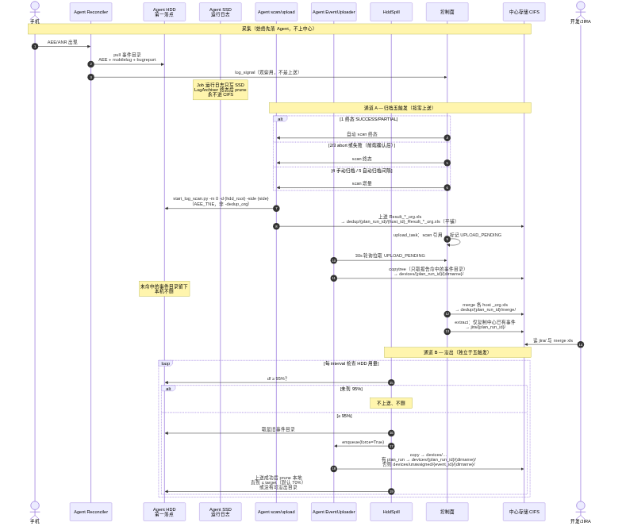
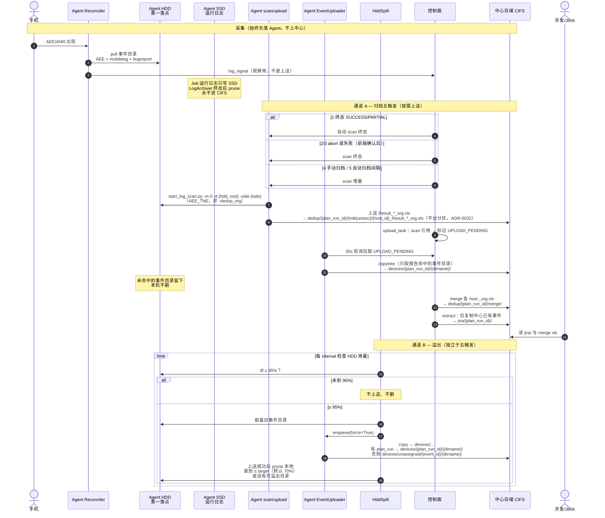
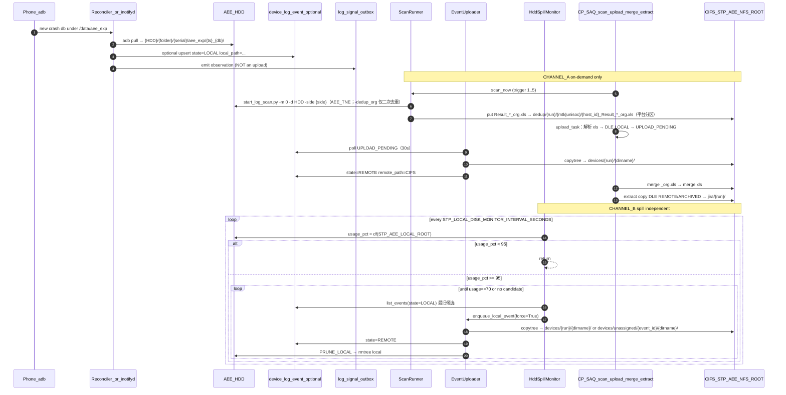

# 设备日志流转时序（上送规则 = ADR-0025）

- **状态**：产品终版（上送规则）
- **日期**：2026-08-12
- **权威**：[`ADR-0025`](../adr/ADR-0025-phase4-architecture-alignment.md) D2/D4；PRD [`2026-plan-c-storage-and-archive.md`](../prd/2026-plan-c-storage-and-archive.md)
- **读者**：人（§1–§3）+ 其他 Agent / 实现者（§4）

> **冲突声明**：若 ADR-0028 D2 出现「连续全量上送」表述，与本文 **上送规则** 冲突时以 ADR-0025 为准（ADR-0028 已修订为过滤模型，见下）。  
> DeviceLogEvent 实体、路径收敛、extract 走 DB 等 **记账/查询** 能力可保留；**不得**把「`LOCAL` 立刻 copy 到 CIFS」当成合法上送通道。  
> 2026-08-12 生产代码 EventUploader 的「连续上送」是 `CONTINUOUS=1` 逃生阀模式；默认 `CONTINUOUS=0` 走过滤模型（与本文上送规则一致）。

---

## 1. 三层存储与两条上送通道

| 层 | 内容 | 上中心？ |
|----|------|----------|
| 手机 `/data/aee_exp` + `/data/vendor/aee_exp` | 设备侧原始崩溃（ANR 含于 aee_exp，**不监测 `/data/anr`**） | 否。只经 ADB pull |
| Agent SSD `logs/runs/{job_id}/` | 运行日志 | **永不**上中心；终态 grace 后 LogArchiver prune |
| Agent HDD `STP_AEE_LOCAL_ROOT` | AEE + mobilelog + bugreport（第一落点） | 仅通道 A 或 B |
| 中心 CIFS `STP_AEE_NFS_ROOT` | 汇总 xls + 按需事件 + 溢出事件 | 交付副本 |

**通道 A — 按需（五触发）**：Agent 本地 scan → 上送报告 → **只上送报告 Path/db 命中的事件目录**。未命中的留在 HDD，不删。

**通道 B — 溢出（独立）**：Agent HDD **≥ 95%** → 最旧事件目录上送中心 → **上送成功后 prune 本地**，直到 ≤ target（默认 70%）或没有可溢出目录。这是唯一「整段转存并腾盘」。

没有第三条：没有手机直达中心；没有「一 pull 就全量进 CIFS」。

---

## 2. 人读时序图



SVG 版本：[`adr-0025-log-flow-sequence-human.svg`](./assets/adr-0025-log-flow-sequence-human.svg)。
重新渲染：`python tools/dev/render_adr0025_sequence.py`（提取本节 Mermaid 源，
经 mermaid-cli 生成 PNG/SVG；首次运行需网络下载 CLI + Chromium）。
以下 Mermaid 源为当前权威图。

<details>
<summary>Mermaid 源（与上图同内容，便于改稿）</summary>



</details>

### 五触发（通道 A）

| # | 场景 | 何时 | 上送内容 |
|---|------|------|----------|
| 1 | 测试结束 | PlanRun SUCCESS / PARTIAL_SUCCESS，自动 | 终态报告 + 报告中 db 对应事件 |
| 2 | 手动停止 | abort → FAILED，前端确认后 | 同上 |
| 3 | 中断/失败 | FAILED，前端确认后 | 同上 |
| 4 | 过程中手动归档 | 详情页按钮 | 增量报告 + 报告中 db 对应事件 |
| 5 | 自动归档间隔 | Plan 配置的周期 | 同上 |

通道 B 不在这五条里，与 PlanRun 终态无关。

### 谁何时进中心

| 对象 | 何时上中心 | 上完本机 |
|------|------------|----------|
| 运行日志（SSD） | 不上 | 终态 grace 后 prune |
| scan / merge xls | 五触发之后 | 本机 scan 缓存可丢 |
| 事件目录 | **仅**报告命中，或 **HDD≥95%** | 按需：留下；溢出：删 |
| 其余事件目录 | 不上 | 留在 HDD |

---

## 3. 路径约定（终版落点）

相对 `STP_AEE_NFS_ROOT`（中心）与 `STP_AEE_LOCAL_ROOT`（Agent HDD）：

| 对象 | 路径 |
|------|------|
| Agent 事件（第一落点） | `{HDD}/{folder}/{serial}/aee_exp/{ts}_{db}/`（含 `mobilelog/`、`bugreport/`） |
| 按需事件 | `{CIFS}/devices/{plan_run_id}/{dirname}/` |
| 溢出事件 | 有 `plan_run_id` 同上；否则 `{CIFS}/devices/unassigned/{event_id}/{dirname}/` |
| 各 host scan | `{CIFS}/dedup/{plan_run_id}/{mtk|unisoc}/{host_id}_Result_*_org.xls`（平台分区，非 host 子目录；ADR-0032） |
| merge | `{CIFS}/dedup/{plan_run_id}/merge/`（控制面 merge 后发布；extract 另拷贝一份至 `jira/{plan_run_id}/`） |
| 提单/extract | `{CIFS}/jira/{plan_run_id}/` |
| 运行日志 | Agent SSD `logs/runs/{job_id}/` only |

溢出 **不要** 再写 ADR-0025 初稿的 `{folder}/{serial}/` 作为 CIFS 终态——那条路径 extract 扫不到（审查 P0-1）。产品规则仍是「超 95% 上送后 prune」；CIFS 落点用 `devices/{plan_run_id}/{dirname}/` 或 `devices/unassigned/{event_id}/{dirname}/`。

---

## 4. 给其他 Agent 的时序图版本（可执行规格）

本节给实现 / 评审 Agent：先读不变量，再对照图，禁止用「`CONTINUOUS=1` 全量模式」覆盖本节；`CONTINUOUS=0` 下 EventUploader 就是本节通道 A 的执行者。

### 4.1 权威顺序

1. **上送是否发生、上送哪些事件目录、上送后是否删本地** → ADR-0025（本文）。
2. **事件如何记账**（`device_log_event` 行、state、`remote_path`）→ 可沿用 ADR-0028 D1；state 不得暗示「所有 LOCAL 必上送」。
3. **现网 `CONTINUOUS=1` 逃生阀（全量 copy）** → **非**默认规格。默认 `CONTINUOUS=0` 只上送 `upload_task` 标记的 `UPLOAD_PENDING` 子集，与 ADR-0025 一致。

### 4.2 MUST / MUST NOT

**MUST**

- 设备日志第一落点 = Agent HDD。pull 完成即可停。
- 上送事件目录仅当：(A) 本轮 scan 报告 Path/db 命中，或 (B) 该 host HDD usage ≥ `STP_LOCAL_DISK_SPILL_THRESHOLD`（生产 95）。
- scan 命令契约：`start_log_scan.py -m 0 -d {hdd_root} -side {side}`（AEE_TNE，非 `-dedup_org`——后者仅对已产 xls 二次去重）；`Result_*_org.xls` 先产在 HDD，再按平台分区上送 `dedup/{run}/{mtk|unisoc}/{host_id}_…`（ADR-0032）。
- 报告驱动的 `event_dir_names` 校验（通道 A/B 共用）：只接受 HDD 根目录下一级目录；拒绝绝对路径、`..`、路径分隔符与符号链接逃逸；basename 匹配 `YYYY-MM-DD_HH-MM-SS_*`；`realpath` 必须仍在 HDD 根内。
- 通道 A 上送成功后 **保留** 本地目录。
- 通道 B 上送成功后 **必须** `rmtree` 本地该事件目录（腾盘）。失败则保持本地、可重试；不得先删后传。
- 通道 B 循环直到 usage ≤ `STP_LOCAL_DISK_SPILL_TARGET`（默认 70）或没有可溢出候选。
- 运行日志不上 CIFS。
- `log_signal` / Watcher UI 计数 = 观察，不等于「已上中心」。
- extract 只复制 **中心已有** 的事件目录到 `jira/`；中心没有的不得假装 extract 成功。
- spill 候选不得删正在被 scan/pull 使用的目录（活跃 Job / 正在 `UPLOADING`）。

**MUST NOT**

- 把手机路径直接当 CIFS 源。
- 在 HDD < 95% 且无归档触发时，把未进报告的事件目录 copy 到 `devices/`。
- 用 `STP_EVENT_UPLOADER_PRUNE_LOCAL=1`（每次上送立刻删）替代通道 B。那是「全量上送后的缓存删除」，不是方案 C 的 95% 溢出。
- 把 `PRUNE_LOCAL` 写入 fleet / `_FLEET_ENV_KEYS`。
- 为腾盘而 prune 尚未上送成功的目录。
- 用 SSD fallback root 跑 HddSpill（无 HDD 时 spill 禁用，SSD 靠 LogArchiver）。

### 4.3 决策表（Agent 每步对照）

```text
事件刚 pull 到 HDD
  → 写本地目录；可选登记 DLE state=LOCAL
  → 不上 CIFS
  → 可 emit log_signal

五触发之一到达
  → Agent scan 本地 HDD
  → CIFS: 报告 → dedup/{plan_run_id}/{mtk|unisoc}/{host_id}_Result_*_org.xls（平台分区）
  → upload_task（控制面筛选）：解析报告命中的 dirname → DLE LOCAL → UPLOAD_PENDING
  → EventUploader（Agent 30s 轮询）：copytree → devices/{plan_run_id}/ → state=REMOTE
  → 未命中：不动本地、不上 CIFS
  → merge → extract 按 DLE remote_path 拷贝 → jira/；成功后 REMOTE → ARCHIVED

HDD usage < 95%
  → HddSpill: no-op

HDD usage ≥ 95%
  → DeviceLogEventClient.list_events(state=LOCAL) 选最旧候选
  → enqueue_local_event(force=True) → EventUploader copytree → REMOTE
  → 上送成功后按 PRUNE_LOCAL 删本地（无候选仍 ≥95% 打告警）
  → 重复直到 ≤ target 或无候选
  → 无候选仍 ≥95%：打告警（hdd_still_high_no_spill_candidate），不得空转假装已腾盘
```

### 4.4 Agent 可读时序图（带状态与职责）



### 4.5 实现锚点（改代码时打开这些文件）

| 职责 | 文件 | 按本文应对齐的行为 |
|------|------|-------------------|
| 采集落盘 | `backend/agent/aee/processor.py`、`reconciler.py` | 只写 HDD；不要在此 copy CIFS |
| 连续上送（逃生阀） | `backend/agent/event_uploader.py` | `CONTINUOUS=1` 才对全部 LOCAL enqueue；默认 0 只拉 `UPLOAD_PENDING`（upload_task 筛选） |
| 筛选上送（通道 A） | `upload_task`（控制面）按 scan 名单标记 `UPLOAD_PENDING`；EventUploader 执行 copytree | 只传报告命中的 dirname |
| 溢出 | `backend/agent/local_disk_monitor.py` | ≥95% 上送 **并且** prune；不能只 enqueue 已是 REMOTE 的副本就结束 |
| scan/merge | `backend/agent/scan_runner.py`、`backend/services/dedup_scan.py` | 扫 HDD；merge 在控制面读 CIFS `dedup/` |
| extract | `backend/services/dedup_extract.py` | 只取中心已有 `remote_path` / `devices/{run}/` |
| 运行日志 | `backend/agent/log_archiver.py` | 只 prune SSD |

### 4.6 验收（Agent 改完后应能证明）

1. HDD 用量 7%、无五触发：CIFS `devices/{run}/` **不应**出现本轮新 pull 的未入报告事件。
2. 五触发后：`dedup/{run}/{mtk|unisoc}/{host_id}_Result_*_org.xls`（各平台子目录）有 xls；`devices/{run}/` **仅**含 xls 命中的 dirname。
3. 人为把 spill 阈值降到当前 df 以下：最旧事件出现在 CIFS，**且**本地目录消失；用量下降或打出无候选告警。
4. 阈值恢复 95% 后，未满盘时不再 prune。
5. `jira/{run}/` 能看到已上送事件；未上送的不在 jira。
6. 运行日志目录不出现在 CIFS。

### 4.7 一句话给 Agent 的任务边界

> 设备日志：手机 → Agent HDD。中心只在「归档报告点名」或「HDD≥95%」时接收事件目录。95% 那条必须上送成功后删除本地。不要用 `CONTINUOUS=1` 逃生阀或 `PRUNE_LOCAL` 舰队开关冒充这两条规则。

---

## 5. 观测 vs 归档：消费方矩阵（#527）

`job_log_signal` 与 `device_log_event` **有意并存**；不是二选一，也不是待删双轨。

| 消费方 | RUNNING（跑测中） | 终态后 |
|--------|-------------------|--------|
| `GET /plan-runs/{id}/watcher-summary` | `job_log_signal`（秒级；`WATCHER_SIGNAL` 刷新） | 仍读 signal 做分类/trend；`archive.link_stats` 暴露链接健康 |
| `GET /plan-runs/{id}/log-events` | 可返回已有 DLE 行（部分列表） | **`device_log_event` 权威**（路径 / `state`） |
| 风险评级 / RunReport | — | DLE + `device_log_event_id IS NULL` 的 signal 补洞（`log_observation`） |
| EventUploader / extract / upload_task | — | `device_log_event` only |
| devices `ui_status=risk` | signal count | — |

关联键：`(job_id, seq_no)` ↔ `(job_id, signal_seq_no)`。补链由两个**写方**负责：signal 上送时（`agent_api` 同事务）即时链接；错序遗漏的存量由 `signal_link_reconcile` 周期 sweep（`STP_SIGNAL_LINK_RECONCILE_INTERVAL_SECONDS`，默认 300s）补链（`link_signals_to_device_log_events_sync`）。只读路由不补链。

详细决策记录：`docs/notes/architecture/2026-08-29-log-observation-authority.md`。
