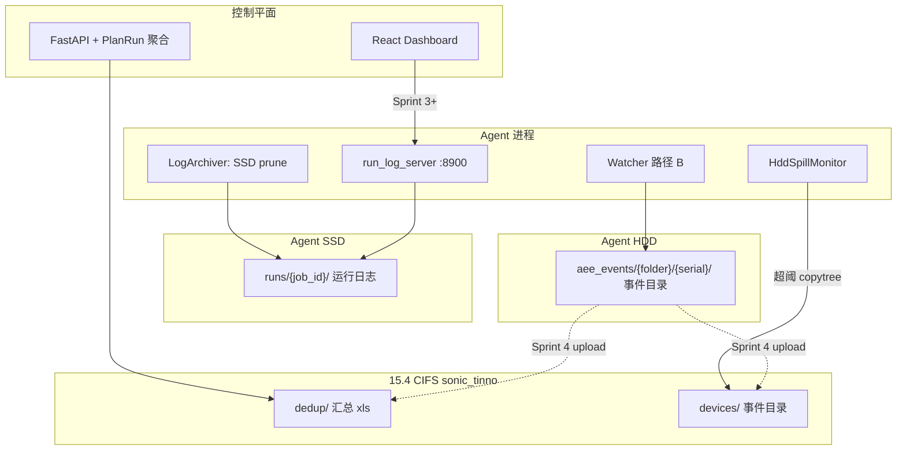

# 技术设计：方案 C — 存储布局与访问路径

- **状态**：Living（随 PR #31 / Sprint 3/4 演进）
- **日期**：2026-06-21
- **PRD**：[2026-plan-c-storage-and-archive.md](../prd/2026-plan-c-storage-and-archive.md)
- **ADR**：[ADR-0025](../adr/ADR-0025-phase4-architecture-alignment.md)、[ADR-0018](../adr/ADR-0018-infrastructure-layer-framework-adoption.md)
- **实施计划**：[2026-06-20-sprint2-watcher-hdd-logarchiver.md](../superpowers/plans/2026-06-20-sprint2-watcher-hdd-logarchiver.md)

---

## 1. 总览



---

## 2. 路径与环境变量

### 2.1 Agent HDD（AEE 第一落点）

| 项 | 值 |
|----|-----|
| 默认根 | `/mnt/hdd/aee_events` |
| 解析函数 | `get_aee_local_root()`（`backend/agent/aee/paths.py`） |
| 优先级 | `STP_AEE_LOCAL_ROOT` > `STP_AEE_NFS_ROOT` > `STP_WATCHER_NFS_BASE_DIR` > `STP_NFS_ROOT/sonic_tinno` > 默认 |

事件目录布局（默认 `stp`）：

```
{local_root}/{folder_name}/{device_serial}/
  __exp_main.txt / db.fatal.00.dbg / …
  mobilelog/
  bugreport/
```

逃生：`STP_WATCHER_AEE_SUBDIR_LAYOUT=correlated` → `correlated_mobilelogs/`、`correlated_bugreports/`。

**代码迁移**：`nfs_root` 参数语义改为 `local_root`（processor / reconciler / job_session）。

### 2.2 Agent SSD（运行日志）

| 项 | 值 |
|----|-----|
| 目录 | `{BASE_DIR}/logs/runs/{job_id}/`（`get_run_log_dir`） |
| 生命周期 | Job 结束后经 **grace** 由 LogArchiver **prune**（删除目录），不上送 15.4 |
| 访问 | `run_log_server` HTTP（见 §4） |

### 2.3 15.4 CIFS（上送目标）

| 项 | 值 |
|----|-----|
| 共享 | `//172.21.15.4/jxtinno/sonic_tinno` |
| Agent env | `STP_AEE_CIFS_ROOT`（HddSpill 与 Sprint 4 upload 使用） |
| 内容 | `dedup/`（xls）、`devices/{相对路径}`（事件目录）；**无** `archives/{job}/run_log_bundle` |

---

## 3. Agent 子系统

### 3.1 LogArchiver（SSD prune only）

- **删除**：`_do_archive`、`snapshot_active_job`、`run_log_bundle` 注册、NFS `nfs_base_dir`、cycle 快照回调。
- **保留**：`_iter_job_dirs`、`scan_once`、grace、跳过 ACTIVE job。
- **`archive_now`**（SocketIO）：`scan_once(grace_seconds=0)`，仅 prune，非 tar。

### 3.2 HddSpillMonitor（`local_disk_monitor.py`）

- 监控 **HDD** 使用率（非 SSD）。
- 超阈：按 mtime 找最旧**事件目录**（`__exp_main.txt` / `main.dbg` 启发式）→ `copytree` 到 `{cifs_root}/devices/{rel}` → 本地 prune。
- **待加固**：读盘失败应返回 `None` 并跳过 spill（勿返回 `0.0`）。

### 3.3 run_log_server

| 端点 | 说明 |
|------|------|
| `GET /run-logs/{job_id}` | 文件列表 JSON |
| `GET /run-logs/{job_id}/{filename}` | 文件下载 |
| 端口 | `STP_RUN_LOG_SERVER_PORT`（默认 `8900`） |
| 安全 | `resolve()` 防路径穿越；仅服务 `runs/{job_id}` 下文件 |

### 3.4 启动耦合（已知债）

LogArchiver、HddSpill、run_log_server 当前在 `watcher_subsystem_enabled()` 块内启动。`STP_WATCHER_ENABLED=0` 时三者均不启——待与 Watcher 解耦（#32 可选项）。

---

## 4. 控制平面（当前与目标）

### 4.1 Sprint 2 已改（PR #31）

| 模块 | 变更 |
|------|------|
| `agent_api.py` | 删除 `run_log_bundle` ingest 白名单 |
| `plan_runs.py` | `run_log_bundle` 下载返回 409，指引 Agent HTTP |

### 4.2 Sprint 3 待改（断层）

| 模块 | 现状 | 目标 |
|------|------|------|
| `plan_runs._aggregate_run_log_archive` | 聚合 `run_log_bundle` JobArtifact | 废弃或改为 HTTP/SSD 状态 |
| `ArchiveStatusCard` | 展示 bundle `storage_uri` | Agent HTTP 或 prune 语义 |
| `report_service` | 从 tar `run_log_bundle` 读 `risk_summary` | SSD/HTTP 或 dedup 就绪态（#16） |
| `dedup_scan.check_archive_completed` | 查 `run_log_bundle` 齐套 | 新完成条件（Sprint 4） |
| `agent_api` archive-status | 统计 bundle | 重新定义 |

### 4.3 Sprint 4 待建

- `scan_runner.py`、`upload_manager.py`（Agent）
- 控制面 `dedup/scan` 触发 Agent scan + 等待上送
- 五触发 wired in `plan_runs.py` / `aggregator.py`

---

## 5. 数据流（运行日志）

```
pipeline_engine 写 logs/runs/{job_id}/
        ↓
run_log_server 只读暴露（控制面或运维直连 Agent IP:8900）
        ↓
LogArchiver 在 grace 后 prune 本地目录
```

**不再**：tar → 15.4 → `POST .../artifacts` 注册 `run_log_bundle`。

---

## 6. 数据流（AEE 设备日志）

```
Watcher 路径 B + reconciler
        ↓
HDD {local_root}/.../mobilelog|bugreport/
        ↓
（Sprint 4）Agent start_log_scan → Result_*.xls
        ↓
upload → 15.4 dedup/ + devices/
        ↓
控制面 merge / extract → UI DedupReportCard
```

HDD 满：**HddSpillMonitor** 溢出最旧事件 → `15.4/devices/`。

---

## 7. 关键文件索引

| 职责 | 路径 |
|------|------|
| AEE 路径 | `backend/agent/aee/paths.py` |
| Watcher 处理 | `backend/agent/aee/processor.py`、`reconciler.py` |
| SSD prune | `backend/agent/log_archiver.py` |
| HDD spill | `backend/agent/local_disk_monitor.py` |
| 运行日志 HTTP | `backend/agent/run_log_server.py` |
| Agent 启动 | `backend/agent/main.py` |
| 控制面 PlanRun | `backend/api/routes/plan_runs.py` |
| 去重 | `backend/services/dedup_scan.py`、`backend/api/routes/dedup.py` |

---

## 8. 测试映射

见 [`acceptance/2026-plan-c-sprint2-3.md`](../acceptance/2026-plan-c-sprint2-3.md)。

---

## 9. 修订记录

| 日期 | 变更 |
|------|------|
| 2026-06-21 | 初版：Sprint 2 设计 + Sprint 3/4 断层清单 |
