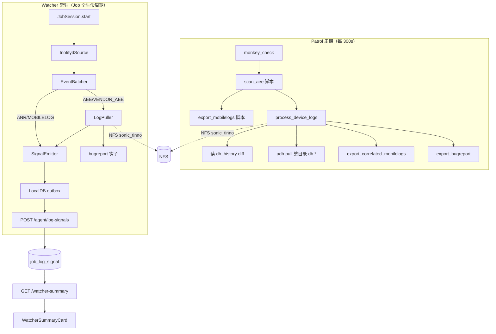
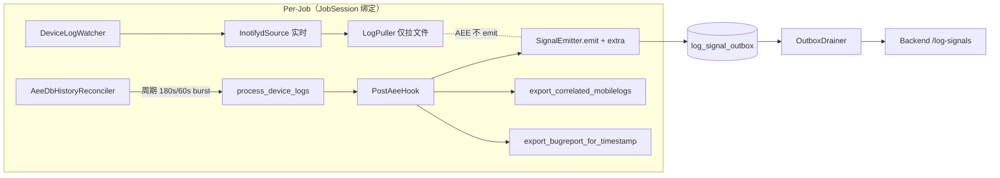

# Watcher 收编 scan_aee / export_mobilelogs 方案

> 日期：2026-05-27（v2 更新：2026-05-27）  
> 状态：方案 v2（已锁定关键决策，未实施）  
> 背景：D1 已落地 `backend/agent/aee/`、`scan_aee`/`export_mobilelogs` patrol 脚本、Watcher LogPuller sonic 路径、`POST /agent/log-signals`、`GET /plan-runs/{id}/watcher-summary`、前端 `WatcherSummaryCard`。  
> 目标：将 AEE 增量拉取与 mobilelog 关联收进 Watcher 常驻链路，patrol 仅保留 `monkey_check`；平台端可聚合展示 Crash/ANR 数量与涉及应用。

---

## 0. 结论

**合适，需条件。**

| 维度 | 判断 |
|------|------|
| 架构方向 | ✅ 与 ADR-0018 Watcher「设备侧报错文件探测器 + log_signal 权威流」一致；patrol 周期脚本与 Watcher 实时/常驻职责重叠，收编合理 |
| 代码复用 | ✅ `aee/processor.py`、`mobilelog.py`、`bugreport.py`、`paths.py` 已与 patrol 脚本共享；Watcher Puller 已接 sonic 布局 + bugreport 钩子 |
| 平台聚合 | ✅ `job_log_signal` 表、`watcher-summary` 端点、`watcher_signal` SocketIO、`WatcherSummaryCard` 已存在，扩展 `extra` + 聚合 SQL 即可 |
| 前置缺口 | ⚠️ **db_history 周期 reconciler 尚未接入 Watcher**；**mobilelog 时间窗关联未在 Puller/Reconciler 路径触发**；**polling 能力探测存在但无 PollingSource 实现（永久不实现，由 reconciler 替代）** |
| 迁移风险 | ⚠️ 双路径并行期需去重；Watcher 未启用主机需显式 gate；inotifyd 拉单文件 vs scan_aee 拉整目录存在语义差异 |
| D1 缺口 | ⚠️ D1 已知 P0：(1) processor 缺 strict 校验、(2) mobilelog 子目录命名与单体不一致、(3) bugreport 钩子 event_type 与冷却集不匹配 — 全部在 M0.5 前置吸收（M0 启动门槛），见 §10 |

### 0.1 已锁定关键决策（v2）

| ID | 决策 | 选择 | 说明 |
|----|------|------|------|
| D1 | Dedup 策略 | **A：reconciler 独占 emit** | inotifyd 仅低延迟触发 LogPuller 拉文件；不参与 emit。AEE log_signal 的字段完整性由 reconciler 单线保证 |
| D2 | reconciler 节奏 | **180s 基线 / 60s burst（hash 跳过）** | 默认 180s 间隔；db_history 内容 hash 未变直接跳过；如某轮发现新行则下一轮进入 burst 模式持续 5 轮；burst 期间任一轮再次有新行则计数器重置 |
| D3 | NFS 子目录命名 | **`correlated_mobilelogs/` / `correlated_bugreports/`** | 与 monolith 一致；既有线下数据/脚本可直接复用；逃生口：env `STP_WATCHER_AEE_SUBDIR_LAYOUT=stp` 同时把 mobilelog 回到 `mobilelog/`、bugreport 回到 `bugreport/`（bugreport 与 mobilelog 同类，M0.5/C-2 起默认 `correlated_bugreports/`，stp 逃生口可回退 `bugreport/`） |
| D4 | D1 P0 吸收 | **M0 前置吸收（M0.5）** | M0 启动前必须完成 D1 P0-#1/#2/#3 修复 + 回归用例 |
| — | M0.5 范围 | **代码勘误小迭代** | D1 P0 修复 + D1 高价值 P1；不引入新架构 |
| — | state_store key | **M1 与 patrol 共用；M3 改 watcher 专属命名空间** | 共用键避免双写期对账漂移；patrol 退役后改名隔离 |

---

## 1. 现状与差距

### 1.1 两条并行链路



### 1.2 能力对照

| 能力 | patrol `scan_aee` | Watcher 现状 | 收编后（v2 锁定） |
|------|-------------------|--------------|--------|
| 检测方式 | 周期读 `db_history` | inotifyd 文件事件 | **inotifyd 仅触发 LogPuller**（不 emit AEE）**+ 周期 db_history reconciler（AEE emit 唯一来源）** |
| AEE 拉取粒度 | 整目录 `db.*` | 单文件 `adb pull` | reconciler 走目录 pull；inotifyd 单文件 pull 仅供低延迟落盘，不写 signal |
| mobilelog 关联 | pull 成功后按 AEE 时间戳 | ❌ 未做 | reconciler / PostAeeHook 调用 `export_correlated_mobilelogs`，写入 `correlated_mobilelogs/` |
| bugreport | ✅ | ✅ Puller `_maybe_export_bugreport` | 保持；写入 `correlated_bugreports/`；cooldown 参数对齐 `ProcessConfig`；event_type 修正为 CRASH/ANR（D1 P0-#3 修复） |
| package / event_type | db_history 解析 | ❌ 仅 filename | 由 reconciler 写入 `log_signal.extra` |
| 平台可见性 | step_trace metrics（弱） | log_signal + watcher-summary | 扩展 aee_breakdown + UI（含 by_package + unknown 桶） |
| Agent 重启恢复 | ScriptStateStore | outbox drainer + watcher_state（reconcile stub） | reconciler 状态与 db_history processed 共用 LocalDB（M1 期共用 patrol 键，M3 期迁移到 watcher 命名空间） |
| capability 矩阵 | — | — | 见 §2.1 capability × reconciler 行为表 |

### 1.3 关键代码锚点

| 模块 | 路径 | 说明 |
|------|------|------|
| AEE 处理器 | `backend/agent/aee/processor.py` | `process_device_logs` — patrol 与 Watcher reconciler 共用 |
| Watcher 管理 | `backend/agent/watcher/manager.py` | 启动 DeviceLogWatcher + LogPuller；`reconcile_on_startup` 仍为 stub |
| Puller | `backend/agent/watcher/puller.py` | AEE 单文件 pull + sonic 路径 + bugreport（M0 起 emit 职责剥离） |
| 契约 | `backend/agent/watcher/contracts.py` | `LogSignalEnvelope`；`extra` 已预留 |
| 入库 | `backend/api/routes/agent_api.py` | `ingest_log_signals` + `broadcast_watcher_signal` |
| 聚合 | `backend/api/routes/plan_runs.py` | `get_plan_run_watcher_summary` — 按 category 计数 |
| 前端 | `frontend/src/components/plan-run/WatcherSummaryCard.tsx` | 分类条数 + 趋势 + 阈值 |
| Pipeline 模板 | `backend/schemas/pipeline_templates/monkey_aee_*.json` | patrol 含 scan_aee + export_mobilelogs |

---

## 2. 目标架构

### 2.1 Agent 侧



**硬约束（v2 锁定）：**

> inotifyd 仅作为 LogPuller 的触发器（低延迟拉文件）；AEE log_signal 的 emit 由 `AeeDbHistoryReconciler` 独占，确保每条 signal 的 `extra` 同时包含 `event_type` / `package_name` / `aee_ts` / `nfs_path`。任何 inotifyd → SignalEmitter 的旁路写入路径在 M0 期关闭。ANR / MOBILELOG 两类 category 仍走 inotifyd → emit 原路径，不在本次收编范围。

**组件职责：**

| 组件 | 职责 | 新增/改造 |
|------|------|-----------|
| `DeviceLogWatcher` | inotifyd → batcher → puller；**AEE/VENDOR_AEE 不再触发 emit** | 改造：AEE 类路径关闭 emit；ANR/MOBILELOG 保持原路径 |
| `AeeDbHistoryReconciler` | 后台 daemon 线程，180s 基线 / 60s burst（hash 跳过）调用 `process_device_logs` 或薄封装；**AEE signal emit 唯一来源** | **新增** |
| `PostAeeHook` | AEE 新事件统一后处理：mobilelog + bugreport + emit | **新增**（从 processor 与 Puller 抽共用） |
| `DedupStore` | LocalDB key：**实现锁定为 patrol 同款** `scan_aee:{serial}:{aee_type}:processed_entries`（经 `db_history.state_key` helper 统一生成；prefix=`scan_aee`）；M1 期与 patrol ScriptStateStore 真正共用 key，M3 迁移到 `watcher:aee:*`。<br>⚠️ 早期草案写作 `aee:processed:{job_id}:{nfs_dir}`，但 patrol 去重维度是 (serial, aee_type) 而非 job_id；为真正共享去重状态(C-1)，实现统一采用 patrol 的 serial 维度键 | **新增**（共用 SQLite） |
| `LogPuller` | 维持 sonic 布局 + bugreport 钩子；AEE 类 pull-done 不再触发 emit，转为 reconciler 复用 | 改造：去除 AEE/VENDOR_AEE 的 `_emit_via_signal_emitter` 调用；保留 ANR/MOBILELOG |
| patrol | 仅 `monkey_check` | **降级/删除** scan_aee、export_mobilelogs 步骤（M2） |

**Reconciler × capability 行为矩阵：**

| watcher_capability | inotifyd | reconciler 行为 | 说明 |
|--------------------|----------|----------------|------|
| `inotifyd_realtime` | ✅ | 启用，180s 基线 / 60s burst（5 轮） | 默认目标态。inotifyd 负责低延迟拉文件，reconciler 兜底 + 唯一 emit |
| `polling` | ❌ | 启用，180s 基线 / 60s burst（5 轮） | inotifyd 不可用（如 BusyBox 缺 inotifyd）；reconciler 承担拉+emit 全责 |
| `unavailable` | ❌ | 启用，**固定 60s 单节奏**（不进入 burst 切换） | 探测过但全部失败；以 reconciler 为唯一通道；前端 watcher-summary 显示降级提示 |
| `skipped` | ❌ | **不启动** | watcher_policy.enabled=false 或非 Plan Job；保持空运行 |

**gate 优先级（AND 关系）：** `STP_WATCHER_AEE_RECONCILE_ENABLED` 仅在「全局 Watcher 启用（`STP_WATCHER_ENABLED=true` 或 `STP_WATCHER_PLAN_DEFAULT=true` 满足 Plan Job 默认开启）」**且**「Job capability ≠ `skipped`」时实际生效；全局 Watcher 关闭时 capability 探测不会发生，reconciler 也不会启动。

**reconciler 节奏细节（D2 锁定）：**

- 基线间隔 `STP_WATCHER_AEE_RECONCILE_INTERVAL_SECONDS=180`
- 每轮先 `cat db_history` → 计算 sha256 → 与上轮记录比较
  - 内容未变：本轮直接跳过 pull/解析（计入 `reconciler_skip_unchanged_total` 指标）
  - 内容变化：进入 burst 模式，下 `STP_WATCHER_AEE_RECONCILE_BURST_ROUNDS=5` 轮以 `STP_WATCHER_AEE_RECONCILE_BURST_INTERVAL_SECONDS=60` 间隔运行；burst 期间任一轮再次有新行则计数器重置
  - 5 轮 burst 内无新增 → 回到 180s 基线
- `unavailable` capability 固定 60s，忽略 burst 切换

**Reconciler 与 inotifyd 分工（v2 重写）：**

- **inotifyd**：低延迟感知新文件 → 触发 LogPuller 拉文件落盘；**不参与 AEE log_signal emit**
- **db_history reconciler**：唯一 AEE emit 来源；按 db_history 行解析 `event_type / package_name / aee_ts`，组装 `nfs_path` 后 emit；负责 mobilelog/bugreport 后处理
- **去重**：以 patrol 同款 `scan_aee:{serial}:{aee_type}:processed_entries`（per (serial, aee_type)）为幂等状态；reconciler 与 patrol 共享 processed db_history 行集合，已处理行不再重复 pull/emit；inotifyd 拉到本轮 reconciler 还没处理的目录，下轮 reconciler 自然吸收

**去掉 patrol 脚本的路径：**

1. **Phase A（双写）**：patrol 保留 scan_aee/export_mobilelogs，Watcher 启用 reconciler；后端 / UI 以 Watcher 为准，patrol metrics 仅对账  
2. **Phase B（降级）**：模板去掉两步骤；patrol 仅 monkey_check；Plan 编辑 UI 不再展示 AEE 步骤  
3. **Phase C（清理）**：脚本 `is_active=false`；删除模板引用；保留 `backend/agent/aee/` 库供 Watcher 使用  

### 2.2 数据模型

**决策：扩展现有 `job_log_signal`，不新建事件表。**

理由：

- `JobLogSignal.extra`（JSONB）已存在且 API 已透传  
- `watcher-summary` / SocketIO / DeviceMatrix `log_signal_count` 已围绕该表  
- 新表会增加 join 与 drainer 复杂度，YAGNI  

**category（保持现有枚举，不新增顶层 category）：**

| category | 含义 | crash/anr 归类 |
|----------|------|----------------|
| `AEE` | 主进程 AEE | `COALESCE(extra.event_type,'CRASH')='CRASH'` → crash_count |
| `VENDOR_AEE` | 厂商 AEE | 同上 → vendor_crash_count（与 crash_count 互斥，不重复计数） |
| `ANR` | `/data/anr` 新文件 **或** AEE/VENDOR_AEE 但 `extra.event_type='ANR'` | anr_count |
| `MOBILELOG` | mobilelog 目录异常文件 | 不计入 crash/anr（辅助） |

**`extra` 字段设计（schema version 1）：**

```json
{
  "schema_version": 1,
  "event_type": "CRASH",
  "package_name": "com.example.app",
  "aee_ts": "2026-05-27T10:15:22.123+00:00",
  "nfs_path": "/mnt/.../sonic_tinno/X6851.../SERIAL/aee_exp/<db_target>",
  "db_history_line": "<optional 审计>",
  "pull_source": "reconciler",
  "mobilelog_pulled": 3,
  "bugreport_exported": true
}
```

| 字段 | 类型 | 必填 | 说明 |
|------|------|------|------|
| `schema_version` | int | 是 | 演进兼容 |
| `event_type` | string | 是（reconciler 来源） | db_history 第 2 列：CRASH / ANR / …；旧 patrol 来源可缺省按 category 推断 |
| `package_name` | string | 否 | db_history 解析；vendor AEE 解析失败时可缺省 → 聚合归入 "unknown" 桶 |
| `aee_ts` | ISO8601 | 是（reconciler 来源） | 设备侧 crash 时间 |
| `nfs_path` | string | 是（reconciler 来源） | **目录级**：sonic 落盘**目录**（如 `.../SERIAL/aee_exp/<db_target>`）；与 `JobArtifact.storage_uri` 的**文件级** uri 区分；同一 nfs_path 仅 emit 一次 |
| `pull_source` | enum | 是 | `inotifyd` / `reconciler` / `legacy_patrol`（**v2 修正**：移除 `db_history`）；AEE category 实际生产值仅 `reconciler` 与 `legacy_patrol`；`inotifyd` 保留给 ANR/MOBILELOG 路径 |
| `mobilelog_pulled` | int | 否 | 关联 mobilelog 文件数 |
| `bugreport_exported` | bool | 否 | 是否触发 bugreport |

**索引（可选 Phase 2）：**

- 若按 package 聚合慢，可加 GIN：`CREATE INDEX idx_job_log_signal_extra_pkg ON job_log_signal USING gin ((extra->'package_name'));`  
- 首期数据量下窗口聚合 + 内存 distinct 足够  

**NFS 子目录命名（D3 锁定）：**

- `correlated_mobilelogs/`（替代当前 `aee/mobilelog.py` 使用的 `mobilelog/` — D1 P0-#2 修复）
- `correlated_bugreports/`（bugreport 与 mobilelog 同类；M0.5/C-2 起 `aee/bugreport.py` 默认改为 `correlated_bugreports/`，替代旧的 `bugreport/`，对齐 monolith `BUGREPORT_EXPORT_DIRNAME`）
- 逃生口：env `STP_WATCHER_AEE_SUBDIR_LAYOUT=stp`（默认 `correlated`）同时把 mobilelog 切回 `mobilelog/`、bugreport 切回 `bugreport/` 旧布局（两者共用 `paths.resolve_*_subdir` 逃生口）

**不做的数据模型变更：**

- 不新增 `aee_event` 表  
- 不改 `(job_id, seq_no)` 幂等键  
- `JobArtifact` 保持独立（aee_crash / bugreport 下载入口不变）  

### 2.3 后端 API

**推荐：扩展 `GET /plan-runs/{id}/watcher-summary`，不新增 `/aee-summary`。**

原因：前端已接 SocketIO invalidation → refetch watcher-summary；减少端点分裂。

**`WatcherSummaryOut` 扩展字段（v2 锁定）：**

```python
class PackageStatOut(BaseModel):
    package_name: str             # 空/缺失统一归 "unknown"
    crash_count: int              # 该包在 AEE category 的去重 nfs_dir 计数
    vendor_crash_count: int       # 该包在 VENDOR_AEE 的计数
    anr_count: int                # 该包对应 ANR category + AEE/VENDOR_AEE.extra.event_type=ANR
    latest_detected_at: datetime

class AeeBreakdownOut(BaseModel):
    crash_count: int              # category=AEE 且 COALESCE(extra.event_type,'CRASH')='CRASH' 的 nfs_dir 去重计数
    vendor_crash_count: int       # category=VENDOR_AEE 同条件；与 crash_count 互斥
    anr_count: int                # category=ANR OR extra.event_type='ANR'
    packages: list[str]           # distinct COALESCE(NULLIF(extra.package_name,''),'unknown')
    by_package: list[PackageStatOut]  # 按 crash + vendor_crash + anr 总数降序

class WatcherSummaryOut(BaseModel):
    # ... 现有字段 ...
    aee_breakdown: Optional[AeeBreakdownOut] = None
```

**聚合 SQL 思路：**

```sql
-- crash: category = 'AEE' AND COALESCE(extra->>'event_type','CRASH') = 'CRASH'
-- vendor_crash: category = 'VENDOR_AEE' AND COALESCE(extra->>'event_type','CRASH') = 'CRASH'
--   ↑ 两者互斥（同一 signal 不会同时出现在两个 category），不重复计数
-- anr: category = 'ANR' OR extra->>'event_type' = 'ANR'
-- 去重：按 extra->>'nfs_path' DISTINCT（同一目录视为同一 crash 事件）
-- packages: SELECT DISTINCT COALESCE(NULLIF(extra->>'package_name',''),'unknown') ...
```

**SocketIO：**

- 保持现有 `watcher_signal` 事件作 invalidation hint  
- payload 可扩展 `category` + `inserted_count`（已有）；**不必**推送完整 aee_breakdown（前端 refetch 权威态）  

**Prometheus（可选）：**

- `stability_log_signal_total{category}` 已有  
- 可加 `stability_aee_crash_total` / `stability_aee_anr_total` label=`plan_run_id`（高基数需评估）  
- 新增 `reconciler_skip_unchanged_total` / `reconciler_burst_mode_active`（按 host 标签，不打 plan_run_id 控基数）  

**Agent 指标暴露面现状与桥接（M0/Task2 落地）：**

- **现状**：Agent 进程**没有**独立的 Prometheus `/metrics` HTTP 端点（无 `start_http_server`，无 ASGI metrics 挂载）。`reconciler.py` 的 `record_reconciler_skip_unchanged` / `set_reconciler_burst_mode_active` 只在 Agent 进程自身 registry 自增，永不被抓取 → 等同 dead metric。
- **选择（不引入重型依赖）**：复用既有 `complete_job` 上报通道桥接，不为 Agent 单独起 HTTP server / pushgateway。
  - `JobSession` 已把 `ReconcilerStats` 收进 `summary.reconciler_stats`，但此前 `to_complete_payload()` **未带出**（字段在 payload 边界被丢弃）。M0/Task2 将其纳入 payload（契约 `WatcherSummaryPayload.reconciler_stats`）。
  - 后端 `complete_job` 在 Job **首次进入终态**时（`not already_terminal` 守卫，避免 outbox 重试重复计数）按整段 Job 累计的 `ticks_skipped_unchanged` 一次性 `record_reconciler_skip_unchanged(host_id, amount=N)`，把 Agent 本地计数搬到**中心** `/metrics`（后端进程的 registry 才是被抓取面）。每个 Job 仅贡献一次 → 计数器单调正确，跨进程无重复抓取。
  - `reconciler_burst_mode_active` 是**运行期实时 gauge**（Job 结束时恒为 0），无法通过终态快照有意义地带出 → **保持 Agent 进程内**；M4 若需中心可见再评估（如 Agent 起轻量 `/metrics`，或经 heartbeat extra 周期上报当前 burst 状态，与 `agent_outbox_pending` 同款 heartbeat→Gauge 路径）。

### 2.4 前端

**`WatcherSummaryCard` 改造：**

1. **顶栏摘要**：在「共 N 条」旁增加 **`X Crash / Y ANR`**（来自 `aee_breakdown`，crash = AEE+VENDOR_AEE 之和）  
2. **应用列表**：`packages.length > 0` 时渲染 chip 行：`com.foo (3)` · `com.bar (1)` · `unknown (1)`  
3. **分类行**：现有 AEE / VENDOR_AEE / ANR 行保留；tooltip 展示 `by_package` Top 3  
4. **空态**：Watcher 未启用 / 无信号时说明「AEE 监控由 Watcher 提供，请确认 Agent `STP_WATCHER_PLAN_DEFAULT`」  
5. **capability 提示**：`watcher_capability=unavailable` 时顶栏显示「reconciler 单通道模式」徽章  
6. **pull_source facet**（M1 双写 / M2 暖回滚保护）：可按 `reconciler` / `legacy_patrol` 过滤；M3 后默认隐藏  

**`PlanRunDetailPage`：**

- 无需新卡片；继续 `useQuery(['watcher-summary', runId, window])` + `watcher_signal` invalidate  
- `BusinessFlowTimeline` patrol 阶段步骤变少（仅 monkey_check）— 符合用户预期的「patrol UI 步骤变弱」  

**`DeviceMatrixCard`：**

- 可选：点击 `log_signal_count` 跳转 run 报告或 filter events by device  

**类型：** `frontend/src/utils/api/types.ts` 增加 `AeeBreakdown` / `PackageStat` / 扩展 `WatcherSummary`  

---

## 3. 迁移阶段（v2 重写）

| 阶段 | 目标 | 关键子任务 | 验收 | 回滚 |
|------|------|------------|------|------|
| **M0.5 D1 勘误** | D1 P0 修复 + 高价值 P1 落地（不引入新架构） | T0.5-1 `processor.py` 接入 `_verify_pulled_aee_log_strict` 替换 `_dir_has_content`<br>T0.5-2 `aee/mobilelog.py` 子目录改 `correlated_mobilelogs/`<br>T0.5-3 `watcher/puller.py` `_maybe_export_bugreport` event_type 映射（AEE/VENDOR_AEE→CRASH，ANR→ANR）<br>T0.5-4 模板 `monkey_aee_*.json` patrol step `version` 字符串统一<br>T0.5-5 回归 `test_aee_processor.py` + `test_puller.py` + `test_watcher_enable.py` + 新增「bugreport 必触发」用例 | D1 P0 全绿；现有 patrol 行为不退化 | 直接 revert 子任务 commit |
| **M0 开发** | Reconciler + PostAeeHook + extra 完整字段 + watcher-summary 扩展 + UI | T0-1 `AeeDbHistoryReconciler` daemon + 180s/60s 双节奏 + capability gate<br>T0-2 `PostAeeHook` 抽出（mobilelog + bugreport + emit 三步合一）<br>T0-3 LogPuller 关闭 AEE/VENDOR_AEE 的 emit 旁路（保留 ANR/MOBILELOG）<br>T0-4 SignalEmitter `extra` 完整化（event_type / package_name / aee_ts / nfs_path / pull_source）<br>T0-5 backend `WatcherSummaryOut.aee_breakdown` + 聚合 SQL（互斥 + unknown 桶）+ 测试<br>T0-6 frontend `WatcherSummaryCard` Crash/ANR/packages chip + capability 徽章<br>T0-7 reconciler state 与 patrol ScriptStateStore 共用 key（实现锁定为 patrol 同款 `scan_aee:{serial}:{aee_type}:processed_entries`，经 `db_history.state_key` 统一生成；草案 `aee:processed:{job_id}:{nfs_dir}` 维度不符已订正） | Agent/Backend/Frontend 单测 + 集成测；同一 Job 重启 reconciler 不漏拉 | env `STP_WATCHER_AEE_RECONCILE_ENABLED=0` 关闭 reconciler |
| **M1 双写** | Watcher reconciler 上线；patrol 仍跑 scan_aee/export_mobilelogs；模板不改 | T1-1 灰度 host 列表 env 配置（`STP_WATCHER_AEE_RECONCILE_HOSTS`）<br>T1-2 双写对账日志（`pull_source=reconciler` vs `legacy_patrol` 条数 + 包名对比）<br>T1-3 watcher-summary UI 提示「双写模式」+ pull_source facet<br>T1-4 同一 Job 对比 NFS 目录与 signal 条数 | reconciler 漏报率 < 5%；metrics 对账日志连续 1 个完整 PlanRun 周期通过 | 灰度 host 列表清空回退 patrol-only |
| **M2 关 patrol** | `monkey_aee_*.json` 删除 scan_aee、export_mobilelogs；新 Plan 默认无两步骤 | T2-1 模板更新 + version bump<br>T2-2 schema 增加 `legacy_patrol_aee` enum 标记历史 PlanRun<br>T2-3 watcher-summary `pull_source` facet 保留显示历史 PlanRun<br>T2-4 文档 ADR-0018 / ADR-0022 同步 | patrol 周期仅 monkey_check；PlanRun timeline 步骤减少；历史 signals 不受影响 | **暖回滚**：恢复模板 patrol 步骤 + 新 PlanRun 重新双写；历史 signals 不动 |
| **M3 脚本退役** | DB `script.is_active=false`；state_store key 迁移 watcher 命名空间 | T3-1 `scan_aee` / `export_mobilelogs` script 标 `is_active=false`<br>T3-2 reconciler 改写 `scan_aee:{serial}:{aee_type}:processed_entries` → `watcher:aee:...`<br>T3-3 一次性迁移脚本:旧 key → 新 key<br>T3-4 文档标记 deprecated | 扫描无活跃 Plan 引用；state key 迁移完成无双写 | 暂留旧 key 容错读取 1 个版本周期 |
| **M4 稳态** | `STP_WATCHER_ENABLED=true` 生产默认；`on_unavailable` 评估是否改 FAIL | T4-1 生产 host 全量切换<br>T4-2 watcher_capability 监控盘<br>T4-3 `on_unavailable` 策略评审（DEGRADED vs FAIL）<br>T4-4 `Manager.reconcile_on_startup` 接入 reconciler 首轮 catch-up | watcher_capability 覆盖率 ≥ 90%；reconciler 漏报告警可观察 | env `STP_WATCHER_ENABLED=false` 全局关闭 |

**关键回滚语义：**

- **M2 回滚是"暖回滚"**：恢复模板 patrol 步骤 + 新 PlanRun 重新进入双写；**历史 PlanRun 的 signals 不会重写**，依靠 `extra.pull_source` 区分双写期 / patrol-only 期 / reconciler-only 期数据，前端按 facet 过滤
- **M3 回滚**：state key 迁移可双向；reconciler 同时容错读取新旧两套 key 1 个版本周期

---

## 4. 测试策略（pytest / vitest 清单）

### 4.1 Agent（`backend/agent/tests/`）

| 用例 | 说明 |
|------|------|
| `test_aee_reconciler_emits_signal_on_new_db_history_line` | mock adb；新 db_history 行 → outbox 1 条；extra 同时包含 `event_type` / `package_name` / `aee_ts` / `nfs_path` / `pull_source=reconciler` |
| `test_aee_reconciler_skips_processed_lines` | 增量状态与 `processor` 一致 |
| `test_aee_reconciler_triggers_mobilelog_export` | pull 成功后 `mobilelog_pulled > 0`；落盘到 `correlated_mobilelogs/` |
| `test_inotifyd_triggers_pull_but_does_not_emit` | **替换原 dedup 用例**：inotifyd 路径仅触发 LogPuller；outbox 无 AEE/VENDOR_AEE signal 写入 |
| `test_reconciler_is_sole_emit_source` | **新增**：inotifyd 与 reconciler 并发触发同一 crash；最终 outbox 仅一条 signal 且 `pull_source=reconciler` |
| `test_aee_reconciler_burst_mode_engaged_on_new_lines` | 第一轮新行 → 后 5 轮间隔 60s；burst 结束回到 180s |
| `test_aee_reconciler_skip_when_db_history_hash_unchanged` | hash 未变直接跳过 pull/解析；`reconciler_skip_unchanged_total` 计数+1 |
| `test_aee_reconciler_capability_unavailable_fixed_60s` | capability=unavailable 时固定 60s 不进入 burst 切换 |
| `test_log_puller_no_aee_emit` | Puller pull-done → 写文件落盘；AEE/VENDOR_AEE 不再触发 `_emit_via_signal_emitter` |
| `test_log_puller_anr_mobilelog_emit_preserved` | ANR/MOBILELOG 仍走 inotifyd → emit 原路径 |
| `test_reconciler_stop_on_job_session_exit` | JobSession stop → reconciler 线程 join |
| `test_aee_reconciler_disabled_when_watcher_skipped` | capability=skipped 时不启动 |
| 回归 | `test_aee_processor.py` 全绿（含 M0.5 strict 校验 + `correlated_mobilelogs/` 子目录用例） |
| 回归 | `test_job_session_e2e.py` / `test_device_watcher.py` |

### 4.2 Backend（`backend/tests/`）

| 用例 | 说明 |
|------|------|
| `test_watcher_summary_aee_breakdown_crash_anr_counts` | 插入 AEE/VENDOR_AEE/ANR signals + extra → crash_count/vendor_crash_count/anr_count 正确，互斥归类不重复 |
| `test_watcher_summary_packages_distinct_with_unknown_bucket` | 多 package 去重列表；空 package_name 归 "unknown" |
| `test_watcher_summary_dedup_by_nfs_path` | 同一 nfs_path 多条 signal 仅计一次 crash |
| `test_log_signals_persist_extra_jsonb` | ingest 后 extra 可查询 |
| `test_watcher_summary_empty_breakdown` | 无 signal 时 aee_breakdown 零值 |
| 回归 | `test_plan_run_aggregation_endpoints.py` watcher-summary 3 cases |
| 回归 | `test_agent_api_watcher.py` log-signals 幂等 + broadcast |

### 4.3 Frontend（`frontend/`）

| 用例 | 说明 |
|------|------|
| `WatcherSummaryCard.test.tsx` 新增 | 渲染「3 Crash / 1 ANR」与 package chips（含 unknown）；capability=unavailable 徽章；pull_source facet |
| `PlanRunDetailPage.test.tsx` 回归 | watcher_signal invalidate 仍触发 refetch |

### 4.4 手工 / E2E

1. WSL Agent + 真机触发 AEE → PlanRun 页 180s 内出现 Crash 计数（burst 模式下 60s 内）  
2. 重启 Agent → reconciler 补拉未 processed db_history 行  
3. 双写期同一 crash NFS 仅一份、signal 不重复，`pull_source` facet 区分双源对账  
4. M2 关 patrol 后回滚：新 PlanRun 双写恢复；历史 PlanRun 的 signals 不变  

---

## 5. 环境变量与运维变化

| 变量 | 默认 | 说明 |
|------|------|------|
| `STP_WATCHER_ENABLED` | `false` | 全局 Watcher；收编完成后建议生产 `true` |
| `STP_WATCHER_PLAN_DEFAULT` | `true` | Plan Job 默认启用 Watcher（已存在） |
| `STP_WATCHER_NFS_BASE_DIR` | 空 | 非空才启用 LogPuller；**必填**才能 pull + sonic |
| `STP_AEE_NFS_ROOT` | 见 `aee/paths.py` | sonic_tinno 根；与 Watcher NFS 对齐；env 优先级 `STP_AEE_NFS_ROOT > STP_WATCHER_NFS_BASE_DIR > STP_NFS_ROOT/sonic_tinno` |
| `STP_WATCHER_AEE_RECONCILE_ENABLED` | `true` | **新增**：是否启用 db_history 周期 reconciler；与 `STP_WATCHER_ENABLED` / `watcher_policy.enabled` 是 AND 关系，仅在 capability ≠ skipped 时生效（详 §2.1 gate 优先级） |
| `STP_WATCHER_AEE_RECONCILE_INTERVAL_SECONDS` | `180` | **新增**：reconciler 基线间隔（D2） |
| `STP_WATCHER_AEE_RECONCILE_BURST_INTERVAL_SECONDS` | `60` | **新增**：reconciler burst 间隔（D2） |
| `STP_WATCHER_AEE_RECONCILE_BURST_ROUNDS` | `5` | **新增**：burst 持续轮数（D2） |
| `STP_WATCHER_AEE_RECONCILE_HOSTS` | 空 | **新增**：M1 灰度 host 列表（逗号分隔）；空=所有 host |
| `STP_WATCHER_AEE_EXPORT_MOBILELOG` | `true` | **新增**：等价原 scan_aee export_mobilelog |
| `STP_WATCHER_AEE_EXPORT_BUGREPORT` | `true` | **新增**：bugreport；cooldown 对齐 ProcessConfig |
| `STP_WATCHER_AEE_FILTER_DB_LOGS` | `false` | **新增**：白名单过滤（与 patrol params 一致） |
| `STP_WATCHER_AEE_SUBDIR_LAYOUT` | `correlated` | **新增**（D3）：`correlated`=与单体一致；`stp`=回到 `mobilelog/` 旧布局（逃生口） |

**命名约定**：M0 起新增的 reconciler 相关 env 一律加 `STP_WATCHER_AEE_` 前缀；与历史 `STP_AEE_NFS_ROOT`（库路径根，patrol/Watcher 共用）和 `STP_WATCHER_*`（全局 Watcher 控制）保持层级清晰。

**运维变化：**

- Patrol 周期耗时下降（去掉 300s×2 的 AEE 脚本）  
- NFS 写入从「每 5 分钟批量」变为「事件驱动 + 180s/60s burst reconciler 补漏」  
- 监控：关注 `watcher_capability=unavailable` 比例、outbox 积压、`pulls_failed`、`reconciler_skip_unchanged_total`、`reconciler_burst_mode_active`  
- Agent 热更新后需验证 `LogWatcherManager.configure(nfs_base_dir=...)`  

---

## 6. 明确未做

| 项 | 说明 |
|----|------|
| **aee_extract** | 解密/解析 AEE db 内容不在本方案范围；与 D1 / Puller 注释一致 |
| **PollingSource 完整实现** | **永久不实现**；reconciler 已覆盖 polling capability 的全部需求（拉文件 + 解析 + emit），无需独立 PollingSource。`watcher_capability=polling` 由 reconciler 直接服务 |
| **`Manager.reconcile_on_startup`** | 仍为 stub；Agent 崩溃重启依赖 reconciler 首轮 catch-up，非本方案必须项但 M4 跟进 |
| **按 package 的 AlertManager 规则** | 依赖 ADR-0011 第二层 |
| **logcat 实时采集** | 非 Watcher 职责（见 WatcherPolicy 注释） |
| **inotifyd → AEE emit 旁路** | M0 起关闭；AEE emit 仅由 reconciler 负责。ANR/MOBILELOG 仍保留 inotifyd→emit 原路径 |

---

## 7. 决策对比：保留 patrol 脚本 vs 全 Watcher

| 维度 | 保留 patrol scan_aee + export_mobilelogs | 全 Watcher（本方案） |
|------|------------------------------------------|----------------------|
| **检测延迟** | 最坏 = patrol 间隔（300s） | inotifyd 秒级拉文件 + reconciler 180s 基线 / 60s burst |
| **Job 耦合** | 每周期占用 pipeline 2 步 / 600s timeout 预算 | 后台线程，不阻塞 monkey_check |
| **Patrol UI** | timeline 可见 scan_aee/export 步骤与 metrics | 仅 monkey_check；AEE 在 Watcher 卡片 |
| **Agent 重启** | 下周期 patrol 继续；state 在 ScriptStateStore | outbox drainer + reconciler 共用 LocalDB（M1 共用键 / M3 迁移 watcher 命名空间） |
| **平台聚合** | 需解析 step_trace output | log_signal 原生 + watcher-summary（含 crash/vendor_crash/anr 互斥 + by_package + unknown 桶） |
| **重复劳动** | 与 Watcher Puller 双份 adb pull | 单链路；reconciler 唯一 emit；inotifyd 仅拉文件 |
| **Watcher 不可用** | patrol 仍可跑（降级） | reconciler 仍可独立工作（capability=unavailable 单通道） |
| **实现成本** | 0（已上线） | M0.5 勘误 + M0 Reconciler + extra + API/UI + 迁移 |
| **长期维护** | 脚本 + Watcher 两套 state | 仅 `aee/` 库 + Watcher |
| **推荐** | 过渡双写期 | **稳态目标** |

**推荐路径：** 短期 M1 双写保安全 → M2 关 patrol（暖回滚保护历史 signal）→ 全 Watcher 为稳态。

---

## 8. 实施顺序（建议）

1. **M0.5** D1 P0 勘误（processor strict 校验 / mobilelog 子目录 / bugreport event_type / 模板 version 字符串）
2. **M0** `AeeDbHistoryReconciler` + `PostAeeHook` + emit `extra` 完整字段 + LogPuller AEE emit 旁路关闭
3. **M0** Backend：扩展 `WatcherSummaryOut.aee_breakdown`（crash/vendor_crash/anr 互斥 + by_package + unknown 桶 + pull_source facet）
4. **M0** Frontend：`WatcherSummaryCard` Crash/ANR/应用列表 + capability 徽章 + pull_source facet
5. **M1** 灰度双写验证 → **M2** 改 pipeline 模板（暖回滚保护历史 signal）→ **M3** 脚本退役 + state key 迁移 → **M4** 稳态

---

## 9. 相关文档

- ADR-0018 Watcher 子系统  
- ADR-0022 patrol heartbeat（patrol 步骤弱化前提）  
- D1：`backend/agent/aee/`、`backend/agent/tests/test_aee_processor.py`  
- 模板：`backend/schemas/pipeline_templates/monkey_aee_patrol.json`
- v1 方案存档：`docs/plans/watcher-consolidate-aee-2026-05-27.v1.md`

---

## 10. 附录：D1 实现审核结论 + M0 前置检查清单

### 10.1 D1 已知 P0（M0.5 必须修复）

| 编号 | 问题 | 位置 | 修复方向 |
|------|------|------|----------|
| P0-#1 | `process_device_logs` 使用 `_dir_has_content`（仅判 iterdir 非空），未对齐 monolith `_verify_pulled_aee_log_strict`（按目录名前缀 + 关键文件存在性双重校验） | `backend/agent/aee/processor.py` | 补 `_verify_pulled_aee_log_strict` 并替换 `_dir_has_content` 调用点；保留 `_dir_has_content` 仅供 mobilelog 这类弱校验使用 |
| P0-#2 | `export_correlated_mobilelogs` 写入 `output_dir/mobilelog/`，与单体 `correlated_mobilelogs/` 不一致；既有线下数据/脚本复用失败 | `backend/agent/aee/mobilelog.py` | 子目录改 `correlated_mobilelogs/`；env 逃生口 `STP_WATCHER_AEE_SUBDIR_LAYOUT=stp` 切回旧布局 |
| P0-#3 | `LogPuller._maybe_export_bugreport` 把 `event.category`（AEE/VENDOR_AEE）当 event_type 传给 `export_bugreport_for_timestamp`，但后者 cooldown 集合是 `{"ANR","CRASH"}` → 全部命中"非冷却 event_type"早返回，bugreport 永远不导出 | `backend/agent/watcher/puller.py` `_maybe_export_bugreport` | category=AEE/VENDOR_AEE → event_type=CRASH；category=ANR → event_type=ANR；新增 `test_puller.py` 「bugreport 必触发」回归用例 |

### 10.2 D1 高价值 P1（建议 M0.5 一并处理）

- 模板 `monkey_aee_*.json` patrol step 的 `version` 字段在不同 step 间字面值规范不统一；统一为字符串无前缀
- `monkey_aee_lifecycle.json` 与 `monkey_aee_patrol.json` **byte-identical 除 description**；M2 关 patrol 前考虑合并为单一模板 + 模式开关
- `aee/folder_name.py` 与 monolith `_get_aee_log_folder_name` 已对齐，但缺 `ELA-LX2/LX3` 路径单测（监管口径）

### 10.3 D1 P2 待跟踪（不阻塞 M0）

- `bugreport.py` `.partial` → `os.replace` 落盘原子性已对齐，但缺 fsync；NFS 极端断电场景未覆盖
- `paths.py` env 优先级 `STP_AEE_NFS_ROOT > STP_WATCHER_NFS_BASE_DIR > STP_NFS_ROOT/sonic_tinno` 已在 §5 表注释中说明
- `state_store.py` `ScriptStateStore` 与 Agent LocalDB `agent_state` 表的并发写入未做锁验证；patrol + reconciler 同表竞争需 M1 双写期观察

### 10.4 M0 前置检查清单

- [ ] M0.5 三项 P0 修复 + 回归用例全绿（含 `test_puller.py` bugreport 必触发用例）
- [ ] D2 双节奏 env 三件套（`STP_WATCHER_AEE_RECONCILE_INTERVAL_SECONDS` / `_BURST_INTERVAL_SECONDS` / `_BURST_ROUNDS`）已加入 `backend/agent/main.py` 启动期日志输出
- [ ] D3 子目录 env 逃生口 `STP_WATCHER_AEE_SUBDIR_LAYOUT` 默认值已确认（`correlated`）；`aee/mobilelog.py` 读取该 env 切换布局
- [x] reconciler state_store key 已与现有 patrol `ScriptStateStore` 对齐（M1 共用键）——实现锁定为 patrol 同款 `scan_aee:{serial}:{aee_type}:processed_entries`（经 `db_history.state_key` helper 统一生成，prefix=`scan_aee`）；草案 `aee:processed:{job_id}:{nfs_dir}` 因维度 (job_id vs serial) 不符无法真正共享，已订正为 serial 维度
- [ ] M2 暖回滚语义在文档 §3 备注；前端 facet 按 `pull_source` 过滤的 UI 已纳入 M0 任务清单
- [ ] PollingSource 永久不实现的结论已在 §6 标注
- [ ] inotifyd 路径关闭 AEE/VENDOR_AEE emit 的实现（LogPuller 改造）已设计独立 commit + 双向回滚预案

---

*文档版本：2026-05-27 v2*  
*v1 → v2 主要变化：锁定 D1-D4 + M0.5 + state_store key 决策；§3 重写 6 阶段表（含 M0.5）；§2.1 加 capability×reconciler 行为矩阵与 inotifyd 硬约束；§2.2 pull_source 枚举修正（移除 db_history）；§2.3 `AeeBreakdownOut` 互斥归类 + unknown 桶 + `PackageStatOut`；§4.1 用例替换 dedup 为 inotifyd-not-emit + reconciler-sole-source + burst 模式；§5 env 加 `STP_WATCHER_AEE_*` 前缀；§6 PollingSource 永久不实现；新增 §10 D1 审核附录与 M0 前置检查清单。*
