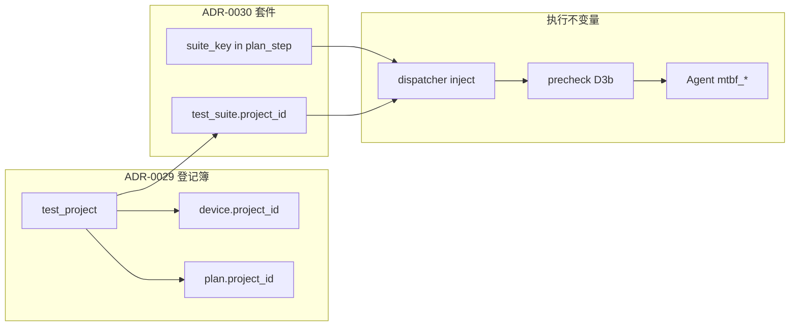

# ADR-0029 / ADR-0030 实现综合评审（评分 + 再设计建议）

- **状态**：Living（2026-08-24 初版；结论随实现推进修订）
- **日期**：2026-08-24
- **性质**：**综合评审**（非 ADR、非 Agent Note）——两份 ADR 落地现状核对 + 评分 + 差距清单 + 再设计建议
- **上游决策**：[ADR-0029](../adr/ADR-0029-project-taxonomy-and-param-layering.md)（项目分类域，Accepted v2.4）、[ADR-0030](../adr/ADR-0030-multi-case-suite-management.md)（多用例平台化管理，Proposed）
- **背景分析**：[`PROJECT_TAXONOMY_REVIEW_2026-08-18.md`](./PROJECT_TAXONOMY_REVIEW_2026-08-18.md)、[`MTBF_MULTI_CASE_RESEARCH_2026-08-19.md`](./MTBF_MULTI_CASE_RESEARCH_2026-08-19.md)
- **产出会话**：resume `317ef8ab-ef9a-4bef-b3eb-b4c19d94c6c4`（短 ID `317ef8ab`，文件名尾缀）
- **方法**：ADR 正文与修订记录对照 + 代码路径核验（`backend/models/`、`backend/api/routes/`、`backend/agent/scripts/mtbf_*/`、`frontend/src/pages/projects/`、`tools/dev/`）+ Agent Note / 设计文档交叉验证
- **关联评审**：同日其他会话产出 [`ADR_0029_0030_IMPLEMENTATION_REVIEW_2026-08-24_245a4531.md`](./ADR_0029_0030_IMPLEMENTATION_REVIEW_2026-08-24_245a4531.md)（含生产库只读实测与 file:line 证据矩阵）、[`ADR_0029_0030_IMPLEMENTATION_REVIEW_2026-08-24_unattributed.md`](./ADR_0029_0030_IMPLEMENTATION_REVIEW_2026-08-24_unattributed.md)（快照缺口与排期反转主张）

---

## 0. 结论摘要（TL;DR）

两份 ADR 的**方向判断**与仓库现状基本一致：ADR-0029 的「登记簿 + 脚本路由」转向正确；ADR-0030 的「配置层实体、不进调度」正确。差距主要在**阶段未闭合**：0029 的 P3、0030 的 P1b（Plan↔Suite 闭环）仍是空档。

| ADR | 路线图得分 | 运营价值得分 | 一句话 |
|-----|-----------|-------------|--------|
| **ADR-0029** | **~78 / 100** | **~82 / 100** | 登记簿主线完成度高，P2.5 超预期；P3 / specialty / 广播未闭合 |
| **ADR-0030** | **~48 / 100** | **~72 / 100**（P0 为主） | P0+P1a 质量高；**P1b 空档使「平台管理用例」尚不可用** |

**若排期只选一件事**：先做 **ADR-0030 P1b**（`inject_suite_params` + precheck 五步 + ACTIVE 守卫），把 env 权宜之计收口；并行补 **ADR-0029 P3 jira**（小、硬需求）。

---

## 1. ADR-0029 实现评分

**对照范围**：Accepted v2.4 已承诺的 P1→P2→P3 + 独立前置；**挂起/取消项**（D1/D4/D5/D7/D8/D9）不计为未完成。

| 模块 | 承诺 | 现状 | 得分 |
|------|------|------|------|
| **P1 schema** | `test_project` + facet + `jira_project_key` + `source`/`match_models`；`plan`/`device`/`plan_run` 归属列；`specialty` 字典 | 模型、迁移、回填脚本齐全（`r5s6t7u8v9w0`、`t6u7v8w9x0y1`） | **92** |
| **P1 回填 M-b/M-c** | 6 个 SEED key + 设备 `project_id` NULL 归零 | ADR/笔记记载已生产执行；`tools/dev/backfill-test-project.py` 完备（dry-run、幂等、清单外拒绝） | **88** |
| **P2 登记簿 UI** | `/projects` + 详情；页面级 `?project_key=` 筛选 | 前端页、inventory、map preview/apply（P2.5）；`ProjectFilterSelect` 覆盖 Plan/Run/结果/设备 | **90** |
| **P2 实时** | `on_subscribe` 收窄；设备归属变更广播 | subscribe 测试齐全（`test_dashboard_subscribe.py`）；**未见 `project_changed` 广播** | **65** |
| **D6 specialty** | Plan 列表「项目 × 专项」二维分组 | DB 有 `specialty_id` + 种子；**无 API 读路径、无前端下拉** | **25** |
| **P3 jira** | 提交 issue 时自动带 `jira_project_key` | 列可填、详情只展示「P3」占位；无后端 jira 集成 | **5** |
| **并行：脚本路由** | APK/工具差异脚本端吸收 + step_trace sha | `flash_firmware` v1.2.0、`backend=auto` 先例；MTBF 仍主要靠 env/NFS | **70** |
| **写入断点** | Plan 应可带归属 | `create_plan`（`plans.py:505-519`）**不写** `project_id`/`specialty_id` → 新 Plan 恒 NULL | **扣分项** |

### 做得好的地方

- v2.4 产品面纠正落地扎实：SEED 藏工作台、USER 人工项目、`match_models` 精确映射、冲突 409——比「展示六个回填 key」更贴近真实运维。
- 挂起项（D1/D4/D5/D7/D8/D9）没有偷偷复活；页面级筛选替代全局上下文，与「约 5 个项目规模」匹配。
- 测试覆盖厚：`backend/tests/api/test_project_routes.py` 约 674 行级用例。

### 主要缺口

1. **P3 jira 未动**——R4 唯一硬需求仍悬空。
2. **`specialty` 建了没用**——D6 只完成了一半。
3. **多人协作**：设备归属变更无 `project_changed`，与 ADR 弱化版广播不一致。
4. **Plan 创建不写归属**——登记簿与 Plan 编排之间仍有断点。
5. **认知偏差**：登记簿开放读、无 D5 门禁符合 ADR，但新人仍可能期待「选错项目会被派发拦住」。

---

## 2. ADR-0030 实现评分

**对照范围**：P0 + P1a/b/c + P2。

| 阶段 | 承诺 | 现状 | 得分 |
|------|------|------|------|
| **P0 脚本三件套** | setup/check/finish + PROGRESS + NFS 结果 + validate | PlanRun #217/#218 验收；`suite_sha256` 进 step_trace | **95** |
| **P1a 实体+API** | 13 端点 CRUD/import/export/validate/export-to-tool-dir + 审计 | 全链路实现；手工渲染器逐字节 golden；`content_fingerprint` 结构性漂移检测 | **93** |
| **P1b 绑定+门禁** | `inject_suite_params`、快照冻结、precheck 五步、D3b、ACTIVE 409 守卫 | **未实现**（`suites.py` 注释写明留 P1b） | **0** |
| **P1c CLI+文档** | `tools/dev/mtbf-cases.py`；`mtbf-api.md` §2 | CLI 不存在；§2 仍标「占位」 | **10** |
| **P2 前端+结果表** | 用例管理页、`test_case_result`、PlanRun 逐条结果 | 未开始 | **0** |

### 关键矛盾

P1a 把「库里的 130 条用例」管理面做得很精（JSON 列类型、双指纹、审计），但 **Plan 仍无法通过平台绑定套件**——派发仍依赖 `STP_MTBF_*` env + NFS 手工布局。实体层与执行层**尚未闭合**。

P0 Agent Note 已写明：catalog `default_params` 恒为 `{}`，且 D1 挂起 → env 是权宜之计；正确出口是 P1b。

---

## 3. 若按背景与真实需求重新设计

前提不变量不动：`script:<name>` 唯一 action、版本不可变、Redis 仅 SAQ、方案 C 存储。

### 3.1 项目域（ADR-0029）

**保留的核心分层**：

```
知识层（登记簿）          执行层（脚本）
─────────────────        ─────────────────
test_project             mtbf_* / flash_firmware / ...
  facet 标签                 设备指纹路由表（工具目录）
  jira_project_key           step_trace 记 sha256
  match_models               fail-fast
```

与 v2 转向一致：**adb 读不出的**（客户关系、jira、人工型号归属）进平台；**设备能力/APK 差异**进脚本。

**建议的优先级与范围**：

| 优先级 | 做什么 | 为什么 |
|--------|--------|--------|
| P0 | 现有 P1+P2.5（schema + 登记簿 + 映射工作台） | 已做对，迁移成本低 |
| P1 | **P3 jira 一条线打通** | 唯一硬需求，改动小、价值明确 |
| P2 | `specialty` 只读展示 + Plan 编辑可选（无 `applicable` 硬门禁） | 低成本改善 Plan 列表可读性 |
| P3 | `project_changed` SocketIO（invalidate projects/devices） | 多人改归属时的体验问题 |
| 不做 | D8 全局上下文、D5 归属派发门禁、D7 存储命名空间 | 5 个项目、无安全隔离诉求；复议条件未触发 |
| 不做 | D1/D4 参数分层 | APK 已由脚本路由；相机 MTBF 清单分化走 0030 套件 |

**登记簿产品形态**：坚持 v2.4——**Fleet 事实表 + USER 人工卡片**，不用 ADB 推断客户目录。六个 SEED key 作为 FK 锚点合理，工作台永不展示。

### 3.2 多用例域（ADR-0030）

**保留的核心链路**：

```
test_suite / test_case（配置层）
        │ import/export 双向
        ▼
{NFS}/mtbf/{export_dir}/runtask.xml   ← 消费面不变
        │
        ▼
mtbf_setup → OfflineScriptManager（设备端 130 条循环）
```

不展开 130 个 PlanStep——正确判断。

**建议的落地顺序（相对现状）**：

```
P0  脚本三件套 + validate + NFS 结果     ✅ 已完成
P1b Plan↔Suite 绑定 + precheck 门禁      ← 应紧接 P1a，不应延后
P1a 实体 CRUD                             ✅ 已完成
P1c CLI（REST 薄包装）                   可最后
P2  前端 + test_case_result              有 NFS JSON 后可晚做
```

**P1b 应钉死的契约**（与 P1 设计一致）：

```json
// plan_step.default_params（显式，非脚本级 default_params）
{"suite_key": "MTBF-legacy", "project": "legacy", "task_times": 100}
```

- dispatcher：`inject_suite_params`（与 `inject_wifi_params` 同构）
- precheck 五步：存在 / 已导出 / 库指纹 / 磁盘 sha / D3b 项目匹配
- 快照：`run_context.dispatch_suite = {suite_id, exported_sha256, apk_binding, project_key}`

**套件版本化**：defer copy-on-write 版本库；`exported_content_sha256` + `exported_sha256` 双指纹足够归因——P1a 实现应保留。

**结果路径**：P0/P1 继续 step_trace 摘要 + NFS JSON；`test_case_result` 表仅在需要 SQL 聚合/前端表格时引入（P2）。

### 3.3 两份 ADR 的衔接



**D3b（套件项目匹配）**保留为 0030 自有门禁，**不复活 0029 D5**——动机是防配置误配，不是多租户隔离。

### 3.4 明确拒绝的路线

- 130 PlanStep 展开
- 把清单塞进 `default_params`
- ExecutionProfile 五表全家桶
- 若从零且已知相机 MTBF 会频繁分化：仍选混合方案 C；可提前做 `export_dir` 按 `project_key` 分化（成本低）

---

## 4. 差距清单（按严重度）

| # | 差距 | 严重度 | 修复路径 |
|---|------|--------|----------|
| 1 | **P1b 套件绑定门禁缺失** | 高 | `inject_suite_params` + admission 五步门禁 + 脚本侧 expected 改注入 |
| 2 | **Plan 创建不写 `project_id`/`specialty_id`** | 高 | `create_plan` + Plan 表单补项目/专项 |
| 3 | **P1c 状态传播滞后**（ADR 仍 Proposed、mtbf-api §2 占位） | 中 | 按 ADR-0030 修订记录挂靠位逐一同步 |
| 4 | `specialty` 读路径半截 | 中 | specialty 字典 API + Plan 编辑器下拉 |
| 5 | 无 `project_changed` 广播 | 中 | SocketIO 失效 projects/devices 查询键 |
| 6 | P3 jira 自动带 key | 低 | 问题追踪提交入口读 `jira_project_key` |

---

## 5. 落地顺序建议

| 优先级 | 事项 | 对应差距 |
|--------|------|----------|
| **P0** | P1b 门禁（inject + 五步 + ACTIVE 守卫） | #1 |
| **P0** | Plan 编辑器归属写入 | #2 |
| P1 | 状态传播 + mtbf-api §2 定稿 | #3 |
| P1 | specialty API + 前端下拉 | #4 |
| P2 | `project_changed` 广播 | #5 |
| P3 | jira 自动带 key | #6 |

---

## 6. 修订记录

| 日期 | 变更 |
|------|------|
| 2026-08-24 | 初版：本会话 ADR-0029/0030 评分（78/48 路线图）、再设计建议、差距清单 6 项；resume `317ef8ab` |
| 2026-08-24 | 恢复：工作区未提交丢失后按本会话分析重新生成 |
