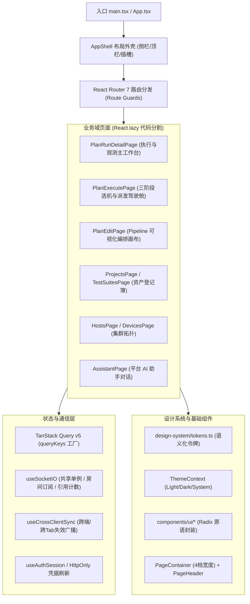
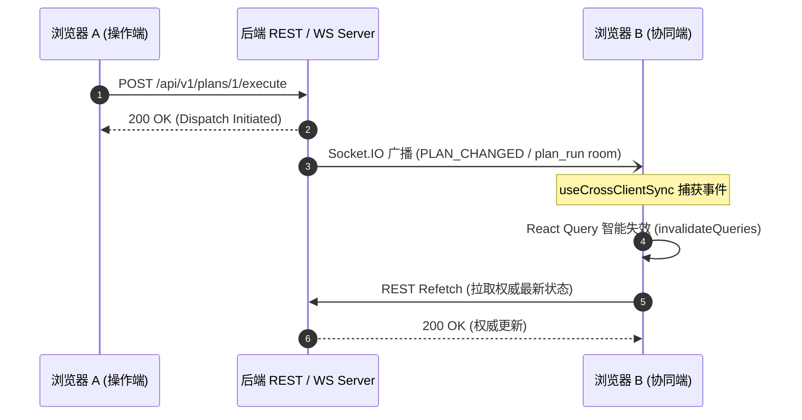
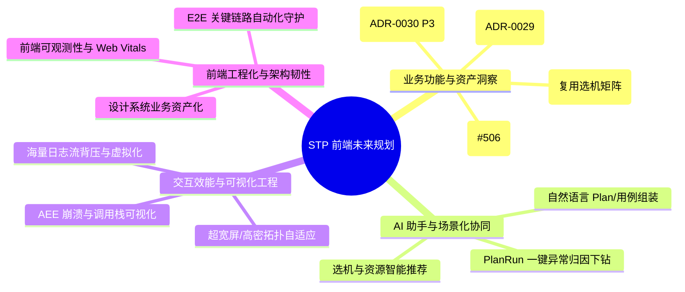
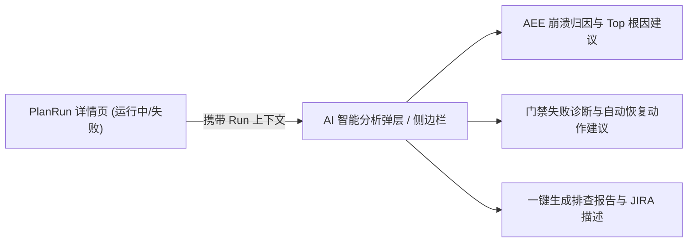

# 前端架构全面只读审查报告与未来演进规划

- **状态**：Living
- **日期**：2026-09-01
- **范围**：`frontend/` 全量代码库（页面路由、组件树、设计系统、状态管理、API 数据层、实时通信、构建配置及测试套件）
- **性质**：源码静态审查 + 契约核验 + 门禁验证 + 未来演进规划

---

## 第一部分：前端架构全面只读审查报告

### 1. 总体审查结论与健康度概览

当前平台前端在历经多次架构演进（包括 ADR-0020 Pipeline 编排、ADR-0021 C5 PlanRun 工作台重构、ADR-0029 项目登记簿、ADR-0030 用例套件、ADR-0031 AI 助手以及全站设计令牌化）后，整体架构呈现出**高度工程化、分层清晰、契约严格、门禁完备**的成熟状态。

#### 核心质量门禁实测结果

| 门禁检查项 | 执行命令 | 状态 | 详情指标 |
|---|---|---|---|
| **TypeScript 类型检查** | `npm run type-check` | **PASS (0 errors)** | `tsc --noEmit` + `tsconfig.node.json` 全绿 |
| **ESLint 静态代码门禁** | `npm run lint` | **PASS (0 warnings)** | 严格模式 `--max-warnings 0`，零违规 |
| **Vitest 单元与集成测试** | `npx vitest run` | **PASS (89/89 files)** | **652 / 652 用例通过**，耗时 ~14.2s |
| **Knip 依赖与死代码检测** | `npm run knip` | **PASS (0 issues)** | 零孤立未引用文件、零未用 npm 依赖 |

---

### 2. 架构与技术栈分层审查

前端采用现代 Web 技术栈：**React 19.2 + React Router 7.18 + TanStack Query 5.101 + Tailwind CSS 4.3 + Radix UI Primitives + Socket.IO Client 4.8 + Vitest 4.0**。

#### 2.1 架构分层特性
1. **代码分割与冷启动**：除鉴权页（`LoginPage.tsx` 与 `RegisterPage.tsx`）首屏同步加载外，其余 25+ 业务页面全部采用 `React.lazy()` 路由级动态分包，配合 `vite.config.ts` 中的 `manualChunks`（`vendor-cn`, `vendor-react`, `vendor-query`, `vendor-recharts`, `vendor-xterm` 等），切断重型依赖污染首屏的风险。
2. **两级错误边界防护（Error Boundary）**：
   - **顶层防线**：`App.tsx` 包含全屏级 `ErrorBoundary` 防御全站崩溃；
   - **路由级局部隔离**：`AppShell.tsx` 在 `<main>` 内容区下沉了局部 `ErrorBoundary`，单页面 render-throw 仅降级当前内容区，保持顶栏、侧栏导航与实时连接常驻可用。
3. **部署热更新防断裂保护**：
   - 实现 `chunkLoadRecovery.ts`，侦听 `vite:preloadError` 并结合 60s 冷却守卫，当后端发布导致本地陈旧 hash chunk 404 时自动刷新，并与 ErrorBoundary 的手动刷新按钮无缝联动。

---

### 3. 设计系统、主题与视觉规范审查

#### 3.1 语义化设计令牌（Tokens）
- **核心文件**：`design-system/tokens.ts` 与 `design-system/colors.ts`
- **令牌覆盖度**：全站彻底杜绝裸色硬编码（如 `gray-500`、`blue-600` 等），全面转向基于 CSS 变量的语义令牌体系：
  - 表面与背景：`SURFACE.page`、`SURFACE.elevated`、`SURFACE.subtle`、`SURFACE.header`
  - 侧栏专用阶度：`SIDEBAR.root`、`SIDEBAR.border`、`SIDEBAR.accent`（与 OpenRouter 设计语言对齐）
  - 排版与交互：`TEXT.*`、`INTERACTIVE.*`、`BORDER.*`、`PANEL.*`、`STAT.*`
  - 实体状态映射：`ENTITY_STATUS_COLORS`（对齐设备/主机/任务/告警四类生命周期）

#### 3.2 暗色主题（Dark Mode）与渲染平滑度
- **实现机制**：`ThemeContext.tsx` 统一管理 `light` / `dark` / `system` 三态，通过 `localStorage` (`stp.theme`) 持久化。
- **DOM 挂载与原生控件适配**：同时更新 `<html class="dark">` 和 `root.style.colorScheme`，确保浏览器原生滚动条、日期选择器等组件自动契合深色主题。
- **Tailwind 4 变体声明**：在 `index.css` 中使用 `@custom-variant dark (&:is(.dark *))` 与 `@theme inline`。
- **字体与渲染平滑度**：`index.css` 规避了在 Linux/Chromium 密集表格下导致中文字体发虚的 `antialiased`，采用 `font-weight: 450` 与异步字体加载策略（`fonts.ts`）。

---

### 4. 页面外壳规范（Page Shell Spec）与导航信息架构

#### 4.1 外壳规范落实情况
依据规范文档 `docs/design/2026-08-21-frontend-page-shell-spec.md`，全站页面全面收敛为 4 档宽度与标准页头模型：

| 宽度类型 | 容器样式 | 典型内容 | 页面落地举例 |
|---|---|---|---|
| `form` | `max-w-3xl` (768px) | 单列表单、配置页 | `SettingsPage`, `ChangePasswordPage` |
| `content` | `max-w-6xl` (1152px) | 卡片流、列表、仪表盘 | `Dashboard`, `ProjectsPage`, `TestSuitesPage`, `ResultsPage` |
| `wide` | `w-full` (无上限) | 密集宽数据表 (≥8列) | `DevicesPage`, `HostsPage`, `PlanRunListPage` |
| `bleed` | `w-full` (0 内边距) | 自管滚动面板、控制台 | `PlanEditPage`, `PlanExecutePage`, `PlanRunLogsPage` |

#### 4.2 页头归属与插槽系统（HeaderSlotContext）
- **单一顶栏原则**：全站顶栏由 `AppShell.tsx` 统一承载。
- **动态注入**：标准页面使用 `PageHeader`，通过 `HeaderSlotContext` 将标题、副标题、面包屑与主操作按钮挂载到 AppShell 顶栏；复杂详情页（如 `PlanRunDetailPage` 与 `PlanEditPage`）使用专有 Hook（`usePlanRunHeaderSlot` / `usePlanEditHeaderSlot`）直接定制复合操作栏与状态指示器。

#### 4.3 侧边栏与信息架构分层（Sidebar IA v1.3）
- **分层策略**：在 `Sidebar.tsx` 中按照使用频率划分：
  - **高频常驻（工作区/分析报告）**：仪表盘、项目登记簿、Plan 管理、执行 Plan、执行记录、测试结果、问题追踪；
  - **中频折叠（资源）**：主机集群、物理设备、脚本库、用例套件、文件服务器（admin）；
  - **低频与角落**：WiFi 资源池、定时调度，管理类页面（用户/通知/审计/设置）收纳进右上角 `UserMenu`；
  - **横切置顶入口**：AI 助手独立置顶渲染，不挤占业务组空间。

---

### 5. 状态管理、实时通信与多端同步审查

#### 5.1 服务端状态与缓存策略
- **权威类型定义**：`utils/api/types.ts` 作为全前端类型单一真实源，严格与后端 Pydantic 数据契约 1:1 对齐。
- **Key 工厂规范化**：`utils/api/queryKeys.ts` 统一管理 Query Key，支持按维度（`projectKey`、`limit`、`status`）隔离和局部前缀批量失效（如 `allLists()`、`devicesByRun(id)`）。

#### 5.2 Socket.IO 单例与失效驱动模型
- **生命周期与引用计数**：`hooks/useSocketIO.ts` 维护单例 Socket 连接，引入 `_hookRefcount` 与 30s 闲置断开定时器，页面全卸载后自动清理连接；登出时通过 `disconnectDashSocket()` 彻底释放资源。
- **Invalidation Hint 哲学**：Socket.IO 仅作为**数据失效提示**（Hint），不直接拼接本地复杂状态，权威状态一律通过 REST Refetch 获取，彻底规避长链接丢包或乱序导致的数据漂移。
- **跨端与跨 Tab 一致性**：`hooks/useCrossClientSync.ts` 监听服务端 `plan_changed` / `project_changed` 广播，并在用户切回后台 Tab 时（`visibilitychange: visible`）自动刷新活跃缓存。

#### 5.3 鉴权会话与并发刷新风暴防护
- **HttpOnly Cookie 驱动**：前端不直接存储 access/refresh token，会话通过浏览器 HttpOnly Cookie 自动携带。
- **并发刷新防抖**：`utils/auth.ts` 实现了 `refreshAccessToken()` 单飞 Promise 锁，多个并发 401 拦截器与 Socket 重连只会触发一次真实刷新请求。

---

### 6. 核心业务模块深度剖析

#### 6.1 PlanRun 详情工作台（`PlanRunDetailPage.tsx`）
- **左侧固定与折叠面板**：`PlanRunHero` 承载中止/复跑/导出，与 KPI 网格（`PlanRunKpiGrid`）和串联 Plan 链（`PlanChainSidebar`）垂直排列；移动端自适应抽屉滑出。
- **心跳超时警报**：顶部醒目渲染心跳超时 Job 提示条（`stuck-jobs-banner`），提示后端 Recycler 探测与 Agent Recovery 窗口。
- **设备矩阵与下钻**：`DeviceOverview` 配合右侧弹出抽屉 `DeviceDetailDrawer`，支持单设备手动重试、退出任务及单次运行报告跳转。
- **异况与去重下钻**：`AnomalyDashboard` 提供 AEE/Crash 分类与包名排行；终态自动加载权威 DLE 事件列表 `LogEventsCard` 及 MTBF 用例集结果 `TestCaseResultsCard`。
- **派发门禁卡片**：`DispatchGateCard` 直读后端 capabilities 投影，对准入失败、环境未就绪提供针对性重试动作。

#### 6.2 Plan 执行驾驶舱（`PlanExecutePage.tsx`）
- **三阶段执行模型**：严格划分 `plan`（选定计划与参数核验）→ `select`（选机与拓扑矩阵）→ `confirm`（派发预检与执行确认）。
- **虚拟化拓扑矩阵**：集成 `@tanstack/react-virtual`（`DeviceMatrix.tsx`），在管理上千台设备时依然维持 60fps 丝滑滚屏。
- **选机小地图与防呆机制**：配备 `SelectedMinimap` 快速定位/撤销已选设备；具备主机容量超载告警（`effective_slots` 溢出检查）与重复派发撞车预警（`DuplicateLaunchBanner`）。
- **草稿自动暂存恢复**：通过 `usePlanExecuteDraft` 实现选机草稿在页面切换或异常刷新后的无损恢复。

#### 6.3 数据可视化系统（Recharts 稳定性封装）
- **首帧尺寸闪烁消除**：`StableResponsiveContainer.tsx` 采用 `useLayoutEffect` + `ResizeObserver`，确保 DOM 容器尺寸就绪后才挂载 Recharts，彻底消除了控制台常见的 `ResponsiveContainer width(-1)/height(-1)` 报错。
- **暗色主题图表对齐**：通过 `hsl(var(--...))` 与 `CHART_COLORS` 保证所有折线图、柱状图、饼图在深浅模式下均具备极高的对比度与清晰度。

---

### 7. 历史审查缺陷闭环核验

对照过往审查报告（`2026-08-19`、`2026-08-27` 与 `2026-08-31` UI 优化批次），核对关键问题的修复闭环情况：

| 历史问题定性 | 历史表现 | 当前代码库状态 | 验证结果 |
|---|---|---|---|
| **H1 系统设置虚假页面** | 早期配置纯硬编码 | `SettingsPage.tsx` 接入 `api.settings.get()`，展示真实 DB 连接与运行时指标 | **已彻底修复** |
| **H2 WiFi 密码明文泄漏** | 表单 input 为明文 text | `WifiPage.tsx` 改为 `type="password"`，补齐 `autoComplete` 与 a11y label | **已彻底修复** |
| **H3 渲染期 setState 反模式** | 模态框与通知页触发副作用 | 统一为 React 19 规范模式；`NotificationsPage` 迁入 `useEffect`，弹窗比较下沉为稳定 ID 比较 | **已彻底修复** |
| **B7 字体字号一致性** | 存在 10px 微型字难以辨认 | 全站除通知红点角标外，所有 chip 与元数据字号全量升阶至 11px+ | **已彻底修复** |
| **A4 模态框焦点与滚动** | 手写 Modal 缺乏 a11y 原语 | 全面重构迁移至 Radix UI `Dialog` 与 `AlertDialog` | **已彻底修复** |

---

## 第二部分：前端未来演进与完善规划

---

### 1. 业务场景深化与资产全景洞察

#### 1.1 用例套件可视化编排器（ADR-0030 P3 深化）
- **可视化用例编排编辑器**：支持在 UI 上拖拽组织测试用例套件、调整执行轮次、配置并发策略与参数覆盖矩阵。
- **实时语法与参数校验**：在保存前对用例依赖关系、参数合法性与目标固件版本进行前端即时校验。
- **套件差异对比（Diff）**：支持不同版本套件的 XML / 步骤可视化 Diff 对比。

#### 1.2 脚本资产运行态全景洞察（闭环 issue #506）
- 在 `ScriptManagementPage` 与版本抽屉中新增**「近 30 天运行画像」**看板：
  - **项目覆盖度**：最近 30 天被哪些项目（Project）在执行中使用；
  - **版本成功率趋势**：按脚本版本呈现历史执行成功率、平均耗时与中断率；
  - **退役决策辅助**：结合「0 配置引用 + 0 近期运行事实」自动高亮可安全退役（`is_active=false`）的候选版本。

#### 1.3 定时调度（Schedules）交互升维
- 复用 `PlanExecutePage` 已沉淀的成熟组件（`DeviceWorkspace`、`DeviceFilterBar`、`SelectionPresets`）；
- 支持按**项目（ProjectKey）**、**机型（Model）**或**动态资源标签（Tag）**定义调度目标池，告别静态 ID 硬编码。

---

### 2. AI 深度赋能与上下文协同（ADR-0031 P2）

1. **PlanRun 详情页一键 AI 归因**：
   - 在 `PlanRunHero` 与 `DispatchGateCard` 中注入「AI 诊断」入口；
   - 自动提取当前 Run 的 `precheck` 状态、`stuck_jobs`、AEE 异常聚合与最近终端日志，一键生成结构化故障排查报告。
2. **自然语言智能派发辅助**：
   - 在 `PlanExecutePage` 中支持自然语言过滤与选机，如：*“选择 Lab A 中所有空闲的 MTK 9400 设备并运行 24h 压力测试”*，由 AI 自动解析并匹配预设组合。

---

### 3. 交互效能与数据可视化工程

1. **宽屏与超高密设备网格适配**：
   - 在 2K / 4K / 34寸超宽屏下，优化 `DevicesPage` 与 `HostsPage` 的信息展示密度；
   - 支持「紧凑密度（Dense）」与「舒适模式（Comfortable）」的一键切换，支持按机柜/主机分组折叠视图。
2. **海量日志流与实时终端增强**：
   - 针对多机并发上送海量日志场景，引入 Worker 线程分词过滤与渲染帧率节流；
   - 增强日志搜索交互（正则语法高亮、时间轴标记、关联设备跳转）。
3. **AEE 异常堆栈下钻可视化**：
   - 在 `AnomalyDashboard` 中引入调用栈层级可视化（Flamegraph / Call Tree），直观呈现 Java/Native Crash 的热点路径。

---

### 4. 前端工程化、可观测性与架构韧性

1. **前端运行时可观测性（Observability）**：
   - 接入统一的错误捕获与性能指标收集（Web Vitals），监控用户实际操作中的白屏率、慢请求与异步 Chunk 加载失败率；
   - 在 `AppShell.tsx` 状态徽标中进一步丰富 WebSocket 丢包率、重连次数与延迟诊断。
2. **端到端（E2E）自动化测试接入**：
   - 引入 **Playwright** 针对 3 条核心业务链路构建轻量级 E2E 门禁：
     - *链路 1*：创建 Plan → 选机派发 → PlanRun 详情页状态流转；
     - *链路 2*：主机热更新确认与批量操作；
     - *链路 3*：项目登记簿机型映射与标签批量更新。
3. **设计系统组件文档与演练场（Storybook / Docs）**：
   - 将 `components/ui/*` 与 `design-system/tokens.ts` 沉淀为可交互的组件库文档，降低新成员参与复杂 UI 研发的学习成本。

---

### 5. 分阶段实施路线图

| 阶段 | 周期建议 | 重点目标 | 核心交付物 |
|---|---|---|---|
| **Phase 1：体验补全与资产洞察** | 近期 (1~2 个迭代) | 闭环既有功能交互断点，丰富运维决策依据 | 1. 脚本管理详情页集成近 30 天运行画像 (#506) 2. 定时调度页集成可视化选机组件 3. PlanRun 详情页内嵌 AI 归因浮层入口 |
| **Phase 2：深度编排与可视化升级** | 中期 (2~3 个迭代) | 提升用例管理与数据分析的专业化水准 | 1. ADR-0030 P3 用例套件可视化编排器 2. Xterm 日志流虚拟滚动与 Worker 线程节流 3. 密集宽表（设备/主机）超宽屏自适应与紧凑视图 |
| **Phase 3：全域协同与工程化底座** | 远期 (3+ 个迭代) | 打造智能化、高韧性、可观测的平台级前端 | 1. Playwright 核心业务链路 E2E 自动化回归 2. 前端运行时异常与性能监控平台 3. AI 自然语言全自动派发与跨任务对比大盘 |
